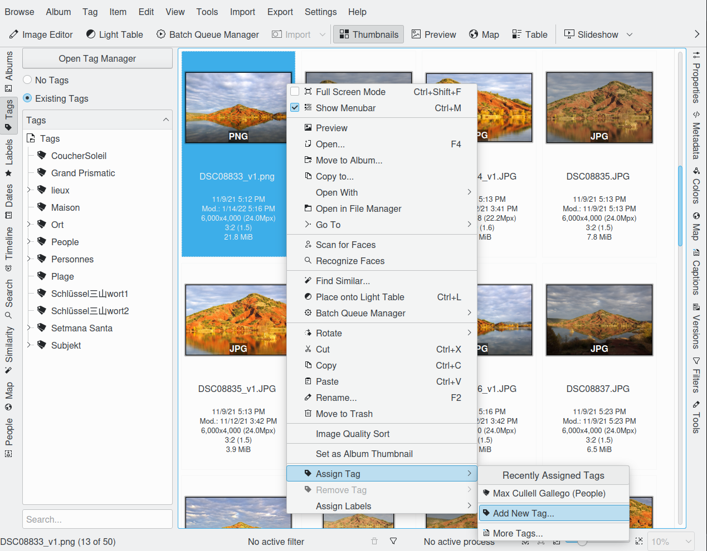

.. meta::
   :description: digiKam Main Window Tags View
   :keywords: digiKam, documentation, user manual, photo management, open source, free, learn, easy

.. metadata-placeholder

   :authors: - Gilles Caulier <caulier dot gilles at gmail dot com>

   :license: Creative Commons License SA 4.0

.. _tags_view:

Tags View
---------

(Hierarchical) tagging provides a flexible and powerful way to organize and catalog your images. Tags (also called “keywords” in other applications) are labels that can be applied to individual images or whole groups. Once a tag has been set to an image the image can be found again by selecting the tag or doing a search.

Tags can be arranged in a hierarchical tree. This allows you to organize your tags in a logical manner. You can collapse parts of the tree in the “Tags” list so that you can easily find the tags that you are looking for. 

.. figure:: images/mainwindow_tagsview.png

When a tag is selected in the Left Sidebar, all of the images that are marked with that tag are displayed in the View Area.

But before assigning and using tags you first have to define them. If you import photographs with tags assigned digiKam will build an appropriate tag tree during import. Other than that you have to define tags by yourself. An easy access to that is the context menu shown in the screenshot above.

Managing Tags
~~~~~~~~~~~~~

You can add new tags by clicking with the right mouse button on either the “Tags” label or an existing tag and selecting New Tag.... A dialog will open where you can type in the tag name (or even a whole hierarchy branch), assign an icon and/or a shortcut to the tag. If you add a new tag by clicking with the right mouse button on an existing tag, your new tag will be created as a sub-tag.

You can delete a tag by clicking with the right mouse button on the tag you want to delete and selecting Delete Tag. When you delete a tag, the photographs themselves are not deleted. Simply the tag is removed from those photographs.

You can move the position of a tag within the tree by dragging it to the position that you want and dropping it there. A menu will appear that gives you the option to Move the tag. This works from the left and right sidebar. A tag can only be in one place in the tree at a time.

You can set the Tag Properties by clicking with the right mouse button on a tag and selecting Properties.... The Tag Properties allow you to change the name of the tag, the icon used in the Tags tree and the shortcut.

To select a photograph as the tag icon, click with the right mouse button on the photograph that you want to use as the tag icon and select Set as Tag Thumbnail from the context menu. Additionally you can use drag and drop to set the tag icon. Drag the images icon and drop it on the currently selected tag in the tag list.

A tool for more elaborate work on big tag trees is the Tags Manager which you can access by clicking the Open Tag Manager button at the top of the Tags tree.

In the Digital Asset Management (DAM) chapter of this handbook you can find some useful considerations about how to build your Tags tree.

It is not always easy to build a logical hierarchy from general and generic categories. You might run into a problem like this:

   - Animal
      - Domestic Animal
         - Cat
         - Cattle
         - Dog

      - Wild Animal
         - Bird
         - Cat
            - Cheetah
            - Lion
            - Tiger

      - Zoo Animal
         - Bird
         - Cat
            - Cheetah
            - Leopard

In this tag tree the keyword “Cat” appears three times. This will not cause a problem within digiKam but there are quite a few views where the user cannot know which of the three is applied to an image because he might not be able to see the whole hierarchy of the tag. A help could be to tag the image in a case like this also with the parent tag or even the whole hierarchy but it becomes quite unwieldy, e.g. in the image icon if you have the tags displayed there. The second “Cat” can be avoided by calling it “Wild Cat” but calling the third one “Zoo Cat” is a bit out of the roof, I think. And still: there are also two “Cheetah”!

Solution: You replace the “Zoo Animal” branch by a single tag “Zoo” which you use in addition to the tag you choose from the two remaining branches. You could even put it on the top level of your hierarchy if you have photographs taken in a zoo but not showing animals. 

Tagging Photographs
~~~~~~~~~~~~~~~~~~~

Before you can get the most out of digiKam's tagging capabilities, you must first tag your photographs. There are a few methods for that task. Once you have identified the photographs that you want to tag you can either drag and drop them onto the tag in the Tags tree or, by clicking with the right mouse button on the selected photographs in the Image Window, you can use the Assign Tag menu to select the tags you wish to set.

Drag and Drop: works with both sidebars provided they are showing tags of course. With the Right Sidebar it works the obvious way: you drag the tag and drop it onto the photograph or selection of photographs you want to tag. With the Left Sidebar you have to drag the photographs to the tags. You want to know why? Just try it the other way and you will see.

Shortcuts: as mentioned earlier in this chapter you can assign keyboard shortcuts in the Tag Properties. With these you can assign or un-assign a tag to the selected photograph(s).

Context menu: by clicking with the right mouse button on the selected photographs and choosing Assign Tag you will see the next menu step offering the ten most recently used tags, Add New Tag..., described at the beginning of the previous article, and More Tags... which leads to what is described in the next paragraph. The context menu method is obviously very useful if you use only a limited number of tags out of your whole tree for a while. 

When you delete an Album from digiKam it will be moved into the internal Trash Can. As an option you could change this behavior, so that delete really will remove the Album and all of the photographs in it. This can be changed by selecting Settings → Configure digiKam... and selecting the Miscellaneous page. At the top of this page are the settings that control what happens when a photograph is deleted. To delete an Album, click with the right mouse button over the Album in the “Albums” tree and select Delete Album from the context menu.

You can remove a tag from a photograph by clicking with the right mouse button on the photograph and using the Remove Tag menu. This menu will only show those tags that have been set on this photograph.

The Right Sidebar: this is what I would call my standard method for assigning tags. Click Captions/Tags on the Right Sidebar and then the Tags tab and you will see the whole tags tree. Simply check/un-check the boxes of the tags you want to assign/un-assign and then click Apply. If you change focus without that you will be asked whether you want to apply the changes unless you disabled that confirmation either by checking “Always apply changes without confirmation” or by checking “Do not confirm when applying changes in the right sidebar” in the Miscellaneous section of Settings → Configure digiKam.... More details about the other buttons and fields in the Tags tab see in digiKam sidebar.

You can label a photograph with as many tags as you like. The photograph will appear when you select any of the tags that are set against it. This way you can set a tag for each person in a photograph, as well as the place the photograph was taken, the event it was taken at, etc.

Once you have tagged a photograph, the tag name will appear under the thumbnail in the Image Area. 

.. tip::

      Tags are stored in a database for fast access, and, the applied tags are written into IPTC data fields of the image (at least for JPEG). So you can use your tags with other programs or, in case of loss of that data in the database, the tags will be re-imported when the image is noticed by digiKam.
