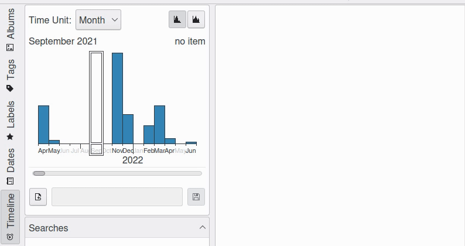

.. meta::
   :description: digiKam Main Window Timeline View
   :keywords: digiKam, documentation, user manual, photo management, open source, free, learn, easy

.. metadata-placeholder

   :authors: - Gilles Caulier <caulier dot gilles at gmail dot com>

   :license: Creative Commons License SA 4.0

.. _timeline_view:

Time-Line View
--------------

.. figure:: images/mainwindow_timeline.webp
    :alt:
    :align: center

    The Timeline View

The Timeline View shows a timescale-adjustable histogram of the numbers of images per time unit which is selectable by a drop down field. To the right of that you can choose between a linear or logarithmic histogram. A selection frame moves over the histogram. To display the photographs out of a certain time frame just click on the corresponding bar. You are not restricted to one bar. With Shift+left click or Ctrl+left click you can add more bars to the first one.

    Timeline Selection Screencast

In the field right below you can enter a title and save your selection. It will then appear in the “Searches” list field below. But the best is still to come: the Timeline View offers a search for a search! If you have a lot more searches saved than my ridiculous four in the screenshot the adaptive search field at the bottom may help to find a certain search.
