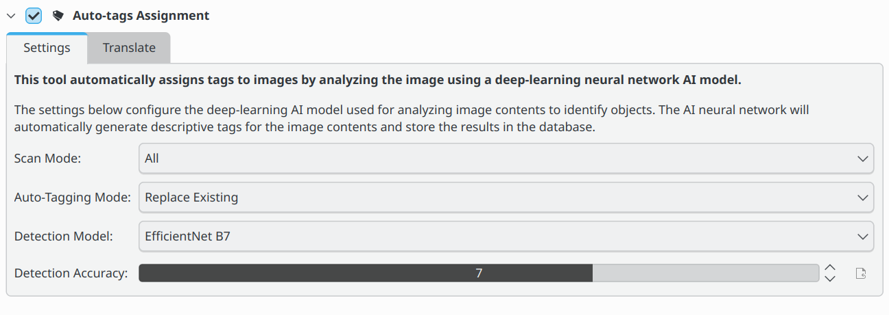

.. meta::
   :description: digiKam Maintenance Tool to Sort Image by Quality
   :keywords: digiKam, documentation, user manual, photo management, open source, free, learn, easy, quality, pick-label, deep-learning

.. metadata-placeholder

   :authors: - digiKam Team

   :license: see Credits and License page for details (https://docs.digikam.org/en/credits_license.html)

.. _maintenance_autotags:

:ref:`Auto-Tags Assignment <maintenance_tools>`
===============================================

    The digiKam Maintenance Options for Auto-Tag Assignment

The **Auto-Tags Assignment** scans the images in your collection using a neural network that has been trained to identify common objects. The objects identified by the neural network are then used to tag each image. When the scan is complete, you can search your database for images containing a bird, or a ball, or a car. Tags generated by the **Auto-Tags Assignment** process will be under the **auto** tag in the Tags view to distinguish them from tags that have been manually assigned.

This process is also accessible in the **Tags** view via the **Auto-tag Scan** button. For more information about **Auto-tags** options see the :ref:`Tags View  <tags_view>` section of this manual.

For Auto-tagging, there are 4 settings the user can adjust to control how digiKam detects and tags objects in an image.

- **Scan mode**: The scan mode determines if digiKam will scan all images, or only images that don't have an **auto** tag already assigned. The **auto** tag is assigned to images that have been auto-tagged. The **auto** tag is not assigned to images that have been manually tagged.
- **Auto-tagging Mode**: When applying auto-tags, you can choose between **Update** and **Replace Existing**. **Update** will add any new auto-tags to the existing tags on the image. **Replace Existing** will remove all existing auto-tags and replace them with the tags detected by the current scan. Any tags not under the **auto** tag will not be affected. This setting is useful if you want to run multiple scans with different settings and combine the results.
- **Detection Model**: The detection model is the neural network used to detect objects in the image. The default model is **EfficientNet B7**. The **EfficientNet B7** model is a general-purpose model that can detect 1,000 different objects and scenes. The **YOLOv11-Nano** model is faster and uses less memory than the **EfficientNet B7** model. The **YOLOv11-Nano** model is recommended for users with limited memory or slower processors, and **YOLOv11-XLarge** is recommended for users with more memory and faster processors. Both YOLOv11 models are trained to detect 80 different objects based on the COCO dataset.
- **Accuracy**: Lower accuracy settings may detect more objects in an image, but it will also increase the number of incorrectly identified objects (false positives). The default setting of 7 is recommended for normal use.

While the auto-tag assignment process is underway, a progress indicator is displayed in the bottom right corner of the main window.
