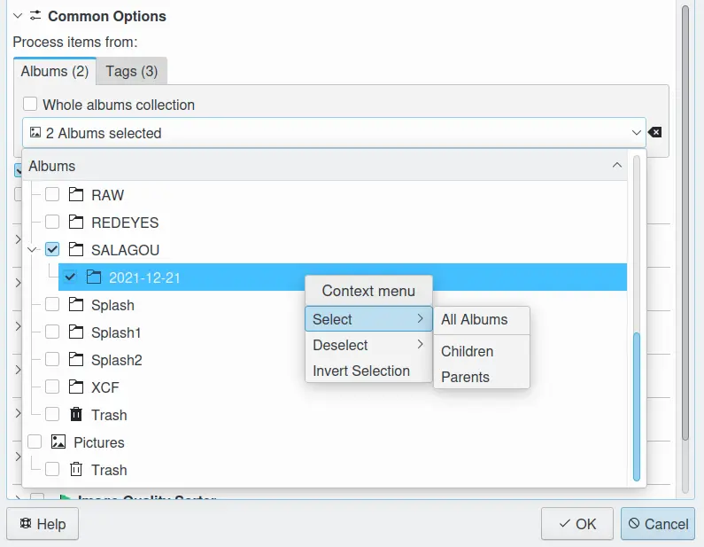
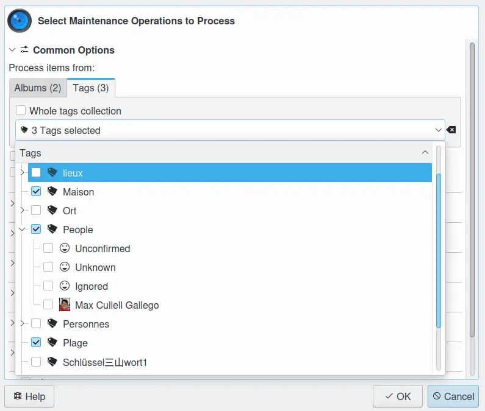
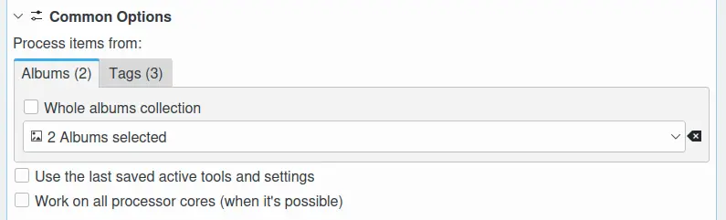

.. meta::
   :description: digiKam Maintenance Tool Common Options
   :keywords: digiKam, documentation, user manual, photo management, open source, free, learn, easy

.. metadata-placeholder

   :authors: - digiKam Team (see Credits and License for details)

   :license: Creative Commons License SA 4.0

.. _maintenance_common:

Common Options
==============

.. contents::

In the Common Options section you can restrict the scope of the maintenance process(es) to certain albums or tags. You got to un-check Whole albums collection or Whole tags collection to get access to the drop down fields where you can select albums or tags. Note that in this drop down field you have a context menu to select or deselect children and/or parents and also to invert the selection. If you switch from Albums to Tags or vice versa your selection in the now grayed out item will remain untouched which might be useful if you need a certain selection more often.

Since many of the processes the maintenance tool can perform are time consuming (depending also on the scope, of course) you have the choice to check Work on all processor cores if your machine has more than one and they are not occupied otherwise.

The **Use the Last Saved Active Tools and Settings** allows to force to remember the options selection taken at last maintenance tool session.

