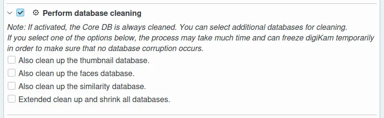
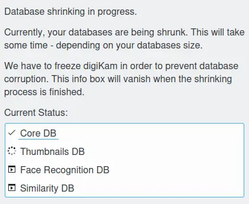

.. meta::
   :description: digiKam Maintenance Tool Database Cleaning
   :keywords: digiKam, documentation, user manual, photo management, open source, free, learn, easy

.. metadata-placeholder

   :authors: - digiKam Team (see Credits and License for details)

   :license: Creative Commons License SA 4.0

.. _maintenance_database:

Database Cleaning
=================

.. contents::

This process will analysis your database files to consolidate the contents. The Core database is always cleaned. You can select additional databases for cleaning by selecting one of the extra options listed below:

    - Cleanup the Thumbnails database.
    - Cleanup the Faces database.
    - Cleanup the Similarity database.
    - Shrink all databases to ensure defragmentation and just keeps the database small.

.. note::

   The last option leads to the vacuuming (shrinking) of the databases. Vacuuming is supported both for SQLite and MySQL.

While the scan for new items process is under progress, as the the process may take much time and digiKam cannot be used, a non modal dialog appear to make sure that no database corruption occurs.

