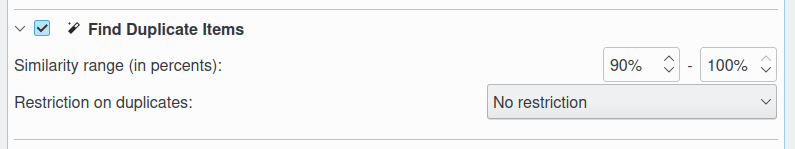
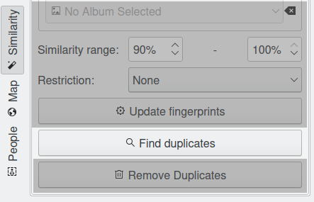
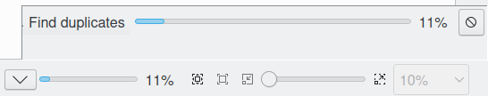

.. meta::
   :description: digiKam Maintenance Tool Find Duplicates
   :keywords: digiKam, documentation, user manual, photo management, open source, free, learn, easy

.. metadata-placeholder

   :authors: - Gilles Caulier <caulier dot gilles at gmail dot com>

   :license: Creative Commons License SA 4.0

.. _maintenance_duplicates:

Find Duplicates
===============

.. contents::

The Find Duplicates Tool is doing the same as the Find duplicates button in the :ref:`the Similarity View <similarity_view>`, but here you can combine it with other maintenance operations and you have the chance to check “Work on all processor cores” under Common Options (see above) to speed up the process.

This process provides two options to find duplicates items:

   - **Similarity Range**: the lower and higher values to define the range of similarity in percents.

   - **Restriction**: this option restrict the duplicate search with some criteria, as to limit search to the album of reference image, or to exclude the album of reference image of the search.
   
While the find duplicates process is under progress, notification on the bottom right of main windows will be visible to indicate the amount of items already done.

