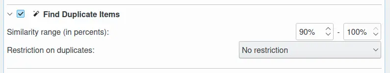
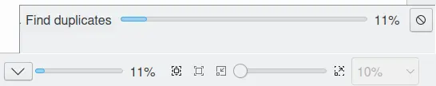

.. meta::
   :description: digiKam Maintenance Tool to Find Duplicates
   :keywords: digiKam, documentation, user manual, photo management, open source, free, learn, easy, maintenance, duplicates, similarity

.. metadata-placeholder

   :authors: - digiKam Team

   :license: see Credits and License page for details (https://docs.digikam.org/en/credits_license.html)

.. _maintenance_duplicates:

:ref:`Find Duplicates <maintenance_tools>`
==========================================

    The digiKam Maintenance Options to Find Duplicates

The **Find Duplicates** tool performs the same as the Find duplicates button in the :ref:`Similarity View <similarity_view>`, but here you can combine it with other maintenance operations and you have the chance to speed up the process by checking **Work on all processor cores** under :ref:`Common Options <maintenance_common>`.

.. figure:: images/maintenance_similarity_duplicates.webp
    :alt:
    :align: center

    The digiKam Find Duplicates Button from Similarity Left Sidebar

This process provides two options for finding duplicate items:

   - **Similarity Range**: the lower and higher values for defining the range of similarity in percents.

   - **Restriction**: this option restricts the duplicate search with some criteria, such as limiting the search to the album of a reference image, or excluding the album of the reference image from the search.

While the find duplicates process is underway, a progress indicator is displayed in the bottom right corner of the main window.

    The digiKam Find Duplicates Process Running in the Background
