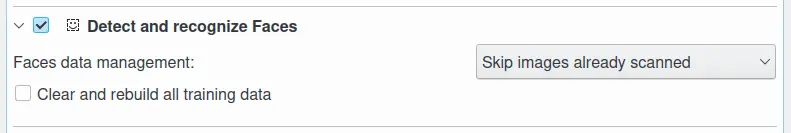

.. meta::
   :description: digiKam Maintenance Tool Detect and Recognize Faces
   :keywords: digiKam, documentation, user manual, photo management, open source, free, learn, easy, maintenance, faces, detection, recognition, deep-learning

.. metadata-placeholder

   :authors: - digiKam Team

   :license: see Credits and License page for details (https://docs.digikam.org/en/credits_license.html)

.. _maintenance_faces:

Detect and Recognize Faces
==========================

.. contents::

    The digiKam Maintenance Options to Detect and Recognize Faces

This is the same process you can access in the **People** view with the **Scan Collection for Faces** button. Here you just cannot set the **Fast - Accurate** parameter but just the **Face Data Management** method and the option to **Clear and rebuild all training data**. For more information about the **Faces Data Management** options see :ref:`the People View section <people_view>`.

.. figure:: images/maintenance_faces_scan.webp
    :alt:
    :align: center

    The Scan Collection for Faces Button from People Left Sidebar

While the faces management process is under progress, notification on the bottom right of main windows will be visible to indicate the amount of items already done.

    The digiKam Faces Management Process Running in the Background

.. important::

   To run properly, the process needs the deep-learning models to download at the first run of digiKam. See :ref:`the Quick Start section <quick_start>` for details.
