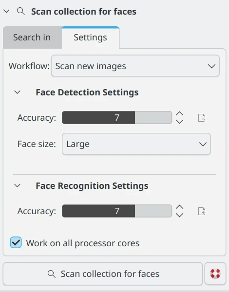

.. meta::
   :description: digiKam Maintenance Tool Detect and Recognize Faces
   :keywords: digiKam, documentation, user manual, photo management, open source, free, learn, easy, maintenance, faces, detection, recognition, deep-learning

.. metadata-placeholder

   :authors: - digiKam Team

   :license: see Credits and License page for details (https://docs.digikam.org/en/credits_license.html)

.. _maintenance_faces:

Detect and Recognize Faces
==========================

.. contents::

.. figure:: images/maintenance_faces_management.webp
    :alt:
    :align: center

    The digiKam Maintenance Options to Detect and Recognize Faces

This process is also accessible in the **People** view via the **Scan collection for faces** button. However, here you can only set the **Faces data management** method. For more information about the **Faces Data Management** options see :ref:`the People View section <people_view>`

    The Scan Collection for Faces Button from People Left Sidebar

While the face management process is ongoing, a notification will appear in the bottom right corner of the main window, indicating the number of items processed so far.

.. figure:: images/maintenance_faces_process.webp
    :alt:
    :align: center

    The digiKam Faces Management Process Running in the Background

.. important::

   For face management to work correctly, digiKam needs to download the deep-learning models from the web during its first run. See :ref:`the Quick Start section <quick_start>` for details.

The **Detect and recognize faces** section of the **Maintenance Tool** has 2 additional options for managing your face database.

- **Rebuild all training data**: Use this to clear all training data from the face recognition database and rebuild it using the face tag thumbnails.  This is useful if you have changed the face tag regions on several images, or if the recognition process isn't returning as many results as you expect.

- **Reset and clear all faces and training**: CAUTION! This will delete all training from the face recognition database and do a full detection scan on all images.  When it is complete, all confirmed faces will be moved to **Unknown** and you will have to begin again training your face database. If this process is interrupted, you can salvage face training that hasn't been deleted by running **Rebuild all training data** above.