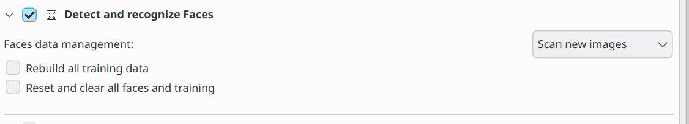

.. meta::
   :description: digiKam Maintenance Tool Detect and Recognize Faces
   :keywords: digiKam, documentation, user manual, photo management, open source, free, learn, easy

.. metadata-placeholder

   :authors: - digiKam Team (see Credits and License for details)

   :license: Creative Commons License SA 4.0

.. _maintenance_faces:

Detect and Recognize Faces
==========================

.. contents::

This is the same process you can access in the People View with the **Scan Collection for Faces** button. Here you just cannot set the Fast - Accurate parameter but just the **Face Data Management** method and the option to **Clear and rebuild all training data**. For more information about the Faces Data Management options see :ref:`the People View section <people_view>`.

.. figure:: images/maintenance_faces_scan.webp

While the faces management process is under progress, notification on the bottom right of main windows will be visible to indicate the amount of items already done.

.. figure:: images/maintenance_faces_process.webp

.. important::

   To run properly, the process needs the deep-learning models to download at the first run of digiKam. See :ref:`the Quick Start section <quick_start>` for details.
