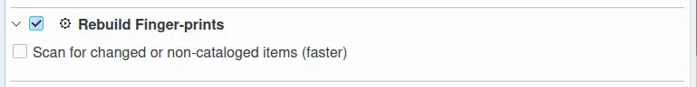
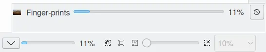

.. meta::
   :description: digiKam Maintenance Tool Rebuild Fingerprints
   :keywords: digiKam, documentation, user manual, photo management, open source, free, learn, easy

.. metadata-placeholder

   :authors: - digiKam Team (see Credits and License for details)

   :license: Creative Commons License SA 4.0

.. _maintenance_fingerprints:

Rebuild Fingerprints
====================

.. contents::

Fingerprints are necessary for finding duplicates and similar items and for finding images by sketches. For detailed description see :ref:`the Similarity View section <similarity_view>`.

This process provides only one option to rebuild the contents in the database: **Scan for Changed or Non-Cataloged Items**. This option will run the rebuild faster to prevent to process already register items in database.

.. note::

    This process can also be called from the Similarity View from left sidebar by the button **Update Fingerprints**.

    .. figure:: images/maintenance_update_fingerprints.webp

While the rebuild fingerprints process is under progress, notification on the bottom right of main windows will be visible to indicate the amount of items already done.

