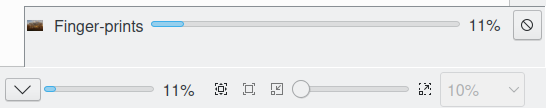

.. meta::
   :description: digiKam Maintenance Tool Rebuild fingerprints
   :keywords: digiKam, documentation, user manual, photo management, open source, free, learn, easy

.. metadata-placeholder

   :authors: - Gilles Caulier <caulier dot gilles at gmail dot com>

   :license: Creative Commons License SA 4.0

.. _maintenance_fingerprints:

Rebuild Fingerprints
====================

.. contents::

Fingerprints are necessary for finding duplicates and similar items and for finding images by sketches. For detailed description see :ref:`the Similarity View section <similarity_view>`.

This process provides only one option to rebuild the contents in the database: **Scan for Changed or Non-Cataloged Items**. This option will run the rebuild faster to prevent to process already register items in database.

While the rebuild fingerprints process is under progress, notification on the bottom right of main windows will be visible to indicate the amount of items already done.

