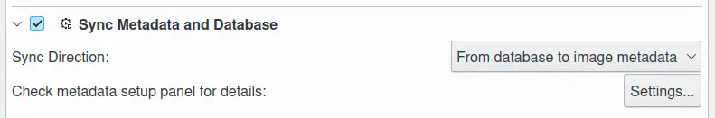

.. meta::
   :description: digiKam Maintenance Tool to Synchronize Metadata
   :keywords: digiKam, documentation, user manual, photo management, open source, free, learn, easy, maintenance, metadata, synchronizer

.. metadata-placeholder

   :authors: - digiKam Team

   :license: see Credits and License page for details (https://docs.digikam.org/en/credits_license.html)

.. _maintenance_metadata:

:ref:`Metadata Synchronizer <maintenance_tools>`
================================================

    The digiKam Maintenance Options to Synchronize Metadata

This **Metadata Synchronizer** tool synchronizes items metadata, that is metadata stored in the image files, with metadata stored in the digiKam database. The operation **Direction** can be:

    - From the database to files.

    - From files to the database.

.. note::

    As synchronization is a time consuming process, especially when metadata are written to files, it's a good idea to restrict the job to certain albums or tags.

The synchronization depends on the settings from :menuselection:`Settings --> Configure digiKam... --> Metadata page`. All these settings are described in :ref:`this section <metadata_settings>` of this manual.

The metadata synchronizer process may take a significant amount of time, all the while constantly accessing the digiKam database. To make sure that no database corruption occurs a non-modal dialog appears and digiKam cannot be used until the process completes.

.. figure:: images/maintenance_metadata_process.webp
    :alt:
    :align: center

    The Metadata Synchronization Process Running in Background
