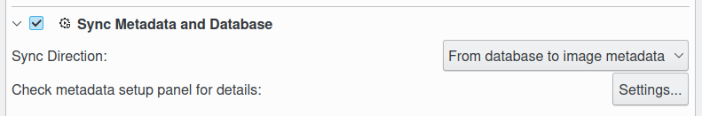
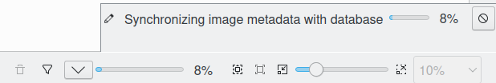

.. meta::
   :description: digiKam Maintenance Tool Metadata Synchronizer
   :keywords: digiKam, documentation, user manual, photo management, open source, free, learn, easy

.. metadata-placeholder

   :authors: - Gilles Caulier <caulier dot gilles at gmail dot com>

   :license: Creative Commons License SA 4.0

.. _maintenance_metadata:

Metadata Synchronizer
=====================

.. contents::

This process synchronize items metadata with database contents. The operation **Direction** can be:

    - From the database to files.
    - From files to the database.

.. note::

    As synchronization is a time consuming process, especially when metadata are written in file, it's a good idea to restrict the job to certain albums or tags. 

The synchronization depends of the settings from Settings → Configure digiKam... → Metadata. All these settings is described in :ref:`the dedicated section <metadata_settings>` from Setup Application.

While the metadata synchronizer process is under progress, as the the process may take much time and digiKam cannot be used, a non modal dialog appear to make sure that no database corruption occurs.

