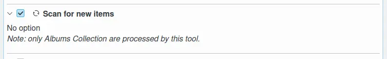
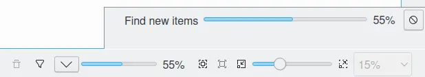
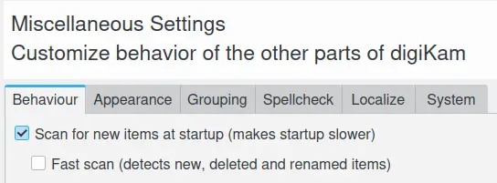

.. meta::
   :description: digiKam Maintenance Tool to Scan for New Items
   :keywords: digiKam, documentation, user manual, photo management, open source, free, learn, easy, maintenance, scan, new, items

.. metadata-placeholder

   :authors: - digiKam Team

   :license: see Credits and License page for details (https://docs.digikam.org/en/credits_license.html)

.. _maintenance_newitems:

Scan for New Items
==================

.. contents::

    The digiKam Maintenance Options to Scan for New Items

This process will scan the collections you defined in :menuselection:`Settings --> Configure digiKam...` and the **Collections** dialog page, i.e. image files you added to your collections while digiKam was not running. You can run this process also automatically on digiKam startup by checking Scan for new items at startup in :menuselection:`Settings --> Configure digiKam...` and the **Miscellaneous** dialog page.

While the scan for new items process is under progress, notification on the bottom right of main windows will be visible to indicate the amount of items already done.

    The Scan for New Items Process working in the background

.. note::

    This process can also be directly called by the main menu, From :menuselection:`Tools --> Scan for New Items` to scan all collections.

This process can be also called automatically at startup using the **Scan for new items at startup** option in :menuselection:`Setting --> Configure digiKam...` and the **Behavior** tab from the **Miscellaneous** dialog page. Take a care that scanning for new items at startup can take a while and slow-down application initialization.

To be precise, this option will force digiKam to scan all collections for new items to register new elements in database. The scan is performed in the background through the progress manager available in the status-bar when digiKam main interface is loaded. If your computer is fast enough, this will have no effect on usability of digiKam while scanning. If your collections are huge or if you use a remote database, this can introduce low latency, and it is recommended to disable this option and to plan a manual scan through the maintenance tool at the right moment.

Another option from this setup panel named **Fast scan (detects new, deleted and renamed items)** can also be turn on to significantly speed up the scan. New items, deleted and also renamed items are found. In order to find items that have been changed, this option must be deactivated.

    The digiKam Options to Scan for New Items from the Setup Dialog

.. note::

   To identify files quickly and register items changes in database while scanning, digiKam uses a hash. This is not a full hash of the file for performance reasons, but it's reliable enough. The file size is therefore included. digiKam uses these parameters to try to find files again during a scan if they have been moved or renamed externally. To have a scan process the most efficient, we recommend doing file operations within digiKam, not by an external application as a file manager.
