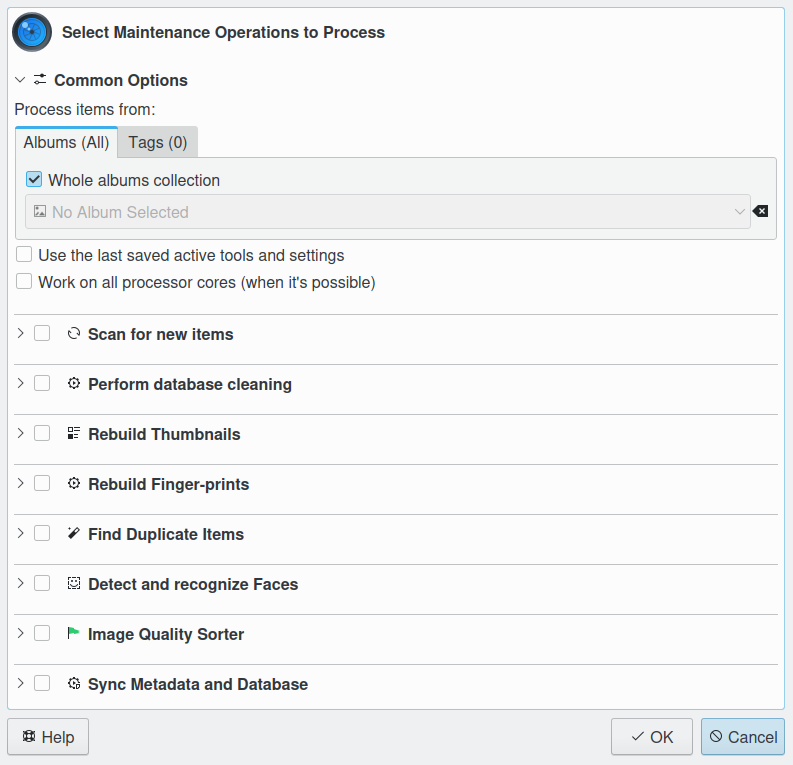

.. meta::
   :description: Overview to digiKam Maintenance Tool
   :keywords: digiKam, documentation, user manual, photo management, open source, free, learn, easy

.. metadata-placeholder

   :authors: - Gilles Caulier <caulier dot gilles at gmail dot com>

   :license: Creative Commons License SA 4.0

.. _maintenance_overview:

Overview
========

.. contents::

Maintenance is a tool running processes in the background to maintain image collections and database contents. 

Depending on your workflow, your digiKam settings and whether you work on your images collection also with other programs it might be necessary to run maintenance operations from time to time to update the digiKam databases and also your images regarding duplicates, face tags, quality labels, etc. The maintenance tool can do that for you, even more than one operation in one go depending on your requirements.

