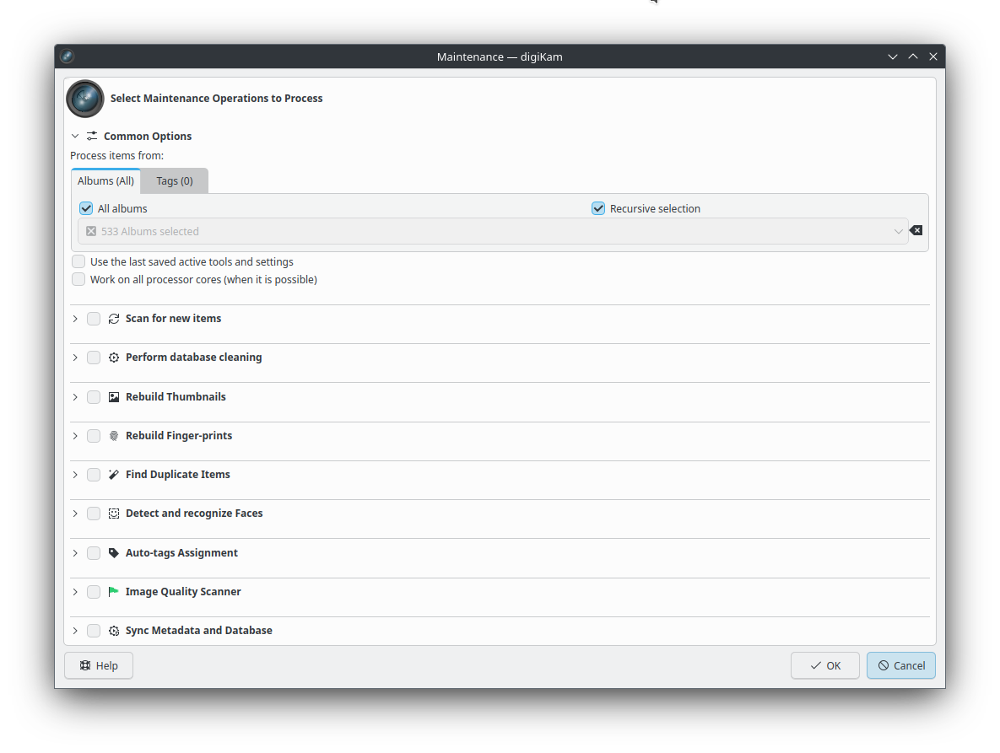

.. meta::
   :description: Overview to digiKam Maintenance Tool
   :keywords: digiKam, documentation, user manual, photo management, open source, free, learn, easy, overview

.. metadata-placeholder

   :authors: - digiKam Team

   :license: see Credits and License page for details (https://docs.digikam.org/en/credits_license.html)

.. _maintenance_overview:

:ref:`Overview <maintenance_tools>`
===================================

Maintenance tools are processes that are run in the background to maintain image collections and the digiKam database.

Depending on your workflow, your digiKam settings, and whether you also work on your image collections with other programs, it might be necessary to run maintenance operations from time to time to update the digiKam **databases**. You may also want to run maintenance tools to **Find Duplicate Items** in your collections, **Detect and recognize faces**, or automatically assign quality labels using the **Image Quality Sorter**. The maintenance tool can do all these things, and more. It can even run multiple tools in one go, depending on your requirements.

    The digiKam Maintenance Dialog

The list of available maintenance tools is presented in a sequential order that cannot be changed. Only the selected tools in this list will be run during the maintenance operation, and they will be run in the order they are listed. The ordering of the tools is relevant when populating the information in the database for the first time, and how these tools operate in subsequent maintenance operations.

The available maintenance tools are:

   1. **Scan For New Items**: scan for new albums (folders) and items in the collection directories to populate the database.

   2. **Perform Database Cleaning**: scan the database for entries that no longer can be associated with albums and items.

   3. **Rebuild Thumbnails**: scan albums to update the item thumbnails.

   4. **Rebuild Finger-prints**: scan albums to update item finger-prints used with **Similarity** searches.

   5. **Find Duplicate Items**: scan albums to update list of duplicates items based on **Similarity** finger-prints.

   6. **Detect and Recognize Faces**: perform automatic face management updates.

   7. **Auto-tags Assignment**: scan items and add tags based on image content recognized by a neural network.

   8. **Image Quality Sorter**: perform an automatic scan of items to sort items by quality and apply **Pick Labels** in database.

   9. **Sync Metadata and Database**: perform synchronization of items metadata with database contents or vice versa.
