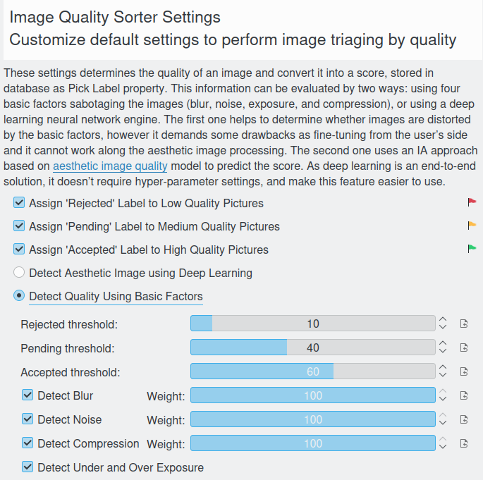

.. meta::
   :description: digiKam Maintenance Tool Image Quality Sorter
   :keywords: digiKam, documentation, user manual, photo management, open source, free, learn, easy

.. metadata-placeholder

   :authors: - Gilles Caulier <caulier dot gilles at gmail dot com>

   :license: Creative Commons License SA 4.0

.. _maintenance_quality:

Image Quality Sorter
====================

.. contents::

.. figure:: images/maintenance_quality_sorter.png

The tool will parse the items to determine the quality and sort them with the Pick Label properties in database as:

   - The **Red** flag for **Rejected**.
   - The **Yellow** flag for **Pending**.
   - The **Green** flag for **Accepted**.

The Image Quality Sorter assigns Pick Labels to items according to the default settings in Settings → Configure digiKam... → Image Quality Sorter, or a dedicated settings tuned in this view.

.. note::

    Since it is a time consuming process it's a good idea to check Work on all processor cores and restrict the job to certain albums or tags. 

All the Image Quality Sorter settings is described in :ref:`the dedicated section <imgqsort_settings>` from Setup Application.

While the image quality sorting process is under progress, notification on the bottom right of main windows will be visible to indicate the amount of items already done.

.. figure:: images/maintenance_quality_process.png

The quality sorting results will appears :ref:`the Labels view <labels_view>` from the right sidebar.

.. figure:: images/maintenance_pick_labels.png
