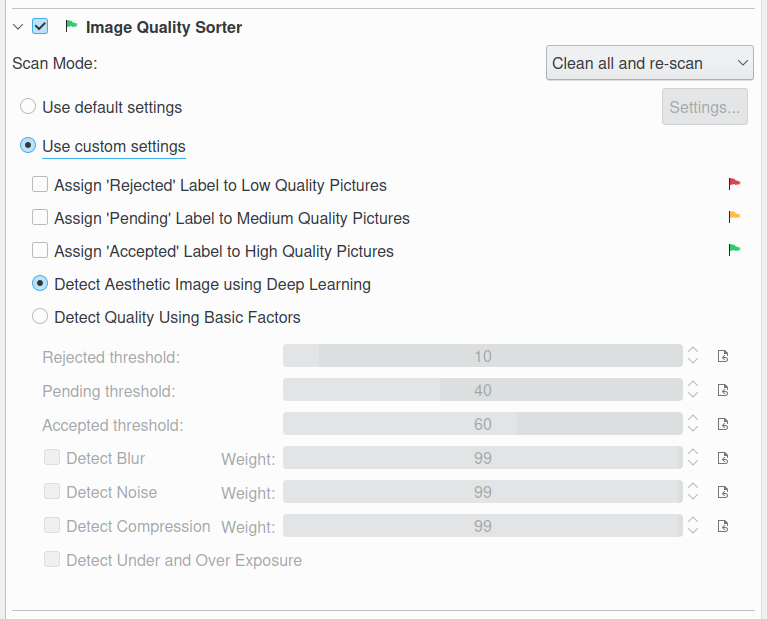

.. meta::
   :description: digiKam Maintenance Tool Image Quality Sorter
   :keywords: digiKam, documentation, user manual, photo management, open source, free, learn, easy

.. metadata-placeholder

   :authors: - Gilles Caulier <caulier dot gilles at gmail dot com>

   :license: Creative Commons License SA 4.0

.. _maintenance_quality:

Image Quality Sorter
====================

.. contents::

The tool will parse the items to determine the quality and sort them with the Pick Label properties in database as:

   - The **Red** flag for **Rejected**.
   - The **Yellow** flag for **Pending**.
   - The **Green** flag for **Accepted**.

The Image Quality Sorter assigns Pick Labels to items according to the default settings in Settings → Configure digiKam... → Image Quality Sorter, or a dedicated settings tuned in this view.

The quality score to determine the Pick Label property can be evaluated by two ways: using four basic factors sabotaging the images (blur, noise, exposure, and compression), or using a deep learning neural network engine. The first one helps to determine whether images are distorted by the basic factors, however it demands some drawbacks as fine-tuning from the user’s side and it cannot work along the aesthetic image processing. The second one uses an IA approach based on `this model <https://expertphotography.com/aesthetic-photography/>`_ to predict the score. As deep learning is an end-to-end solution, it doesn’t require hyper-parameter settings, and make this feature easier to use.

.. note::

    Since it is a time consuming process it's a good idea to check Work on all processor cores and restrict the job to certain albums or tags. 

All the Image Quality Sorter settings is described in :ref:`the dedicated section <imgqsort_settings>` from Setup Application.

The **Scan Mode** settings allows to configure how the database information for the items from the selected collection will be processed. **Clean all and re-scan** reset all data and scan items from scratch, **Scan non-assigned only** wil be faster to process non registered items with Pick Labels.

While the image quality sorting process is under progress, notification on the bottom right of main windows will be visible to indicate the amount of items already done.

.. figure:: images/maintenance_quality_process.png

The quality sorting results will appears in :ref:`the Labels view <labels_view>` from the right sidebar.

.. important::

   To run properly, the process needs the deep-learning model to download at the first run of digiKam. See :ref:`the Quick Start section <quick_start>` for details.
