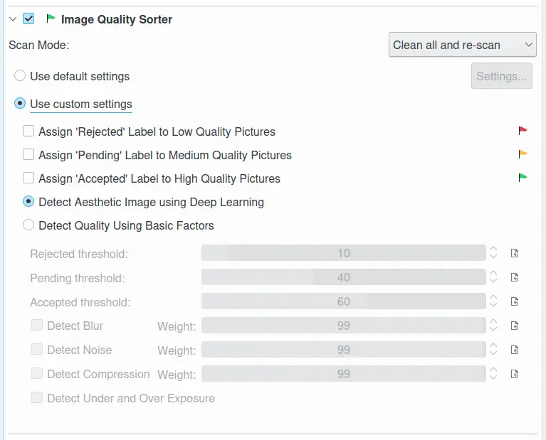
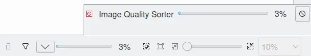
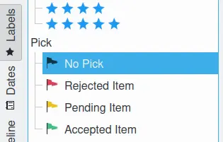

.. meta::
   :description: digiKam Maintenance Tool to Sort Image by Quality
   :keywords: digiKam, documentation, user manual, photo management, open source, free, learn, easy, quality, pick-label, deep-learning

.. metadata-placeholder

   :authors: - digiKam Team

   :license: see Credits and License page for details (https://docs.digikam.org/en/credits_license.html)

.. _maintenance_quality:

:ref:`Image Quality Sorter <maintenance_tools>`
===============================================

    The digiKam Maintenance Options for Image Quality Sorter

The **Image Quality Sorter** tool automatically assesses the **Quality** of each item and assigns a corresponding value to the **Pick Label** property in the database based on:

   - The **Red** flag for **Rejected**.

   - The **Yellow** flag for **Pending**.

   - The **Green** flag for **Accepted**.

The Image Quality Sorter assigns Pick Labels to items according to the default settings in :menuselection:`Settings --> Configure digiKam... --> Image Quality Sorter page`, or the dedicated options set in this view.

The quality **score** to determine the **Pick Label** property can be evaluated in one of two ways: using four basic factors for each image (**Blur**, **Noise**, **Exposure**, and **Compression**), or using a **deep learning neural network engine**.

The first approach helps to determine whether the basic factors have compromised image quality, however the output depends on fine-tuning made the user and it does not include any assessment of the aesthetic value of the image.

The second approach uses an artificial intelligence engine based on `this model <https://expertphotography.com/aesthetic-photography/>`_ to predict an aesthetic score. As deep-learning is an end-to-end solution, it doesn’t require hyper-parameter settings, which makes this approach far easier to use.

.. note::

    Since quality assessment can be a time consuming process, it's a good idea to check Work on all processor cores and restrict the job to certain albums or tags.

All the **Image Quality Sorter** settings are described in :ref:`this section <imgqsort_settings>` of the manual.

The **Scan Mode** settings configure how the database information for the items from the selected collection will be processed. **Clean all and re-scan** resets all data and scans all items from scratch, **Scan non-assigned only** will be faster to process just items that have not previously been assigned **Pick Labels**.

While the image quality sorting process is underway, a progress indicator is displayed in the bottom right corner of the main window.

    The digiKam Image Quality Sorter Process Running in the Background

The quality sorting results will appears in :ref:`the Labels view <labels_view>` from the right sidebar.

    The digiKam Pick Labels from Left Sidebar

.. important::

   To run properly, the process needs access to the deep-learning model that can be downloaded at the first run of digiKam. See the :ref:`Quick Start <quick_start>` section of this manual for details.
