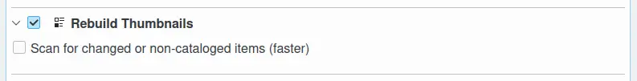
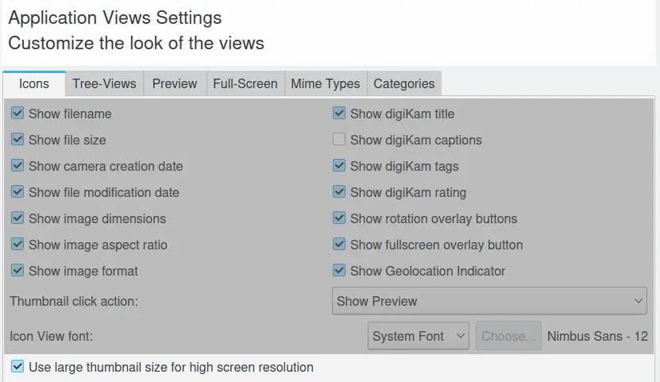
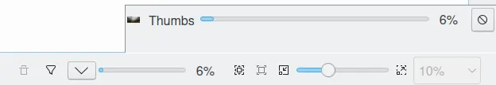

.. meta::
   :description: digiKam Maintenance Tool to Rebuild Thumbnails
   :keywords: digiKam, documentation, user manual, photo management, open source, free, learn, easy, maintenance, thumbnails

.. metadata-placeholder

   :authors: - digiKam Team

   :license: see Credits and License page for details (https://docs.digikam.org/en/credits_license.html)

.. _maintenance_thumbnails:

:ref:`Rebuild Thumbnails <maintenance_tools>`
=============================================

    The digiKam Maintenance Options to Rebuild Thumbnails

digiKam automatically generates and maintains thumbnails, but the **Rebuild Thumbnail** tool might be required if you have worked on your images with other applications or if you have changed the thumbnail size.

From :menuselection:`Settings --> Configure digiKam... --> View page --> Tree-Views tab`, the option **Use Large Thumbnail Size for High Screen Resolution** can be turned on to render **Icon-View** with a large thumbnail size suitable for use on a 4K monitor. By default this option is turned off and the maximum thumbnail size is limited to 256x256 pixels.

When this option is enabled, thumbnail size can be extended to 512x512 pixels. This option will increase the size of the thumbnail database and will use more system memory. digiKam needs to be restarted for this option to take effect, and this **Rebuild Thumbnails** tool needs to be run over all collections.

    The digiKam Views Setup Panel and the Large Thumbnail Option

.. important::

   digiKam stores thumbnails in the database using the wavelet-compressed PGF format, but large collections can still generate huge thumbnail databases. Take care to use a sufficiently large storage media with a large amount of available space to store the database.

.. note::

    The **Scan** options from :menuselection:`Settings --> Configure digiKam... --> Miscelleneous page --> Behaviour tab` speed up the process in the first case or if you just added pictures to your collection.

While the rebuild thumbnails process is underway, a progress indicator is displayed in the bottom right corner of the main window.

    The Rebuild Thumbnails Process Working in the Background

.. note::

    This process can also be directly called by the keyboard shortcut :kbd:`F5` to rebuild the thumbnails for the currently selected album.
