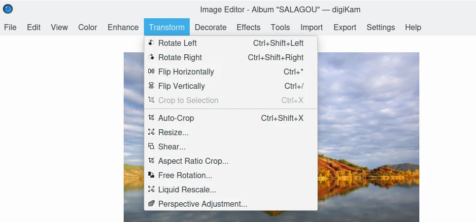

.. meta::
   :description: digiKam Image Editor Menu Descriptions
   :keywords: digiKam, documentation, user manual, photo management, open source, free, learn, easy, menu, image editor

.. metadata-placeholder

   :authors: - digiKam Team

   :license: see Credits and License page for details (https://docs.digikam.org/en/credits_license.html)

.. _menu_imageeditor:

Image Editor Menu
=================

.. contents::

    The digiKam Image Editor Menu

.. tip::

    .. |icon_hamburger| image:: images/menu_icon_hamburger.webp

    When switching in **Full-Screen Mode** :kbd:`Ctrl+Shift+F`, or when you **Hide Menubar** :kbd:`Ctrl+M`, the main menu will be available on the right side of tool-bar with the **Hamburger Button** |icon_hamburger|.

.. _menu_editorfile:

The File Menu
-------------

:menuselection:`File --> Back` :kbd:`PgUp`

    Display the previous image of the current Album.

:menuselection:`File --> Forward` :kbd:`PgDn`

    Display the next image of the current Album.

:menuselection:`File --> First` :kbd:`Ctrl+Home`

    Display the first image of current Album.

:menuselection:`File --> Last` :kbd:`Ctrl+End`

    Display the last image of current Album.

:menuselection:`File --> Save` :kbd:`Ctrl+S`

    Save the current image if it has been modified.

:menuselection:`File --> Save As...`

    Save the current image in a new file.

:menuselection:`File --> Revert`

    Restore the current image from the original file if it has been modified.

:menuselection:`File --> Move to trash` :kbd:`Del`

    Move to trash the current image from the current Album (recoverable delete).

    .. note::

        To **Delete permanently** a file, use :kbd:`Shift+Del`

:menuselection:`File --> Print Image...` :kbd:`Ctrl+P`

    Print the current image.

:menuselection:`File --> Quit` :kbd:`Ctrl+Q`

    Quit digiKam Image Editor.

.. _menu_editoredit:

The Edit Menu
-------------

:menuselection:`Edit --> Copy` :kbd:`Ctrl+C`

    Copy the current image selection in the clipboard.

:menuselection:`Edit --> Undo` :kbd:`Ctrl+Z`

    Cancel the last action applied to the current image using history.

:menuselection:`Edit --> Redo` :kbd:`Ctrl+Shift+Z`

    Redo the last action applied to the current image using history.

:menuselection:`Edit --> Select All` :kbd:`Ctrl+A`

    Select whole image data from the canvas.

:menuselection:`Edit --> Select None` :kbd:`Ctrl+Shift+A`

    Cancel selection of image data from the canvas.

.. _menu_editorcolor:

The Color Menu
--------------

:menuselection:`Color --> Auto-Correction` :kbd:`Ctrl+Shift+B`

    :ref:`Automatic color/exposure correction <color_auto>` of the current image by an histogram manipulation.

:menuselection:`Color --> White Balance`

    Image Editor tool to adjust :ref:`white color balance <color_wb>` on the current image.

:menuselection:`Color --> Brightness/Contrast/Gamma`

    Exposure correction of the current image by :ref:`Brightness, Contrast, or Gamma adjustments <color_bcg>`.

:menuselection:`Color --> Hue/Saturation/Lightness` :kbd:`Ctrl+U`

    Color correction of the current image by :ref:`Hue, Saturation, or Lightness adjustments <color_hsl>`.

:menuselection:`Color --> Color Balance` :kbd:`Ctrl+B`

    Color correction of the current image by :ref:`Red, Green, or Blue adjustments <color_balance>`.

:menuselection:`Color --> Curves Adjust`

    Image Editor tool to :ref:`adjust curves <color_curves>` manually on the current image.

:menuselection:`Color --> Levels Adjust`

    Image Editor tool to :ref:`adjust levels <color_levels>` manually on the current image.

:menuselection:`Color --> Channel Mixer`

    Image Editor tool to :ref:`mix color channels <color_mixer>` on the current image.

:menuselection:`Color --> Invert` :kbd:`Ctrl+I`

    :ref:`Invert <color_invert>` image colors.

:menuselection:`Color --> Black & White`

    Open the :ref:`Black and White <color_bw>` filter dialog for the current image.

:menuselection:`Color --> Color Management`

    Invokes the interactive :ref:`Color Management <color_cm>` editor.

:menuselection:`Color --> Depth`

    :ref:`Switch between 8 bit and 16 bit <color_depth>` format on color channels.

.. _menu_editorenhance:

The Enhance Menu
----------------

:menuselection:`Enhance --> Sharpen`

    :ref:`Image sharpening <enhance_sharpen>` improvements tool.

:menuselection:`Enhance --> Blur`

    :ref:`Image softening <enhance_blur>` operation by blurring.

:menuselection:`Enhance --> Red Eye Reduction`

    :ref:`Red Eye correction <enhance_redeyes>` tool using the current selection.

:menuselection:`Enhance --> Lens Auto-Corrections`

    Image Editor tool to correct :ref:`lens distortion automatically <enhance_lensauto>` of the current image.

:menuselection:`Enhance --> Noise Reduction`

    Image Editor tool to :ref:`reduce the noise <enhance_nr>` with a Wavelets filter.

:menuselection:`Enhance --> Restoration`

    Image Editor tool to :ref:`reduce artifacts <enhance_restoration>` on the current image.

:menuselection:`Enhance --> Local Contrast`

    Image Editor tool to apply a :ref:`Tone-Mapping filter <enhance_localcontrast>` on the current image.

:menuselection:`Enhance --> Hot Pixels Correction`

    Image Editor tool to :ref:`remove hot pixels <enhance_hotpixels>` on the current image.

:menuselection:`Enhance --> Anti Vignetting`

    Image Editor tool to :ref:`correct vignetting <enhance_vignetting>` of the current image.

:menuselection:`Enhance --> Distortion`

    Image Editor tool to correct :ref:`lens distortion manually <enhance_lensdistortion>` of the current image.

:menuselection:`Enhance --> Healing Clone`

    Image Editor tool to :ref:`fix artifacts by cloning region <enhance_clone>` in the current image.

:menuselection:`Enhance --> G'MIC-Qt`

    Image Editor tool to :ref:`select and apply a filter from the powerful G'MIC-Qt tool <enhance_gmicqt>` on the current image.

.. _menu_editortransform:

The Transform Menu
------------------

:menuselection:`Transform --> Rotate --> -90 degrees` :kbd:`Ctrl+Shift+Left`

    :ref:`Left rotation <transform_rotationflip>` of the current image.

:menuselection:`Transform --> Rotate --> 90 degrees` :kbd:`Ctrl+Shift+Right`

    :ref:`90 degrees rotation <transform_rotationflip>` of the current image.

:menuselection:`Transform --> Free Rotation`

    Image Editor tool to :ref:`rotate <transform_freerotation>` the current image by any angle in degrees.

:menuselection:`Transform --> Flip --> Horizontally` :kbd:`Ctrl+*`

    :ref:`Horizontal flip <transform_rotationflip>` of the current image.

:menuselection:`Transform --> Flip --> Vertically` :kbd:`Ctrl+/`

    :ref:`Vertical flip <transform_rotationflip>` of the current image.

:menuselection:`Transform --> Crop` :kbd:`Ctrl+X`

    :ref:`Crop <transform_crop>` image to the current selection.

:menuselection:`Transform --> Resize`

    :ref:`Resize <transform_resize>` (reduce or blow-up) the current image to the appropriate factor or dimensions.

:menuselection:`Transform --> Aspect Ratio Crop`

    Crop the current image using an :ref:`constrained aspect ratio <transform_proportionalcrop>`.

:menuselection:`Transform --> Shear`

    Image Editor tool to :ref:`Shear <transform_shear>` the current image horizontally or vertically.

:menuselection:`Transform --> Perspective Adjustment`

    Image Editor tool to adjust :ref:`Perspective <transform_perspective>` of the current image.

:menuselection:`Transform --> Liquid Rescale`

    Image Editor tool to adjust :ref:`resizing pictures non uniformly while preserving their features <transform_liquidrescale>` of the current image. 

.. _menu_editordecorate:

The Decorate Menu
-----------------

:menuselection:`Decorate --> Apply Texture`

    Image Editor tool to :ref:`apply decorative texture <decorate_texture>` over the current image.

:menuselection:`Decorate --> Add Border`

    Image Editor tool to :ref:`add a decorative border <decorate_border>` around the current image.

:menuselection:`Decorate --> Insert Text`

    Image Editor tool to :ref:`insert text <decorate_inserttext>` over the current image.

.. _menu_editoreffects:

The Effects Menu
----------------

:menuselection:`Effects --> Color Effects`

    Image Editor :ref:`color effects <effects_color>` tool.

:menuselection:`Effects --> Add Film Grain`

    Image Editor filter for to :ref:`adding Film Grain <effects_filmgrain>`.

:menuselection:`Effects --> Oil paint`

    Image Editor filter to :ref:`simulate Oil Painting <effects_oilpaint>`.

:menuselection:`Effects --> Charcoal Drawing`

    Image Editor filter to :ref:`simulate Charcoal Drawing <effects_charcoal>`.

:menuselection:`Effects --> Emboss`

    Image Editor :ref:`Emboss filter <effects_emboss>`. 

:menuselection:`Effects --> Distortion Effects`

    Image Editor filter set with :ref:`distortion special effects <effects_distortion>`.

:menuselection:`Effects --> Blur Effects`

    Image Editor filter set with :ref:`blurring special effects <effects_blur>` on.

:menuselection:`Effects --> Raindrops`

    Image Editor filter to :ref:`add Rain Drops <effects_raindrops>`.

.. _menu_editorview:

The Tools Menu
--------------

See description from :ref:`Main Window <menu_maintools>` section about Generic plugins.

The Import Menu
---------------

See description from :ref:`Main Window <menu_mainimport>` section about Import plugins.

The Export Menu
---------------

See description from :ref:`Main Window <menu_mainexport>` section about Export plugins.

The View Menu
-------------

:menuselection:`View --> Zoom In` :kbd:`Ctrl++`

    Increase the zoom factor on the current image.

:menuselection:`View --> Zoom Out` :kbd:`Ctrl+-`

    Decrease the zoom factor on the current image.

:menuselection:`View --> Fit to Window` :kbd:`Ctrl+Shift+A`

    Toggle between fit-to-window zoom or 100% image zoom size.

:menuselection:`View --> Fit to Selection` :kbd:`Ctrl+Shift+S`

    Make the selection fit the window.

**Slideshow** option is the same entry available in :ref:`Main Window <menu_mainslideshow>`.

**Presentation** option is the same entry available in :ref:`Main Window <menu_mainpresentation>`.

**OpenGL Image Viewer** option is the same entry available in :ref:`Main Window <menu_mainopenglviewer>`.

**Full Screen Mode** option is the same entry available in :ref:`Main Window <menu_mainfullscreen>`.

**Color Managed View** option is the same entry available in :ref:`Main Window <menu_maincolormanaged>`.

The Settings Menu
-----------------

See description from :ref:`Main Window <menu_mainsettings>` section.

The Help Menu
-------------

See description from :ref:`Main Window <menu_mainhelp>` section.
