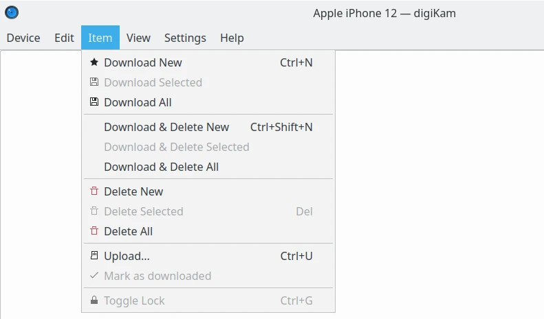
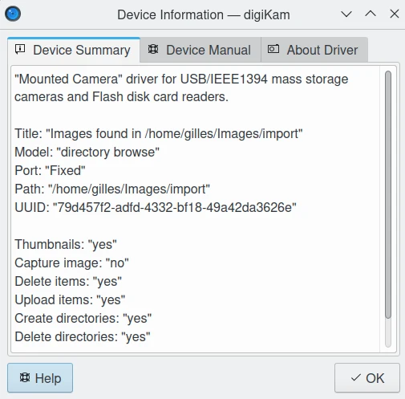

.. meta::
   :description: digiKam Import Tool Menu Descriptions
   :keywords: digiKam, documentation, user manual, photo management, open source, free, learn, easy, menu, import tool

.. metadata-placeholder

   :authors: - digiKam Team

   :license: see Credits and License page for details (https://docs.digikam.org/en/credits_license.html)

.. _menu_importtool:

Import Tool Menu
================

.. contents::

    The digiKam Import Tool Menu

.. tip::

    .. |icon_hamburger| image:: images/menu_icon_hamburger.webp

    When switching in **Full-Screen Mode** :kbd:`Ctrl+Shift+F`, or when you **Hide Menubar** :kbd:`Ctrl+M`, the main menu will be available on the right side of tool-bar with the **Hamburger Button** |icon_hamburger|.

The Device Menu
---------------

:menuselection:`Device --> Capture`

    Perform a tethered shooting ith your camera (supported only by `GPhoto2 devices <http://gphoto.org/doc/remote/>`_).

:menuselection:`Device --> Information`

    Show current device information as drivers version and features.

    The digiKam Import Tool Device Information Dialog

:menuselection:`Device --> Cancel`

    Cancel all operations done in background with the device, as thumbnails loading, downloading files, renaming, etc.

:menuselection:`Device --> Close` :kbd:`Ctrl+W`

    Close digiKam Import Tool.

The Edit Menu
-------------

The Item Menu
-------------

The View Menu
-------------

**Full Screen Mode** option is the same entry available in :ref:`Main Window <menu_mainfullscreen>`.

**Color Managed View** option is the same entry available in :ref:`Main Window <menu_maincolormanaged>`.

The Settings Menu
-----------------

See description from :ref:`Main Window <menu_mainsettings>` section.

The Help Menu
-------------

See description from :ref:`Main Window <menu_mainhelp>` section.
