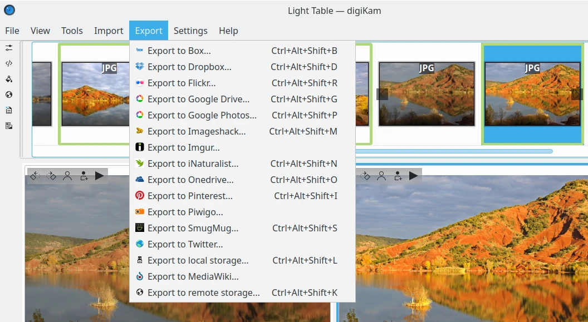

.. meta::
   :description: digiKam Light Table Menu Descriptions
   :keywords: digiKam, documentation, user manual, photo management, open source, free, learn, easy, menu, light table

.. metadata-placeholder

   :authors: - digiKam Team

   :license: see Credits and License page for details (https://docs.digikam.org/en/credits_license.html)

.. _menu_lighttable:

Light Table Menu
================

.. contents::

    The digiKam Light Table Menu

.. note::

    When switching in **Full-Screen Mode**, the menu will be accessible on the right side of tool-bar with the **Hamburger Button**.

The File Menu
-------------

The View Menu
-------------

**Full Screen Mode** option is the same entry available in :ref:`Main Window <menu_mainfullscreen>`.

**Slideshow** option is the same entry available in :ref:`Main Window <menu_mainslideshow>`.

**Presentation** option is the same entry available in :ref:`Main Window <menu_mainpresentation>`.

**OpenGL Image Viewer** option is the same entry available in :ref:`Main Window <menu_mainopenglviewer>`.

**Color Managed View** option is the same entry available in :ref:`Main Window <menu_maincolormanaged>`.

The Tools Menu
--------------

See description from :ref:`Main Window <menu_maintools>` section about Import plugins.

The Import Menu
---------------

See description from :ref:`Main Window <menu_mainimport>` section about Import plugins.

The Export Menu
---------------

See description from :ref:`Main Window <menu_mainexport>` section about Export plugins.

The Settings Menu
-----------------

See description from :ref:`Main Window <menu_mainsettings>` section.

The Help Menu
-------------

See description from :ref:`Main Window <menu_mainhelp>` section.
