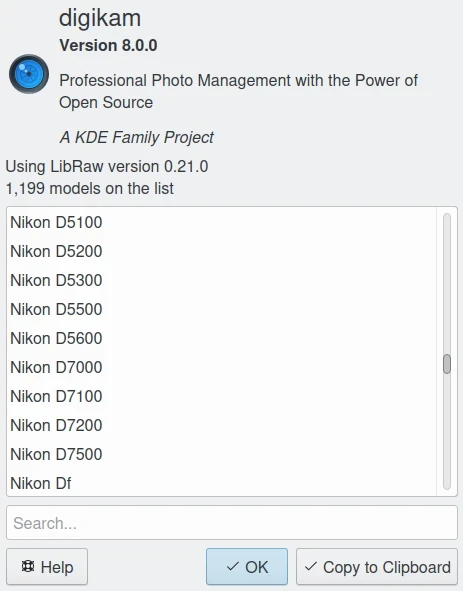
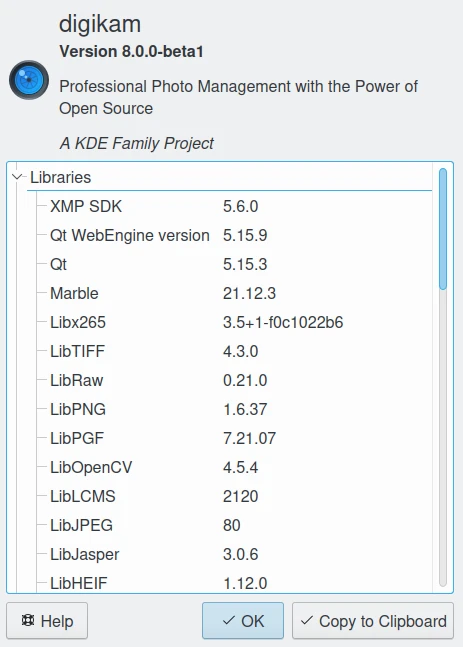
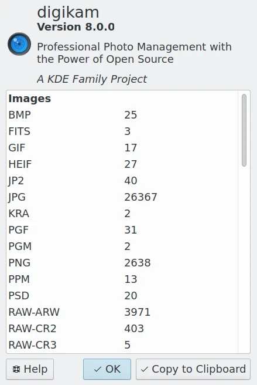
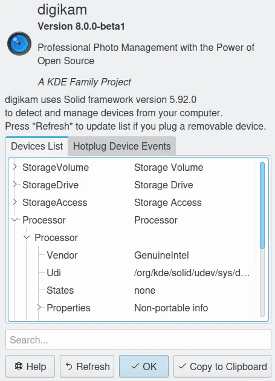

.. meta::
   :description: digiKam Main Window Menu Descriptions
   :keywords: digiKam, documentation, user manual, photo management, open source, free, learn, easy, menu, main window

.. metadata-placeholder

   :authors: - digiKam Team (see Credits and License for details)

   :license: Creative Commons License SA 4.0

.. _menu_mainwindow:

Main Window Menu
================

.. contents::

The Browse Menu
---------------

The Browse menu provides access to the same views you can see on the Left Sidebar. Descriptions see under The Main digiKam Window. In addition there are "Back" and "Forward" menu items that will lead you through the history of your digiKam use in the same way you are used to from an internet browser for example. And finally there is the "Quit" item to leave digiKam.

The Album Menu
--------------

The first five items of this menu (above the separator) are only active if you are in the Albums View.

Album --> New... (Ctrl+N)

    Opens a dialog to create a new album folder similar to the album properties dialog described here. It just has an additional drop down field where you can choose whether the new album is created as a child of the current one or at the root of the current collection.

Album --> Properties

    Edit the currently selected album title, caption and collection as described here.

Album --> Rename (F5)

    Rename the current album.

Album --> Open in File Manager

    Open the default file manager with the current Album path.

Album --> Delete Album

    Delete/Move to trash selected Album and all items in it.

Album --> Write Metadata to Images

    Write the metadata in the database to the file's metadata of all items in the current album. The images will inherit the database metadata, not the other way round as in the next menu item.

Album --> Reread Metadata From Images

    Write the metadata of all items in the current album to the database. The database will inherit the images metadata, not the other way round as in the previous menu item.

The Tag Menu
------------

The items below the separator are only active if you are in the Tags View.

Tag --> Tag Manager

    Opens the digiKam Tag Manager.

Tag --> New...

    A dialog will open where you can type in the tag name (or even a whole hierarchy branch), assign an icon and/or a shortcut to the tag. The new tag will be created as a sub-tag of the selected tag.

Tag --> Properties

    The Tag Properties allow you to change the name of the tag, the icon used in the Tags tree and the shortcut.

Tag --> Delete

    Remove the currently selected Tag from the Album's Database. This doesn't delete the images the tag was assigned to.

The Item Menu
-------------

Item --> Open... (F4)

    Opens the selected image in the digiKam image editor.

Item --> Open With Default Application (Meta-F4)

    Opens the selected item in the default application according to the mimetype, e.g. Gwenview.

Item --> Rename (F2)

    Renames the currently selected item(s). See description here. 

Item --> Move to trash (Del)

    Moves selected item(s) to trash (recoverable delete).

Item --> Place onto Light Table (Ctrl-L)

    Inserts selection into the Light Table thumbbar and puts the Light Table into the foreground.

Item --> Add to Light Table (Ctrl-Shift-L)

    Adds selection to the Light Table thumbbar and puts the Light Table into the foreground.

Item --> Add to Current Queue (Ctrl-B)

    Opens the digiKam Batch Queue Manager and adds selection to the current queue or, if there is no queue yet, to a new queue.

Item --> Add to New Queue (Ctrl-Shift-B)

    Opens the digiKam Batch Queue Manager and puts selection into a new queue.

Item --> Find Similar...

    Puts the selected item into the Image tab in the Fuzzy View.

    See the dedicated Image (Similar items) for more information. 

Item --> Write Metadata to Image

    When editing files outside digiKam, the database will not be triggered to update information. If you want to scan items and backport changes in the database you got to use this function first.

Item --> Reread Metadata from Image

    When editing metadata using the Metadata Editor the data will be written to the image only. If you want them to appear in the Metadata Tab of the Right Sidebar you got to use this function first.

Item --> Rotate

    Menu entry for rotating the currently selected images lossless Left (Ctrl-Shift-Left) or Right (Ctrl-Shift-Right) in 90 degree steps (see submenu). 

Item --> Flip

    Menu entry for flipping the currently selected images lossless Horizontally (Ctrl-\*) or Vertically (Ctrl-/) (see submenu).

Item --> Auto Rotate/Flip using EXIF information

    Menu entry to manually activate the auto rotate/flip feature for the currently selected images using the EXIF orientation tag. For a more detailed description see Lossless Image Rotation. 

Item --> Adjust EXIF Orientation Tag

    The EXIF Orientation Tag of the current selection will be changed depending on the option you choose from the submenu. The thumbnail(s) and preview(s) will be rotated accordingly if Show images/thumbnails rotated according to orientation tag is checked in Settings --> Configure digiKam... --> Metadata --> Rotation --> Rotate actions , but not the actual image file. If you want to rotate that as well you got to use the function Item --> Auto Rotate/Flip using EXIF information described above additionally. If you open the file in the digiKam Image Editor it will also come up in the rotated version and will be stored that way on disc if you save it. But be aware of the fact that this would be a lossy operation as long as it is not a lossless file format.

Item --> Edit Metadata...

    Opens the digiKam Metadata Editor to handle meta data of the image (EXIF, IPTC, XMP).

    See the dedicated Metadata Editor chapter for more information. 

Item --> Edit Geolocation...

    Opens the digiKam Geolocation Editor to handle GPS meta data of the image.

    See the dedicated Geolocation Tool for more information. 

Item --> Print

    Calls standard print dialog. 

Item --> Print Assistant...

    Tool to print Album images.

    See the dedicated Print Wizard for more information. 

.. note::

    Another very useful function on items is grouping which is at the time of writing only available through the context menu on a selection of items. For details see Grouping Photographs in the chapter about the Main digiKam Window.

The Edit Menu
-------------

Beside the usual "Cut", "Copy" and "Paste" the Edit Menu contains the following items:

Edit --> Select All (Ctrl+A)

    Select all images currently shown

Edit --> Select None (Ctrl+Shift+A)

    Un-select all items in the current view

Edit --> Invert Selection (Ctrl+I)

    Invert the current selection

The View Menu
-------------

View --> Thumbnails

    Shows thumbnails in the Image Area

View --> Preview Image (F3)

    Shows additionally a preview in the Image Area.

    The preview has "Back" and "Forward" buttons at the top left corner to navigate through all the images currently shown. 

View --> Map

    Shows images on a map.

View --> Table

    Shows images in a table where you can choose by right clicking on the title bar which information you want to be displayed.

    By default you have these four items also on the main toolbar. 

View --> Slideshow

    Slide Show including RAW files.

View --> Slideshow --> All (F9)

    Start slide show of all images in current window.

View --> Slideshow --> Selection (Alt+F9)

    Start slide show on selected images.

View --> Slideshow --> With All Sub-Albums (Shift+F9)

    Slide show that recurses through the current album tree.

View --> Slideshow --> Presentation... (Alt+Shift+F9)

    Tool to display an advanced slide show with Album items.

    See the dedicated Presentation Tool for more information. 

View --> Full Screen Mode (Ctrl+Shift+F)

    Switch to full screen (Return with the same keyboard shortcut).

View --> Zoom in (Ctrl++,+)

    Increase preview or the thumbnail size of the currently selected Album.

View --> Zoom out (Ctrl+-,-)

    Decrease preview or the thumbnail size of the currently selected Album.

View --> Zoom to 100% (Ctrl+,)

    Will show the image 1:1 (meaning 1 image pixel is mapped exactly to 1 screen pixel) in preview mode.

View --> Fit to Window (Ctrl+Alt+E)

    Will size the image as to fit snug into the window.

View --> Sort Albums

    Sort all digiKam Albums by Folder, by Category or by Date.

View --> Sort Images

    Sort all images in current Album by:

        - Name.
        - Path.
        - Creation Date.
        - Modification Date.
        - File Size.
        - Rating.
        - Image Size.
        - Aspect Ratio.
        - Face Type.
        - Similarity (only in the Fuzzy View).
        - Manual and Name.
        - Manual and Date.

View --> Image Sorting Order

    Select whether images should be sorted in ascending or descending order.

View --> Group Images

    Select whether images should be shown un-grouped (Flat List) or grouped by album or by format.

View --> Group Sorting Order

    Select whether groups should be sorted in ascending or descending order.

View --> Include Album Sub-Tree

    If a hierarchical album structure exists, the currently selected branch will be displayed in full depth.

View --> Include Tag Sub-Tree

    If a hierarchical tag structure exists, the currently selected branch will be displayed in full depth.

View --> Color-Managed View (F12)

    Toggles between showing thumbnails and preview in color-managed mode or not.

    For more information about color management see this lengthy chapter. 

The Tools Menu
--------------

Tools --> Image Editor

    Opens the digiKam Image Editor. 

Tools --> Light Table (L)

    Switches to the Light Table window. 

Tools --> Batch Queue Manager (B)

    Opens the Batch Queue Manager window. 

Tools --> Search... (Ctrl+F)

    Switches to the Search View with focus on the simple search field. 

Tools --> Advanced Search... (Ctrl+Alt+F)

    Switches to the Search View and launches the advanced search dialog. 

Tools --> Find Duplicates (Ctrl+D)

    Leads to the "Duplicates" tab in the Fuzzy View.

    See Fuzzy View for more information. 

Tools --> Maintenance...

    Opens the maintenance tool.

    For a detailed description see this Chapter 

Tools --> Blend Bracketed or Focus Stack Images...

    This tool allows users to blend bracketed images together to create pseudo HDR photo.

Tools --> Create Panorama...

    This tool allows users to assemble images together to create large panorama.

Tools --> Create Calendar...

    Tool to create a calendar with Album items.

    See the dedicated Calendar Tool for more information. 

Tools --> Email Images...

    Tool to send images with your favorite email client.

    See the dedicated Send Images Tool for more information. 

The Import Menu
---------------

Import --> Cameras

    Any configured digital camera will be listed here. You can use the "Add Camera Manually..." menu entry to add a new camera to the list. Please, read the Camera Settings for more information.

    Once you choose a camera from the list the Camera Interface will open. For a detailed description see Using a Digital Camera With digiKam.. 

Import --> USB Storage Devices

    All currently mounted USB storage devices will be listed here. The function will open the same interface as the Import/Cameras menu item.

Import --> Card Readers

    All currently mounted card readers will be listed here. The function will open the same interface as the Import/Cameras menu item.

Import --> Add Images... (Ctrl+Alt+I)

    After asking for the source folder with the standard Open dialog of your OS the function will display the images in that folder in the same interface as the Import/Cameras menu item.

    This item is only active in the Albums View. 

Import --> Add Folders...

    Navigate to a folder and import it entirely

    This item is only active in the Albums View. 

Import --> Import from Scanner...

    Opens a scanner dialog

    See the dedicated Acquire Images Tool for more information. 

Import --> Import from ...

    Here are following the import menu items for the webservices you have chosen in

    Settings --> Configure digiKam... --> Tools and which are labeled “Export” in the “Categories” column. 

The Export Menu
---------------

Tools --> Export to Piwigo

    Tool to upload or update images to Piwigo galleries

    See the dedicated Piwigo Export Tool for more information. 

Export --> Export to Flickr...

    Tool to upload or update images to Flickr server.

    See the dedicated Flickr Export Tool for more information. 

Export --> Export to Google Photos...

    Tool upload or update images to Google Photos galleries.

    See the dedicated Google Services Tool for more information. 

Export --> Export to Google Drive...

    Tool upload images to Google Drive.

    See the dedicated Google Services Tool for more information. 

The Settings Menu
-----------------

Settings --> Show Toolbar

    Enable or disable the main digiKam toolbar.

Settings --> Show Menubar (Ctrl+M)

    Enable or disable the main digiKam menu bar.

    Remind the keyboard shortcut in order to be able to get it back! Another way is the context menu within the Image Area. 

Settings --> Show Statusbar

    Enable or disable the main digiKam status bar.

Settings --> Show Thumbbar (Ctrl+T)

    Enable or disable the thumbbar in the digiKam Image Area.

    This item is only active while a preview is displayed because it is meant to make more space for the preview in the Image Area. 

Settings --> Themes

    Choose from a list (submenu) of predefined color themes for the appearance of digiKam.

Settings --> Configure Shortcuts...

    Configure the digiKam shortcuts and manage different schemes of shortcuts.

Settings --> Configure Toolbars...

    Configure the digiKam toolbars.

Settings --> Configure Notifications...

    Configure the digiKam notifications including actions like "Play a sound", "Log to a file" or "Run command".

Settings --> Database Migration...

    Launch tool to migrate the digiKam databases from SQLite to MySQL or vice versa.

    Find more information about the databases and database migration in the setup section about digiKam databases. 

Settings --> Configure digiKam...

    Launch digiKam configure dialog.

    For a detailed description see digiKam Configuration. 

The Help Menu
-------------

Help --> Supported RAW Camera

    Displays a list of all supported RAW camera.

Help --> Components Information

    Displays an information panel with shared libraries and components.

Help --> Database Statistics

    Displays an information panel with a database summary.

Help --> Detected Hardware

    Displays an information panel with the detected hardware from your computer.

