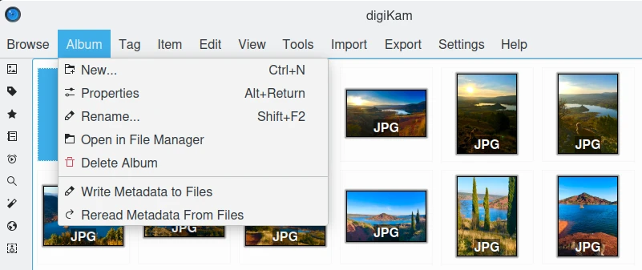
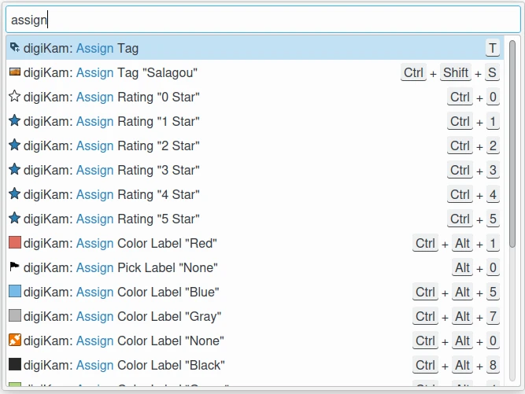

.. meta::
   :description: digiKam Main Window Menu Descriptions
   :keywords: digiKam, documentation, user manual, photo management, open source, free, learn, easy, menu, main window

.. metadata-placeholder

   :authors: - digiKam Team

   :license: see Credits and License page for details (https://docs.digikam.org/en/credits_license.html)

.. _menu_mainwindow:

:ref:`Main Window Menu <menu_descriptions>`
===========================================

.. contents::

    The digiKam Main Window Menu

.. tip::

    .. |icon_hamburger| image:: images/menu_icon_hamburger.webp

    When switching into **Full-Screen Mode** :kbd:`Ctrl+Shift+F`, or when you **Hide Menubar** :kbd:`Ctrl+M`, the main menu will be available on the right side of the toolbar with the **Hamburger Button** |icon_hamburger|.

The Browse Menu
---------------

The Browse menu provides access to the same views you can see on the :ref:`Left Sidebar <main_window>`, accessible through  :kbd:`Ctrl+Shift+Fn` (with *Fn* equals :kbd:`F1`, :kbd:`F2`, :kbd:`F3`, etc.). In addition there are **Back** :kbd:`Alt+Left` and **Forward** :kbd:`Alt+Right` menu items that will lead you through the history of your digiKam use in the same way you are used to from an internet browser for example. And finally there is the **Quit** :kbd:`Ctrl+Q` item to leave digiKam.

.. _menu_mainalbum:

The Album Menu
--------------

The first five items of this menu (above the separator) are only active if you are in the Albums View.

:menuselection:`Album --> New...` :kbd:`Ctrl+N`

    Opens a dialog to create a new album folder similar to the album properties dialog described :ref:`there <managing_albums>`. It just has an additional drop down field where you can choose whether the new album is created as a child of the current one or at the root of the current collection.

:menuselection:`Album --> Properties`

    Edit the currently selected album title, caption and collection as described here.

:menuselection:`Album --> Rename` :kbd:`F5`

    Rename the current album.

:menuselection:`Album --> Open in File Manager`

    Open the default file manager with the current Album path.

:menuselection:`Album --> Delete Album`

    Delete/Move to trash selected Album and all items in it.

:menuselection:`Album --> Write Metadata to Images`

    Write the metadata in the database to the file's metadata of all items in the current album. The images will inherit the database metadata, not the other way round as in the next menu item.

:menuselection:`Album -->Reread Metadata From Images`

    Write the metadata of all items in the current album to the database. The database will inherit the images metadata, not the other way round as in the previous menu item.

.. _menu_maintag:

The Tag Menu
------------

The items below the separator are only active if you are in the Tags View.

:menuselection:`Tag --> Tag Manager`

    Opens the digiKam :ref:`Tag Manager <tag_manager>`.

:menuselection:`Tag --> New...`

    A dialog will open where you can type in the tag name (or even a whole hierarchy branch), assign an icon and/or a shortcut to the tag. The new tag will be created as a sub-tag of the selected tag.

:menuselection:`Tag --> Properties`

    The Tag Properties allow you to change the name of the tag, the icon used in the Tags tree and the shortcut.

:menuselection:`Tag --> Delete`

    Remove the currently selected Tag from the Album's Database. This doesn't delete the images the tag was assigned to.

.. _menu_mainitem:

The Item Menu
-------------

:menuselection:`Item --> Open...` :kbd:`F4`

    Opens the selected image in the digiKam :ref:`Image Editor <image_editor>`.

:menuselection:`Item --> Open With Default Application` :kbd:`Meta-F4`

    Opens the selected item in the default application according to the mime-type set in your desktop.

:menuselection:`Item --> Rename` :kbd:`F2`

    Renames the currently selected item(s). See description :ref:`here <renaming_photograph>`.

:menuselection:`Item --> Move to trash` :kbd:`Del`

    Moves selected item(s) to the :ref:`digiKam Trash <deleting_photograph>` (recoverable delete).

    .. note::

        To **Delete permanently** a file, use :kbd:`Shift+Del`

:menuselection:`Item --> Place onto Light Table` :kbd:`Ctrl-L`

    Inserts selection into the :ref:`Light Table <light_table>` thumbbar and puts the Light Table into the foreground.

:menuselection:`Item --> Add to Light Table` :kbd:`Ctrl-Shift-L`

    Adds selection to the :ref:`Light Table <light_table>` thumbbar and puts the Light Table into the foreground.

:menuselection:`Item --> Add to Current Queue` :kbd:`Ctrl-B`

    Opens the digiKam :ref:`Batch Queue Manager <batch_queue>` and adds selection to the current queue or, if there is no queue yet, to a new queue.

:menuselection:`Item --> Add to New Queue` :kbd:`Ctrl-Shift-B`

    Opens the digiKam :ref:`Batch Queue Manager <batch_queue>` and puts selection into a new queue.

:menuselection:`Item --> Find Similar...`

    Puts the selected item from the **Image** tab in the Similar View.

    See the dedicated :ref:`Similarity Search Tool <similarity_view>` for more information.

:menuselection:`Item --> Write Metadata to Image`

    When editing files outside digiKam, the database will not be triggered to update information. If you want to scan items and backport changes in the database you got to use this function first.

:menuselection:`Item --> Reread Metadata from Image`

    When editing metadata using the Metadata Editor the data will be written to the image only. If you want them to appear in the Metadata Tab of the Right Sidebar you got to use this function first.

:menuselection:`Item --> Rotate`

    Menu entry for rotating the currently selected images lossless Left :kbd:`Ctrl-Shift-Left` or Right :kbd:`Ctrl-Shift-Right` in 90 degree steps (see sub-menu).

:menuselection:`Item -->Flip`

    Menu entry for flipping the currently selected images lossless Horizontally :kbd:`Ctrl-\*` or Vertically :kbd:`Ctrl-/` (see sub-menu).

:menuselection:`Item --> Auto Rotate/Flip using Exif information`

    Menu entry to manually activate the auto rotate/flip feature for the currently selected images using the Exif orientation tag. For a more detailed description see :ref:`Lossless Image Rotation <lossless_rotation>`.

:menuselection:`Item --> Adjust Exif Orientation Tag`

    The Exif Orientation Tag of the current selection will be changed depending on the option you choose from the sub-menu. The thumbnail(s) and preview(s) will be rotated accordingly if **Show images/thumbnails rotated according to orientation** tag is checked in :menuselection:`Settings --> Configure digiKam... --> Metadata --> Rotation --> Rotate actions`, but not the actual image file. If you want to rotate that as well you got to use the function :menuselection:`Item --> Auto Rotate/Flip using Exif information` described above additionally. If you open the file in the digiKam Image Editor it will also come up in the rotated version and will be stored that way on disc if you save it. But be aware of the fact that this would be a lossy operation as long as it is not a lossless file format.

:menuselection:`Item --> Edit Metadata...`

    Opens the digiKam Metadata Editor to handle metadata of the image (Exif, IPTC, XMP).

    See the dedicated :ref:`Metadata Editor <metadata_editor>` chapter for more information.

:menuselection:`Item --> Edit Geolocation...`

    Opens the digiKam Geolocation Editor to handle GPS meta data of the image.

    See the dedicated :ref:`Geolocation Editor <geolocation_editor>` for more information.

:menuselection:`Item --> Print`

    Calls standard print dialog.

:menuselection:`Item --> Print Assistant...`

    Tool to print grouped images from Album.

    See the dedicated :ref:`Print Creator <print_creator>` for more information.

.. note::

    Another very useful function on items is grouping which is at the time of writing only available through the context menu on a selection of items. For details see :ref:`Grouping Photographs <grouping_photograph>` in the chapter about the digiKam **Main Window**.

.. _menu_mainedit:

The Edit Menu
-------------

Beside the usual **Cut**, **Copy** and **Paste** the Edit Menu contains the following items:

:menuselection:`Edit --> Select All` :kbd:`Ctrl+A`

    Select all images currently shown.

:menuselection:`Edit --> Select None` :kbd:`Ctrl+Shift+A`

    Un-select all items in the current view.

:menuselection:`Edit --> Invert Selection` :kbd:`Ctrl+I`

    Invert the current selection.

.. _menu_mainview:

The View Menu
-------------

.. _menu_mainviewthumbs:

:menuselection:`View --> Thumbnails`

    Shows thumbnails in the :ref:`Image View <image_view>`.

.. _menu_mainviewpreview:

:menuselection:`View --> Preview` :kbd:`F3`

    Shows additionally a :ref:`Preview <viewing_photograph>` in the **Image View**.

    The preview has **Back** and **Forward** buttons at the top left corner to navigate through all the items currently shown.

.. _menu_mainviewmap:

:menuselection:`View --> Map`

    Shows items on a map.

.. _menu_mainviewtable:

:menuselection:`View --> Table`

    Shows items in a table where you can choose by right clicking on the title bar which information you want to be displayed.

    By default you have these four items also on the main toolbar.

.. _menu_mainslideshow:

:menuselection:`View --> Slideshow`

    :ref:`Slide-Show <slide_tool>` including RAW files.

:menuselection:`View --> Slideshow --> All` :kbd:`F9`

    Start Slide-Show of all items in current window.

:menuselection:`View --> Slideshow --> Selection` :kbd:`Alt+F9`

    Start Slide-Show on selected items.

:menuselection:`View --> Slideshow --> With All Sub-Albums` :kbd:`Shift+F9`

    Slide-Show that recurses through the current album tree.

.. _menu_mainpresentation:

:menuselection:`View --> Presentation...` :kbd:`Alt+Shift+F9`

    Tool to display an advanced slide show with Album items.

    See the dedicated :ref:`Presentation Tool <presentation_tool>` for more information.

.. _menu_mainopenglviewer:

:menuselection:`View --> OpenGL Viewer`

    Tool to display items using OpenGL compatible device.

    See the dedicated :ref:`OpenGL Viewer <opengl_viewer>` for more information.

.. _menu_mainfullscreen:

:menuselection:`View --> Full Screen Mode` :kbd:`Ctrl+Shift+F`

    Switch to full screen (Return with the same keyboard shortcut).

.. note::

    You can access to the application menu using the **Hamburger Button** on the right side of toolbar.

    .. figure:: images/menu_fullscreen_hamburger.webp
        :alt:
        :align: center

        The Hamburger Menu Available in Full-Screen Mode

.. _menu_mainviewzoomin:

:menuselection:`View --> Zoom in` :kbd:`Ctrl++,+`

    Increase preview or the thumbnail size of the currently selected Album.

.. _menu_mainviewzoomout:

:menuselection:`View --> Zoom out` :kbd:`Ctrl+-,-`

    Decrease preview or the thumbnail size of the currently selected Album.

:menuselection:`View --> Fit to Window` :kbd:`Ctrl+Alt+E`

    Will size the item it fits snug into the window.

:menuselection:`View --> Zoom to 100%` :kbd:`Ctrl+,`

    Will show the item full size (meaning 1 item pixel is mapped exactly to 1 screen pixel) in preview mode.

:menuselection:`View --> Sort Albums`

    Sort all digiKam Albums by Folder, by Category or by Date.

:menuselection:`View --> Sort Images`

    Sort all images in current Album by:

        - Name: Compare by file name in alphabetical order.
        - Path: Compare by file path in alphabetical order.
        - Creation Date: Compare by camera creation date.
        - Modification Date: Compare by date modified by the computer.
        - File Size: Compare by file size in bytes.
        - Format: Compare by type-mime in alphabetical order.
        - Rating: Compare by Rating enumerate values.
        - Pick Label: Compare by Pick Label enumerate values.
        - Color Label: Compare by Color Label enumerate values.
        - Image Size: Compare by pixels number.
        - Orientation: Compare by Exif Rotation flag.
        - Aspect Ratio: Compare by aspect ratio computed as ((width / height) * 100000).
        - GPS Position: Compare by GPS location properties. If an image lacks GPS coordinates it is placed after images with GPS data. If both images lack GPS data, they are treated as equal. The primary sort is by latitude, followed by longitude if latitudes are equal.
        - Face Type: Compare by counting the number of unconfirmed faces.
        - Similarity: Compare by similarity results (only available in the Similarity Search View).
        - Manual and Name: Compare by the manual sorting order and the file name.
        - Manual and Date: Compare by the manual sorting order and the creation date.

:menuselection:`View --> Image Sorting Order`

    Select whether images should be sorted in ascending or descending order.

:menuselection:`View --> Separate Items`

    Select whether images should be shown un-grouped (Flat List), or grouped by album, by format, by faces, by month, and by day.

:menuselection:`View --> Separate Items Order`

    Select whether groups should be sorted in ascending or descending order.

:menuselection:`View --> Include Album Sub-Tree`

    If a hierarchical album structure exists, the currently selected branch will be displayed in full depth.

:menuselection:`View --> Include Tag Sub-Tree`

    If a hierarchical tag structure exists, the currently selected branch will be displayed in full depth.

.. _menu_maincolormanaged:

:menuselection:`View --> Color-Managed View` :kbd:`F12`

    Toggles between showing thumbnails and preview in color-managed mode or not.

    For more information about color management see :ref:`this <color_management>` lengthy chapter.

.. _menu_maintools:

The Tools Menu
--------------

:menuselection:`Tools --> Image Editor`

    Opens the digiKam Image Editor.

:menuselection:`Tools --> Light Table` :kbd:`L`

    Switches to the Light Table window.

:menuselection:`Tools --> Batch Queue Manager` :kbd:`B`

    Opens the Batch Queue Manager window.

:menuselection:`Tools --> Search...` :kbd:`Ctrl+F`

    Switches to the Search View with focus on the simple search field.

:menuselection:`Tools --> Advanced Search...` :kbd:`Ctrl+Alt+F`

    Switches to the Search View and launches the advanced search dialog.

:menuselection:`Tools --> Find Duplicates` :kbd:`Ctrl+D`

    Leads to the **Duplicates** tab in the Similarity Search View.

    See :ref:`Similarity Search Tool <similarity_view>` for more information.

:menuselection:`Tools --> Maintenance...`

    Opens the maintenance tool.

    For a detailed description see :ref:`this Chapter <maintenance_tools>`.

:menuselection:`Tools --> Blend Bracketed or Focus Stack Images...`

    This tool allows users to blend bracketed images together to create pseudo HDR photo.

:menuselection:`Tools --> Create Panorama...`

    This tool allows users to assemble images together to create large panorama.

:menuselection:`Tools --> Create Calendar...`

    Tool to create a calendar with Album items.

    See :ref:`this section <calendar_tool>` for more information.

:menuselection:`Tools --> Email Images...`

    Tool to send images with your favorite email client.

    See :ref:`this section <send_images>` for more information.

:menuselection:`Tools --> G'MIC-Qt (layers)`

    Tool to apply a G'MIC filter using stacked images as layers.

    See :ref:`this section <enhance_gmicqt_layers>` for more information.

.. _menu_mainimport:

The Import Menu
---------------

:menuselection:`Import --> Cameras`

    Any configured digital camera will be listed here. You can use the **Add Camera Manually...** menu entry to add a new camera to the list. Please, read the :ref:`Camera Settings <camera_settings>` section for more information.

    Once you choose a camera from the list the Camera Interface will open. For a detailed description see the :ref:`digiKam Import Tool <import_overview>`.

:menuselection:`Import --> USB Storage Devices`

    All currently mounted USB storage devices will be listed here. The function will open the same :ref:`interface <import_overview>` as the Import/Cameras menu item.

:menuselection:`Import --> Card Readers`

    All currently mounted card readers will be listed here. The function will open the same :ref:`interface <import_overview>` as the Import/Cameras menu item.

:menuselection:`Import --> Add Images...` :kbd:`Ctrl+Alt+I`

    After asking for the source folder with the standard Open dialog of your OS the function will display the images in that folder in the same :ref:`interface <import_overview>` as the Import/Cameras menu item.

    This item is only active in the Albums View.

:menuselection:`Import --> Add Folders...`

    Navigate to a folder and import it entirely

    This item is only active in the Albums View.

:menuselection:`Import --> Import from Google Photos` :kbd:`Alt+Shift+P`

    Tool to download files from Google Photos web-service.

    See :ref:`Google Photos Import Tool <google_import>` for more information.

:menuselection:`Import --> Import from SmugMug` :kbd:`Alt+Shift+S`

    Tool to download files from SmugMug web-service.

    See :ref:`SmugMug Import Tool <smugmug_import>` for more information.

:menuselection:`Import --> Import from remote storage` :kbd:`Alt+Shift+K`

    Tool to download files from another computer using network.

    See :ref:`Remote Storage Import Tool <remote_import>` for more information.

:menuselection:`Import --> Import from Scanner...`

    Opens a scanner dialog

    See :ref:`Acquire Images Tool <scanner_import>` for more information.

.. _menu_mainexport:

The Export Menu
---------------

:menuselection:`Export --> Export to Box...` :kbd:`Ctrl+Alt+Shift+B`

    Tool to upload or update files to Box web-service.

    See :ref:`Box Export Tool <box_export>` for more information.

:menuselection:`Export --> Export to Dropbox...` :kbd:`Ctrl+Alt+Shift+D`

    Tool to upload or update files to Dropbox web-service.

    See :ref:`Dropbox Export Tool <dropbox_export>` for more information.

:menuselection:`Export --> Export to Flickr...` :kbd:`Ctrl+Alt+Shift+R`

    Tool to upload or update files to Flickr web-service.

    See :ref:`Flickr Export Tool <flickr_export>` for more information.

:menuselection:`Export --> Export to Google Drive...` :kbd:`Ctrl+Alt+Shift+G`

    Tool to upload or update files to Google Drive web-service.

    See :ref:`Google Export Tool <google_export>` for more information.

:menuselection:`Export --> Export to Google Photos...` :kbd:`Ctrl+Alt+Shift+P`

    Tool to upload or update files to Google Photos web-service.

    See :ref:`Google Export Tool <google_export>` for more information.

:menuselection:`Export --> Export to Imageshack` :kbd:`Ctrl+Alt+Shift+M`

    Tool to upload or update files to Imageshack web-service.

    See :ref:`Imageshack Export Tool <image_shack>` for more information.

:menuselection:`Export --> Export to Imgur`

    Tool to upload or update files to Imgur web-service.

    See :ref:`Imgur Export Tool <imgur_export>` for more information.

:menuselection:`Export --> Export to INaturalist` :kbd:`Ctrl+Alt+Shift+N`

    Tool to upload or update files to INaturalist web-service.

    See :ref:`INaturalist Export Tool <inaturalist_export>` for more information.

:menuselection:`Export --> Export to Onedrive` :kbd:`Ctrl+Alt+Shift+O`

    Tool to upload or update files to Onedrive web-service.

    See :ref:`Onedrive Export Tool <one_drive>` for more information.

:menuselection:`Export --> Export to Pinterest` :kbd:`Ctrl+Alt+Shift+I`

    Tool to upload or update files to Pinterest web-service.

    See :ref:`Pinterest Export Tool <pinterest_export>` for more information.

:menuselection:`Export --> Export to Piwigo`

    Tool to upload or update files to Piwigo web-service.

    See :ref:`Piwigo Export Tool <piwigo_export>` for more information.

:menuselection:`Export --> Export to SmugMug` :kbd:`Ctrl+Alt+Shift+S`

    Tool to upload or update files to SmugMug web-service.

    See :ref:`SmugMug Export Tool <smugmug_export>` for more information.

:menuselection:`Export --> Export to Twitter`

    Tool to upload or update files to Twitter web-service.

    See :ref:`Twitter Export Tool <twitter_export>` for more information.

:menuselection:`Export --> Export to local storage` :kbd:`Ctrl+Alt+Shift+L`

    Tool to copy files somewhere in your computer outside your collections.

    See :ref:`Local Storage Export Tool <local_export>` for more information.

:menuselection:`Export --> Export to MediaWiki`

    Tool to upload or update files to MediaWiki web-service.

    See :ref:`MediaWiki Export Tool <media_wiki>` for more information.

:menuselection:`Export --> Export to remote storage` :kbd:`Ctrl+Alt+Shift+K`

    Tool to upload files to another computer using network.

    See :ref:`Remote Storage Export Tool <remote_export>` for more information.

.. _menu_mainsettings:

The Settings Menu
-----------------

:menuselection:`Settings --> Show Toolbar`

    Enable or disable the main digiKam toolbar.

:menuselection:`Settings --> Show Menubar` :kbd:`Ctrl+M`

    Enable or disable the main digiKam menu bar.

    Remember the keyboard shortcut in order to be able to get it back. Another way is the context menu within the **Icon-View**.

:menuselection:`Settings --> Show Statusbar`

    Enable or disable the main digiKam status bar.

:menuselection:`Settings --> Show Thumbbar` :kbd:`Ctrl+T`

    Enable or disable the thumb-bar in the digiKam Icon-View.

    This item is only active while a preview is displayed because it is meant to make more space for the preview in the Image Area.

:menuselection:`Settings --> Themes`

    Choose from a list (sub-menu) of predefined color themes for the appearance of digiKam.

    For a detailed description see the :ref:`digiKam Themes Configuration <theme_settings>` section.

:menuselection:`Settings --> Configure Languages...`

    Launch digiKam languages configuration dialog.

    For a detailed description see the :ref:`digiKam Languages Configuration <languages_settings>` section.

:menuselection:`Settings --> Configure Shortcuts...` :kbd:`Ctrl+Alt+,`

    Configure the digiKam shortcuts and manage different schemes of shortcuts.

    For a detailed description see the :ref:`digiKam Shortcuts Configuration <shortcuts_settings>` section.

:menuselection:`Settings --> Configure Toolbars...`

    Configure the digiKam toolbars.

    For a detailed description see the :ref:`digiKam Toolbars Configuration <toolbars_settings>` section.

:menuselection:`Settings --> Configure Notifications...`

    Configure the digiKam notifications including actions like *Play a sound*, *Log to a file* or *Run command*.

    For a detailed description see the :ref:`digiKam Notifications Configuration <notifications_settings>` section.

:menuselection:`Settings --> Database Migration...`

    Launch tool to migrate the digiKam databases from SQLite to MySQL or vice versa.

    Find more information about the databases and database migration in the :ref:`digiKam databases <database_settings>` section.

:menuselection:`Settings --> Configure digiKam...` :kbd:`Ctrl+Shift+,`

    Launch digiKam configure dialog.

    For a detailed description see the :ref:`digiKam Configuration <setup_application>` section.

.. _menu_mainhelp:

The Help Menu
-------------

:menuselection:`Help --> What's this?` :kbd:`Shift+F1`

    Show Contextual help.

:menuselection:`Help --> Find Action` :kbd:`Ctrl+Alt+I`

    Search a menu action in application window.

    The Dialog to Find Action in Menu

.. _help_rawcamera:

:menuselection:`Help --> Supported RAW Camera`

    Displays a list of all supported RAW camera.

.. figure:: images/menu_raw_camera.webp
    :alt:
    :align: center

    The List of Supported RAW Camera

.. _help_detectedhardware:

:menuselection:`Help --> Detected Hardware`

    Displays an information panel with the detected hardware from your computer.

.. figure:: images/menu_detected_hardware.webp
    :alt:
    :align: center

    The List of Detected Hardware

.. _help_componentsinfo:

:menuselection:`Help --> Components Information`

    Displays an information panel with shared libraries and the component configurations used by the application.

.. figure:: images/menu_components_info.webp
    :alt:
    :align: center

    The List of Components Information

.. _help_databasestats:

:menuselection:`Help --> Database Statistics`

    Displays an information panel with a database summary.

.. figure:: images/menu_database_statistics.webp
    :alt:
    :align: center

    The Statistics from the Database

:menuselection:`Help --> Donate`

    Open project `Donation page <https://www.digikam.org/donate/>`_.

:menuselection:`Help --> Check from New Version`

    Check if new application version is available online. See :ref:`this chapter <updates_settings>` from details.

:menuselection:`Help --> Recipes Book`

    Open `Recipes Book page <https://www.digikam.org/recipes_book/>`_.

:menuselection:`Help --> Contribute`

    Open project `Contribute page <https://www.digikam.org/contribute/>`_.

:menuselection:`Help --> Online Handbook`

    Open `Online Manual page <https://docs.digikam.org/en/index.html>`_.

:menuselection:`Help --> Report Bug`

    Open a dialog to report online a dysfunction.

:menuselection:`Help --> About digiKam`

    Open a dialog to show application version and details.
