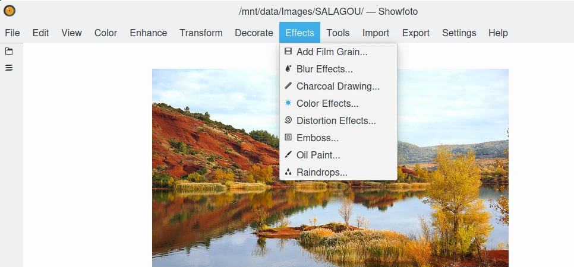

.. meta::
   :description: digiKam Showfoto Menu Descriptions
   :keywords: digiKam, documentation, user manual, photo management, open source, free, learn, easy, menu, showfoto

.. metadata-placeholder

   :authors: - digiKam Team

   :license: see Credits and License page for details (https://docs.digikam.org/en/credits_license.html)

.. _menu_showfoto:

Showfoto Menu
=============

.. contents::

    The Showfoto Editor Menu

**Showfoto** menu is mostly the same than **digiKam Image Editor**. Only few differences are presents in **File** and **Settings**, and **Help** entries due to the lack of database support.

.. note::

    When switching in **Full-Screen Mode**, the menu will be accessible on the right side of tool-bar with the **Hamburger Button**.

The File Menu
-------------

:menuselection:`File --> Open` :kbd:`Ctrl+O`

    Open files from your local storage.

:menuselection:`File --> Open folder` :kbd:`Ctrl+Shift+O`

    Open all files from a directory located on your local storage.

For the rest of menu entries, see description from :ref:`Main Window <menu_editorfile>` section. Versioning options do not exit here.

The Edit Menu
-------------

See description from :ref:`Main Window <menu_editoredit>` section.

The Color Menu
--------------

See description from :ref:`Main Window <menu_editorcolor>` section.

The Enhance Menu
----------------

See description from :ref:`Main Window <menu_editorenhance>` section.

The Transform Menu
------------------

See description from :ref:`Main Window <menu_editortransform>` section.

The Decorate Menu
-----------------

See description from :ref:`Main Window <menu_editordecorate>` section.

The Effects Menu
----------------

See description from :ref:`Main Window <menu_editoreffects>` section.

The View Menu
-------------

See description from :ref:`Main Window <menu_editorview>` section.

The Tools Menu
--------------

:menuselection:`Tools --> DNG Convert`

    Batch tool to :ref:`convert RAW files to DNG containers <showfoto_dngconvert>`.

For the rest of menu entries, see description from :ref:`Main Window <menu_maintools>` section about Generic plugins. Database options do not exist here.

The Import Menu
---------------

See description from :ref:`Main Window <menu_mainimport>` section about Import plugins.

The Export Menu
---------------

See description from :ref:`Main Window <menu_mainexport>` section about Export plugins.

The Settings Menu
-----------------

See description from :ref:`Main Window <menu_mainsettings>` section.

The Help Menu
-------------

See description from :ref:`Main Window <menu_mainhelp>` section. Database options do not exist here.
