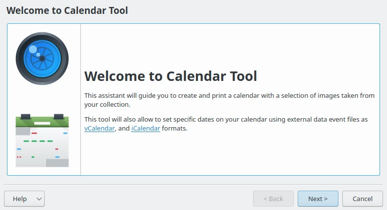
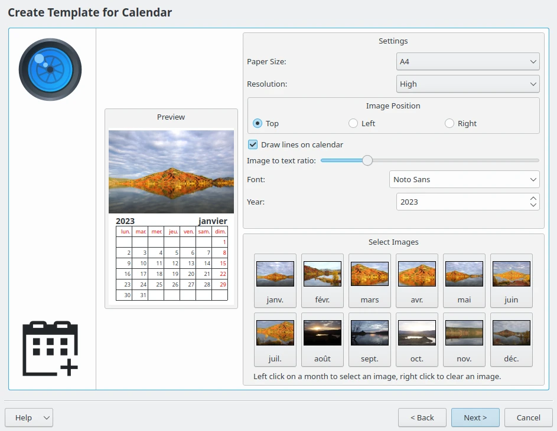
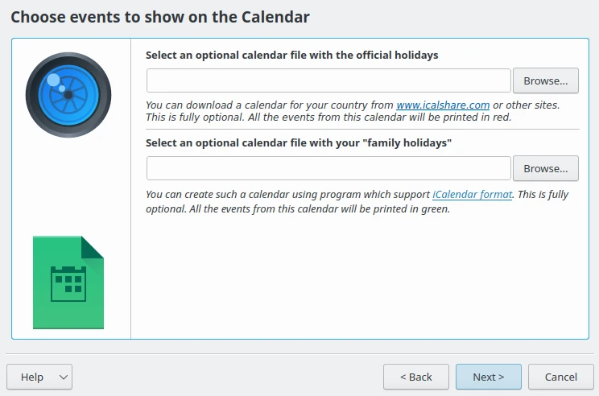
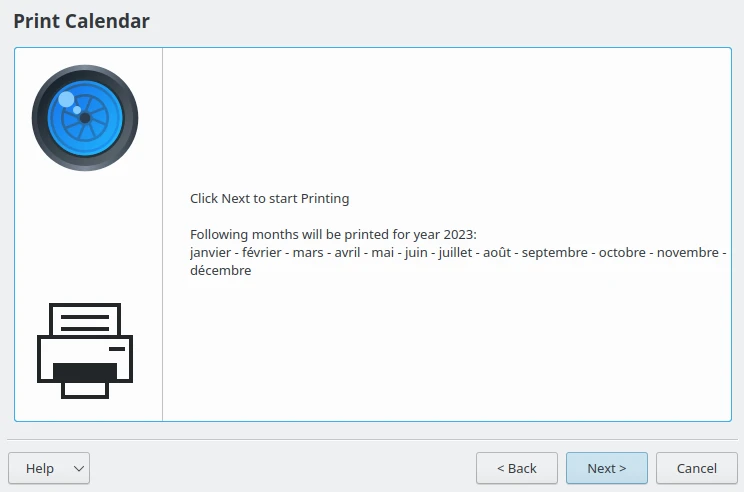
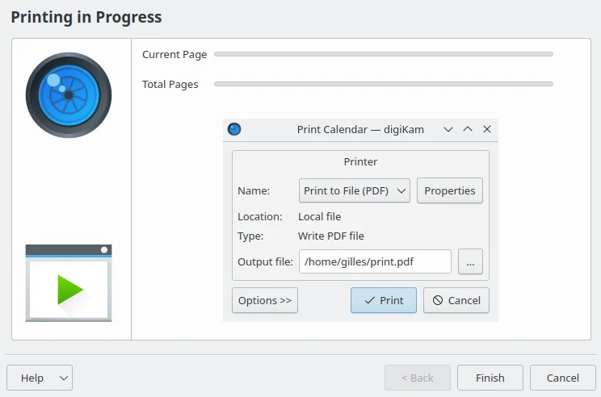
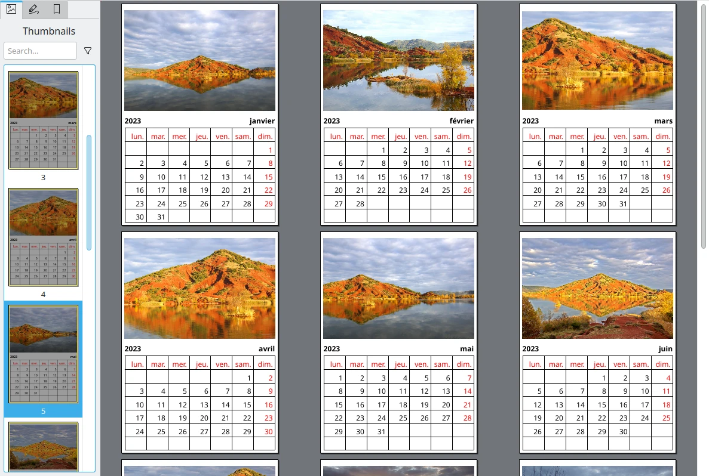

.. meta::
   :description: The digiKam Calendar Tool
   :keywords: digiKam, documentation, user manual, photo management, open source, free, learn, easy, calendar

.. metadata-placeholder

   :authors: - digiKam Team

   :license: see Credits and License page for details (https://docs.digikam.org/en/credits_license.html)

.. _calendar_tool:

:ref:`Calendar Tool <post_processing>`
======================================

    The Calendar Tool Introduction Page

The **Calendar Tool** tool easily creates a personalized calendar with your photos. First, you need to select some items, most preferably 12 photos so that the photos correspond to 12 months in the calendar. After selecting the pictures go to :menuselection:`Tools --> Create Calendar` menu entry, and an assistant will appear to guide you in the creation process.

    The Calendar Tool Page to Setup Contents

The settings from this page are:

    - **Paper size**: You have two choices standard **A4** and **US Letter** size.

    - **Resolution**: You have two choices **High** or **Low**.

    - **Image Position**: Set the position the images appear in the calendar.

    - **Draw lines on calendar**: Disables or enables the lines which appear in the calendar.

    - **Image to text ratio**: Increase or decrease the size of the image relative to the text. Move the slider and the preview will change as you adjust it.

    - **Font**: Choose a default font to be used for the text.

    - **Year**: Choose the calendar year to be used.

On the bottom, the **Select Images** mosaic of buttons allows you to customize the image to render for each calendar page.

When you have completed this page, click on the **Next** button in the assistant and you will be greeted with a new page to customize extra events in the calendar:

    The Calendar Tool Page to Add Extra Calendar Data

The website `iCalshare <http://icalshare.com/calendars>`_ has many great templates that can be used. They are free to use and download. All you need to do is register an account with them. It includes templates that contain much information on public holidays and events in many countries.

digiKam also supports the transfer of calendar data from external calendar applications that you may have used to store special days like birthdays of friends and relatives. To transfer data, you first have to export the data as a calendar file onto your computer, using `vCalendar or iCalendar <https://en.wikipedia.org/wiki/ICalendar>`_ formats. In the digiKam Calendar Tool, select the folder button on the window from the current page and show it to the file manager then select **Open**. This will add the data to your calendar. Then press **Next** in the assistant to see this page.

    The Calendar Tool Page Preparing to Export Contents

When you are done press **Print** and it will generate a 12-page PDF file exactly like a paper calendar.

    The Calendar Tool Page to Generating Contents

You can either send the calendar directly to your printer or print to a PDF file. However, it will be a wise decision to print to PDF first so that you can see what you have created. If you need to change the printer properties, press **Properties**. You will be able to change the page layout (portrait, landscape) and the units of measurement (cm, inches, px, etc.). By default, the output file will be made in your home folder. If you need to change the location press the button on the right and specify manually.

    The Calendar Generated as PDF File
