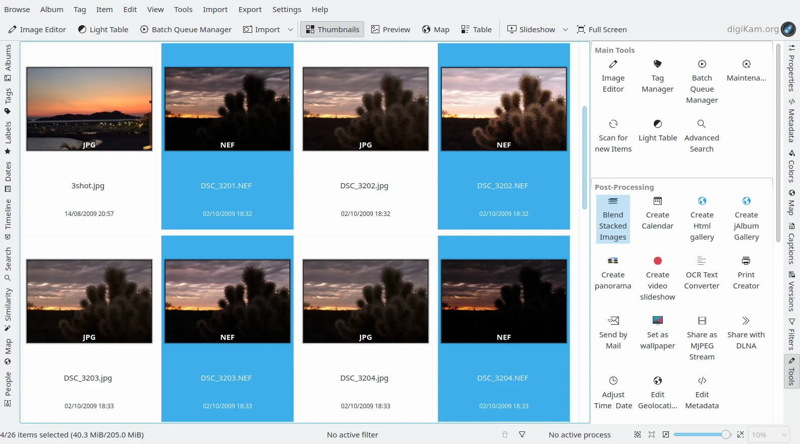
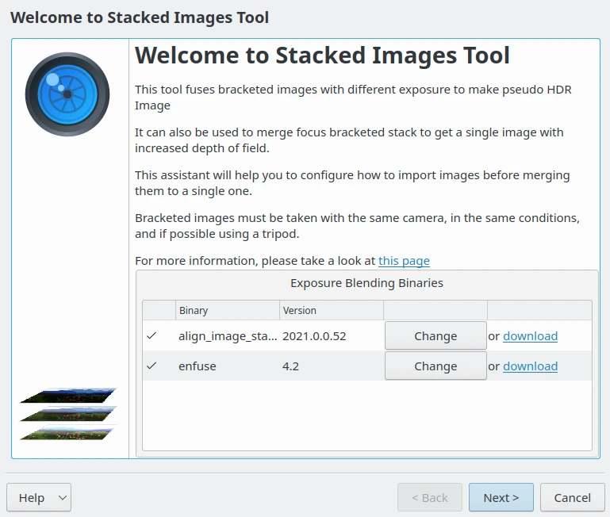
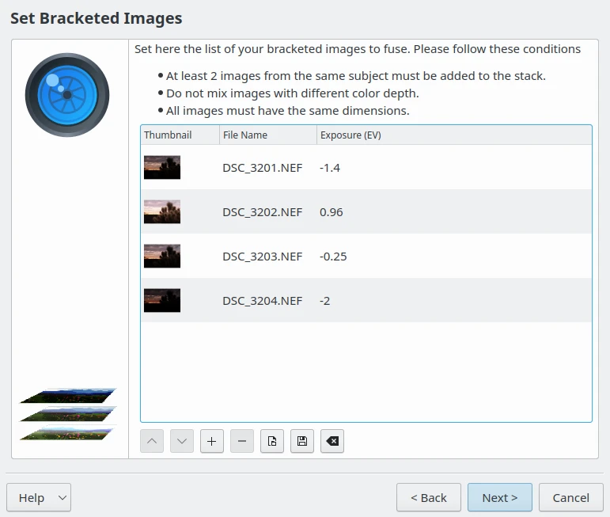
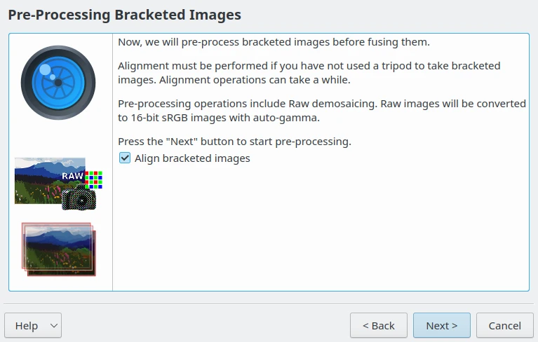
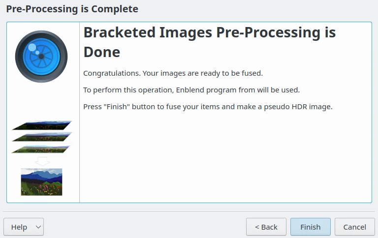
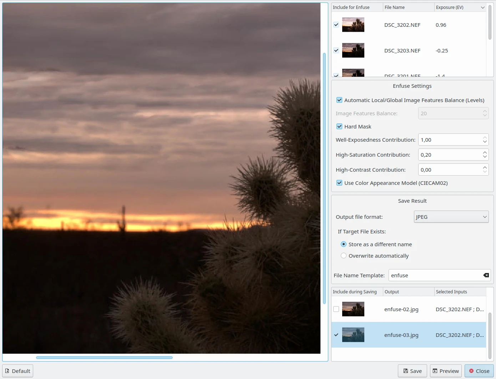
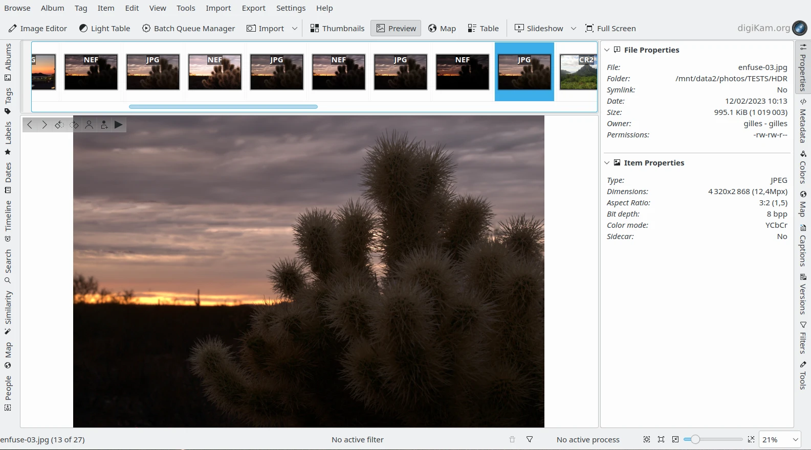

.. meta::
   :description: The digiKam Exposure Blending Tool
   :keywords: digiKam, documentation, user manual, photo management, open source, free, learn, easy, exposure, blending, bracketing

.. metadata-placeholder

   :authors: - digiKam Team

   :license: see Credits and License page for details (https://docs.digikam.org/en/credits_license.html)

.. _expo_blending:

:ref:`Exposure Blending <post_processing>`
==========================================

No matter how good your camera is, taking a well-exposed photo of a high-contrast scene like a black bird on snow can be really tricky. Even if you switch to the manual mode and tweak the exposure settings, there is still a risk that you will end up with a shot containing under or over-exposed areas. One way to solve this problem is to use the digiKam Exposure Blending. This technique involves taking several shots of the same scene or subject with different exposures (**bracketing**) and then fusing these shots into one perfectly exposed photo.

While exposure blending sounds simple in theory, achieving usable results can be a rather laborious and time-consuming process. Fortunately, digiKam can do the hardest part of the job for you. The exposure blending tool relies on the `Hugin command line tools <https://hugin.sourceforge.io/>`_ for processing and fusing photos, so you must install Hugin on your machine beforehand.

From Icon-View, select the photos you want to blend, and choose :menuselection:`Tools --> Blend Stacked Images`, or click on the **Blend Stacked Images** icon from the **Tools** tab in the **Right Sidebar**.

    The Bracketed NEF Files Selected from Icon-View

This opens the Exposure Blending wizard that guides you through the entire process.

    The Exposure Blending Wizard with the Hugin Components Detection

In the Set Bracketed Images window, add other photos if needed, and remove and rearrange the photos that are already in the list. Then hit the Next button to move to the next step.

    The Exposure Blending Wizard with the List of Items to Merge

digiKam can align the selected photos before blending them. This feature can come in handy if you took the photos without a tripod. If this is the case, tick the Align bracketed images check box, and press Next to start the pre-processing.

    The Exposure Blending Wizard Pre-Processing Stage

Once digiKam is done, press the **Finish** button, and you will be automatically dropped into the **Exposure Blending Editor**.

    The Exposure Blending Ready to Edit the Stacked Images

Hit the **Preview** button to see the blended photo in the preview pane. If you move the mouse over the preview canvas, a toolbar appears in the top left corner of the image to **Zoom In**, **Zoom Out**, and **Zoom to Fit**.

If you are not satisfied with the **Preview** result, you can tweak the available **Enfuse Settings** on the right side. where you will find the following options:

    - **Automatic Local/Global Image Features Balance (Levels)**: Set automatic level selection (maximized) for pyramid blending, i.e. optimize image features (contrast, saturation, ...) to be as global as possible.

    - **Image Features Balance**: Set the number of levels for pyramid blending. Balances towards local features (small number) or global features (high number). Additionally, a low number trades off quality of results for faster execution time and lower memory usage. This option is enabled only if **Automatic Local/Global Image Features Balance (Levels)** is disabled.

    - **Hard Mask**: Force hard blend masks without averaging on the finest scale. This is only useful for focus stacks with thin and high contrast features. It improves sharpness at the expense of increased noise.

    - **Well-Exposedness Contribution**: Set the well-exposedness criterion contribution for the blending process. Higher values will favor well-exposed pixels.

    - **High-Saturation Contribution**: Increasing this value makes pixels with high saturation contribute more to the final output.

    - **High-Contrast Contribution**: Sets the relative weight of high-contrast pixels. Increasing this weight makes pixels with neighboring differently-colored pixels contribute more to the final output. Particularly useful for focus stacks.

    - **Use Color Appearance Model (CIECAM02)**: Use Color Appearance Modelling (CIECAM02) to render detailed colors. Your input files should have embedded ICC profiles. If no ICC profile is present, sRGB color space will be assumed. The difference between using this option and default color blending algorithm is very slight, and will be most noticeable when you need to blend areas of different primary colors together.

You can also exclude individual photos from the stack on the top right corner to improve the blending result. The clever part is that every time you tweak the settings and press the **Preview** button, digiKam generates a preview image stored on the bottom right corner which you can compare with the previous versions. You can then save all the generated versions, or save only the one you like most by selecting wanted preview. The output format to use at export stage can be set in **Save Result** settings. If the exported file already exists, it can be overwritten or not. A common template file name can be also configured for the exported files.

    The Exposure Blending Editor to Create Fusionned Versions

digiKam’s exposure blending tool is capable of producing rather impressive results, especially if you are not afraid of getting your hands dirty by manually tweaking the final results.

    The Fusionned NEF Files Exported as JPEG and Displayed in digiKam
