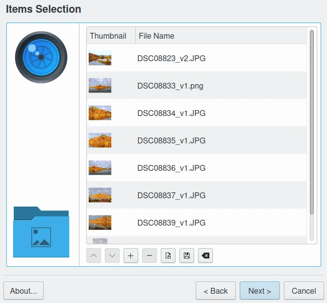
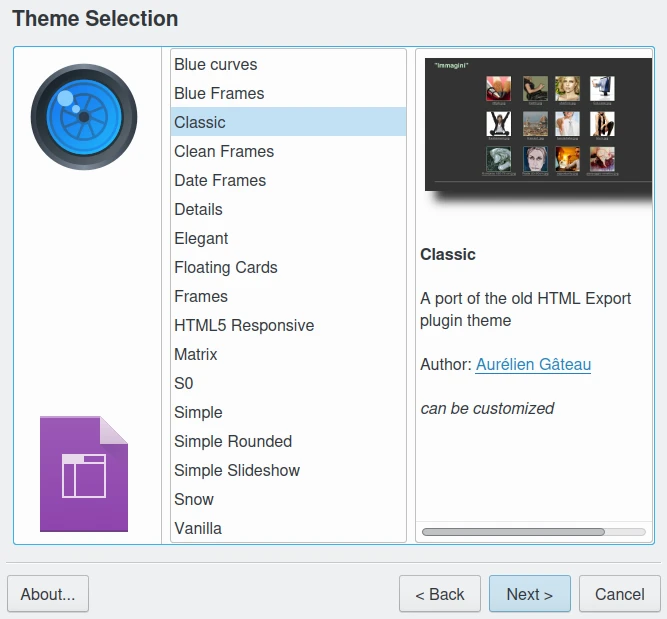
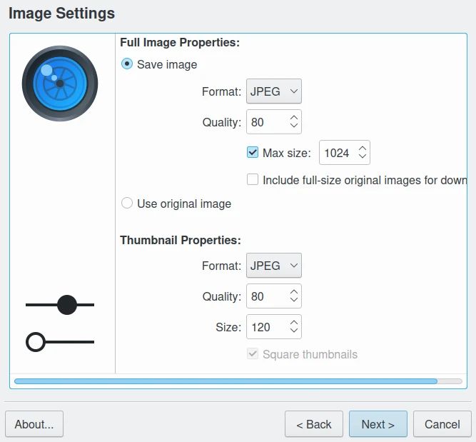
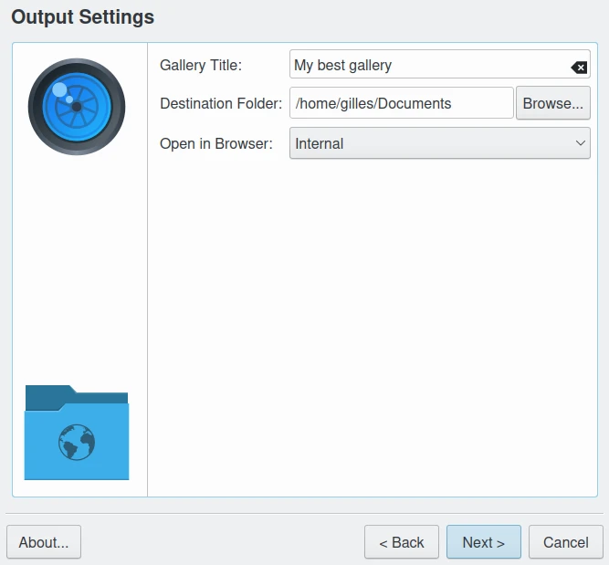
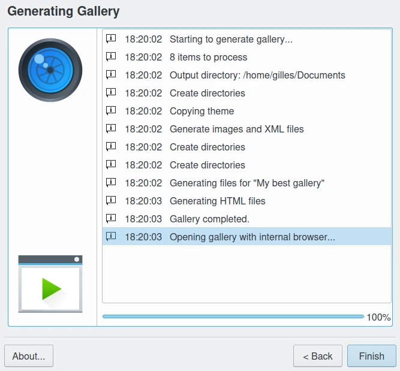
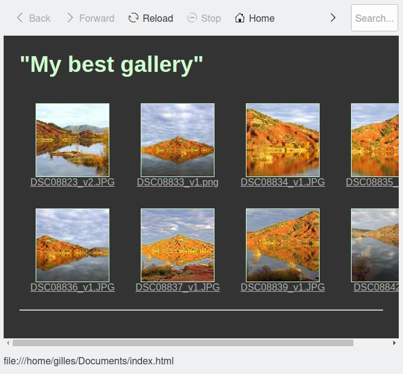

.. meta::
   :description: The digiKam HTML Gallery
   :keywords: digiKam, documentation, user manual, photo management, open source, free, learn, easy, html, gallery

.. metadata-placeholder

   :authors: - digiKam Team

   :license: see Credits and License page for details (https://docs.digikam.org/en/credits_license.html)

.. _html_gallery:

HTML Gallery
============

.. contents::

Overview
--------

The HTML Gallery is a tool for exporting a set of Albums or images to a HTML page.

This powerful tool can export your Albums into a HTML compliant web image gallery. You can easily select the Images or the Albums to export in an HTML page and set many designs and parameters for the HTML rendering. UTF-8 encoding is used for the best internationalization.

Using the Wizard
----------------

.. figure:: images/html_gallery_page1.webp
    :alt:
    :align: center

    The HTML Gallery Page Selection Mode

Launching the tool from within digiKam displays a view to select the contents to export: from current items selection, or from a list of albums. The Albums selection mode allows you to select items from Albums that you want to export to HTML. Just check the respective Albums displayed with hierarchical nesting. On the next three tabs **Tags**, **Searches**, and **Labels** you can refine your selection using tags, labels, or previous search results in digiKam. 

    The HTML Gallery Page to Select Items

Next step is to select a **Theme** to generate the gallery.

    The HTML Gallery Page to Select Theme

Depending on the chosen theme you may have additional options to fine-tune the appearance of the gallery.

The next screenshot shows the theme parameters configuration (here the **Classic** theme for example).

.. figure:: images/html_gallery_page4.webp
    :alt:
    :align: center

    The HTML Gallery Page to Tune Theme Parameters

For all selected themes you can adjust the settings for the images and thumbnails in the gallery.

    The HTML Gallery Page to Tune Images and Thumbnail Properties

In the Full Image section you can either save modified images or Use original image.

For modified images you can select as output format JPEG (smallest filesize, but lossy) and PNG (lossless and free license) and set specific image compression features. If disk space is of concern check the target image compression and lower the compression level from the host application default value.

Checking the Max. size box you can fix the maximum target image size (in pixels) with the spinbox at the right. Images bigger than this value will be scaled down to it, but smaller images will not be modified.

.. note::

    If JPEG file format is selected for target resizing images, all Exif information will be preserved from the original JPEG files.

The Thumbnails section allows to set the Format, Quality and Size for the thumbnails in the gallery.

    The HTML Gallery Page to Configure the Output

This page defines the settings of where and how to store the gallery with all its associated images. Select a folder or add a new folder with write access where you want the gallery to be written to. Two sub-folders with the name of your album folder and the theme name will be created containing everything.

A progress dialog giving a feedback indicate to user. Press Cancel button during this stage if you want abort the process.

    The HTML Gallery Page to Show Progress While Generating the Gallery

Finally, the HTML gallery generated is displayed in a browser.

    The Browser Displaying the HTML Gallery at end

.. _htmlgallery_newtheme:

Creating a New Theme
--------------------

The HTML Gallery tool can easily be themed to produce very different sites.
This document explains how to create themes.

Getting started
~~~~~~~~~~~~~~~

A theme is a folder which contains at least two files:
- a desktop file describing the theme.
- a template.xsl file to generate the HTML files.

When the tool is run it does the following:

- Create an output folder
- For each image collection:

  - Create a folder
  - Generate thumbnails (square by default)
  - Generate full images
  - Optionally copy original images

- Copy the theme folder to the output folder
- Generate an XML file describing the image collections: gallery.xml
- Generate the HTML files by applying template.xsl to gallery.xml

The Desktop File
~~~~~~~~~~~~~~~~

The desktop file describes the theme. The information it contains is used in the
theme selection page of the tool.

It's a .ini-style file and looks like this:

    [Desktop Entry]
    Type=Theme
    Name=Hello World
    Comment=A demonstration theme

    [X-HTMLGallery Author]
    Name=The Author
    Url=http://example.com/themes/helloworld

    [X-HTMLGallery Preview]
    Name=Preview's Caption
    Url=preview.png

We use a desktop file format so that entries can be translated. If you look at
the desktop file for one of the themes shipped with the tool, you will find
something like this:

    [Desktop Entry]
    Name=Simple
    Name[br]=Eeun
    Name[cs]=Jednoduchý
    Name[cy]=Syml
    Name[da]=Simpel
    ...

The nice thing is that when your theme get integrated into HTML Gallery default
themes, translators will intertionalize the desktop file for you.

Image preview file will be placed in the root theme folder.

Creating new Theme from Another One
~~~~~~~~~~~~~~~~~~~~~~~~~~~~~~~~~~~

The easiest way to get started is to copy one theme and modify it.
Theme folders can be found in ${DATA_INSTALL_DIR}/digikam/themes/,
where ${DATA_INSTALL_DIR} is the install folder of digiKam on your machine
(usually /usr under Linux).

Writing in this folder requires root access, so we will not create our theme
there, instead do the following:

Create a theme folder in your home:

.. code-block:: shell

    mkdir -p ~/.local/share/digikam/themes/

- Go to this directory:

.. code-block:: shell

    cd ~/.local/share/digikam/themes/

Copy the "snow" theme to this folder, under a new name: "snow2":

.. code-block:: shell

    cp -r ${DATA_INSTALL_DIR}/digikam/themes/snow snow2

Rename the desktop file accordingly:

.. code-block:: shell

    cd snow2
    mv snow.desktop snow2.desktop

Edit :file:`snow2.desktop**`: Remove all the **Name[...]** entries and replace **Name=Snow**
with **Name=Snow 2**.

You are done, you can now open digiKam and start the HTML Gallery tool, the **Snow 2** theme should appear in the theme list.

Generating HTML Using XSL Rules
~~~~~~~~~~~~~~~~~~~~~~~~~~~~~~~

The template.xsl file is responsible for generating the HTML files from the :file:`gallery.xml` file.

It looks like this:

.. code-block:: xml

     <?xml version="1.0" encoding="UTF-8"?>
     <collections>
      <collection>
       <name>Name of first collection</name>
       <fileName>collection_folder</fileName>
       <comment>Collection comment</comment>
       <image>
        <title>Image Title</title>
        <description>Image Description</description>
        <date>2009-08-27T09:53:26</date>
        <full fileName="pict1279.jpeg" height="450" width="600"/>
        <thumbnail fileName="thumb_pict1279.jpeg" height="80" width="80"/>
        <!-- If there is an original image, you will get the 'original' tag -->
        <original fileName="original_pict1279.jpeg" height="3000" width="4000"/>

       </image>
       <image>
        <title>Image Title</title>
        <date>2009-08-27T09:55:33</date>
        <description>Image Description</description>
        <full fileName="pict1280.jpeg" height="450" width="600"/>
        <thumbnail fileName="thumb_pict1280.jpeg" height="80" width="80"/>
        <original fileName="original_pict1279.jpeg" height="3000" width="4000"/>
       </image>
       ...
      </collection>

      <collection>
       <name>Name of second collection</name>
       ...
      </collection>
     </collections>

We won't explain XSLT here, you should be able to find the documentation you need on the web. We recommend to learn XSLT with the `XSLT tutorial here <https://www.w3schools.com/xsl>`_.

It's worth nothing nevertheless that you can make use of `EXSLT <https://www.exslt.org>`_, a set of extensions to XSLT. In particular, the `exslt:document element <https://www.exslt.org/exsl/elements/document>`_  is extremely useful because it allows you to generate multiple documents from the same file.

HTML Gallery tool imposes no constraint on the organization of HTML files: you can generate one file per image, or only one per collection. One could imagine a theme which would only contains one HTML file and uses Javascript to show the different images, there is already one theme using frames, you can even generate CSS files on the fly if you want to.

About translations
~~~~~~~~~~~~~~~~~~

You should not **hardcode** any text in the template, instead you should use the
**i18n parameters**. For example instead of using this:

.. code-block:: xml

    <a href="previous">Previous</a>
    | <a href="next">Next</a>

Do this:

.. code-block:: xml

    <a href="previous"><xsl:value-of select="$i18nPrevious"/></a>
    | <a href="next"><xsl:value-of select="$i18nNext"/></a>

It's quite a lot more verbose, but this way your user will get localized HTML
output.

Final Words
~~~~~~~~~~~

This is the end of this chapter, now is the time for you to get creative and add new themes.

When you are done, do not hesitate to propose your work for an official integration in digiKam, to see your new theme included in the official list. See the `Contribute page <https://www.digikam.org/contribute/>`_ from the digiKam project web-site for details.

