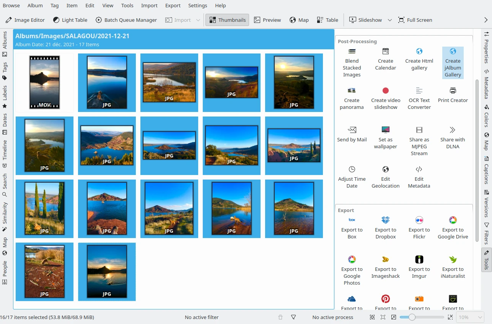
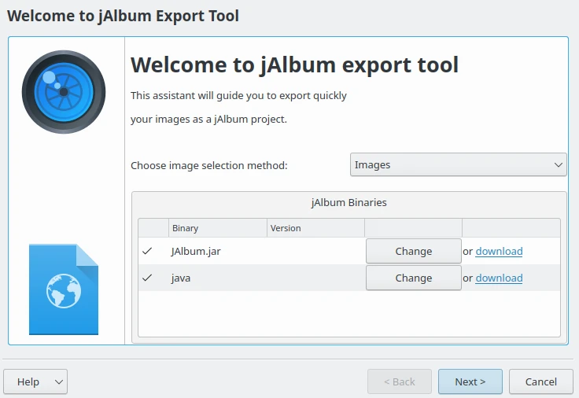
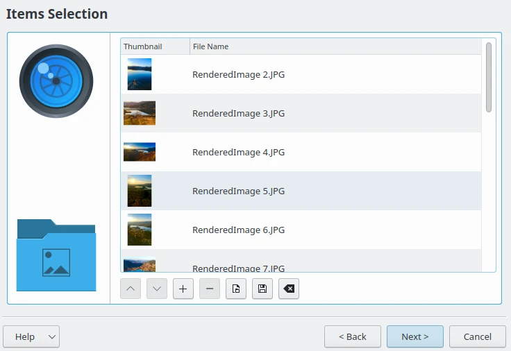
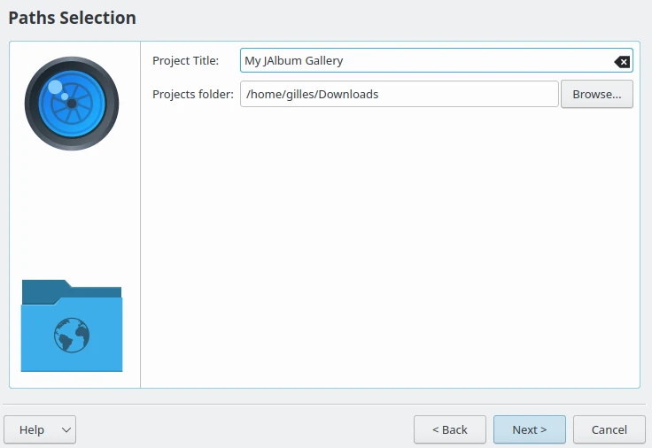
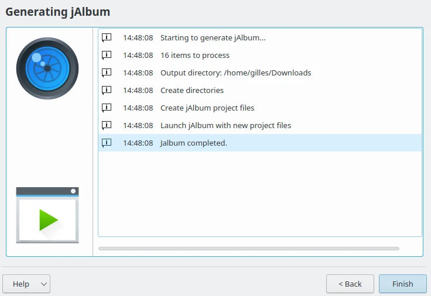
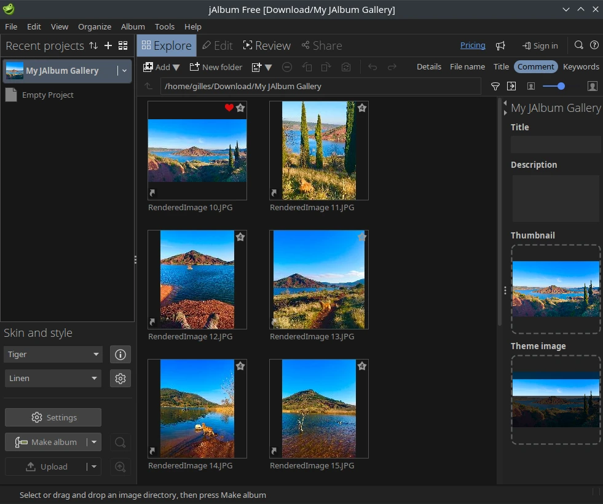

.. meta::
   :description: The digiKam JAlbum Export
   :keywords: digiKam, documentation, user manual, photo management, open source, free, learn, easy, jalbum, gallery, export

.. metadata-placeholder

   :authors: - digiKam Team

   :license: see Credits and License page for details (https://docs.digikam.org/en/credits_license.html)

.. _jalbum_export:

:ref:`JAlbum Export <post_processing>`
======================================

The JAlbum Export tool allows you to create metadata for a set of digiKam items to use in the Java-based `JAlbum HTML Gallery Generator <https://en.wikipedia.org/wiki/JAlbum>`_. The `Java virtual machine <https://en.wikipedia.org/wiki/Java_virtual_machine>`_ and the JAlbum program must be previously installed on your computer so JAlbum can be executed by digiKam.

To run this tool, choose the :menuselection:`Tools --> Create JAlbum Gallery` menu entry, or click on the **Create JAlbum Gallery** icon from the **Tools** tab in the **Right Sidebar**.

    The Selection of Item to export to JAlbum Gallery Generator

This opens the JAlbum Export wizard that guides you through the entire process. This first page allows you to select items either from **Images** currently selected in digiKam, or from **Albums** hosted in your collections. This page also verifies the availability of the **JAlbum** and **Java** binary programs.

    The JAlbum Export Wizard Welcome Page

The second page of this wizard allows you to review the list of images, or album contents to export to the JAlbum HTML gallery generator. When the selection is complete, press the **Next** button.

    The JAlbum Export Wizard Items Selection Page

The third page configures the JAlbum settings to export contents. Here you can configure the **Project Title** and the **Projects folder** designating where the files should be generated.

    The JAlbum Export Wizard Settings Page

The fourth page lists all of the steps taken to generate and export the album.

    The JAlbum Export Wizard Preparing Output Files

When all the steps are completed, the JAlbum Application is started with all of the files exported from digiKam. At this time, you can close the JAlbum Export tool and continue to work with JAlbum application.

    The JAlbum Application Started with the Exported Files from digiKam
