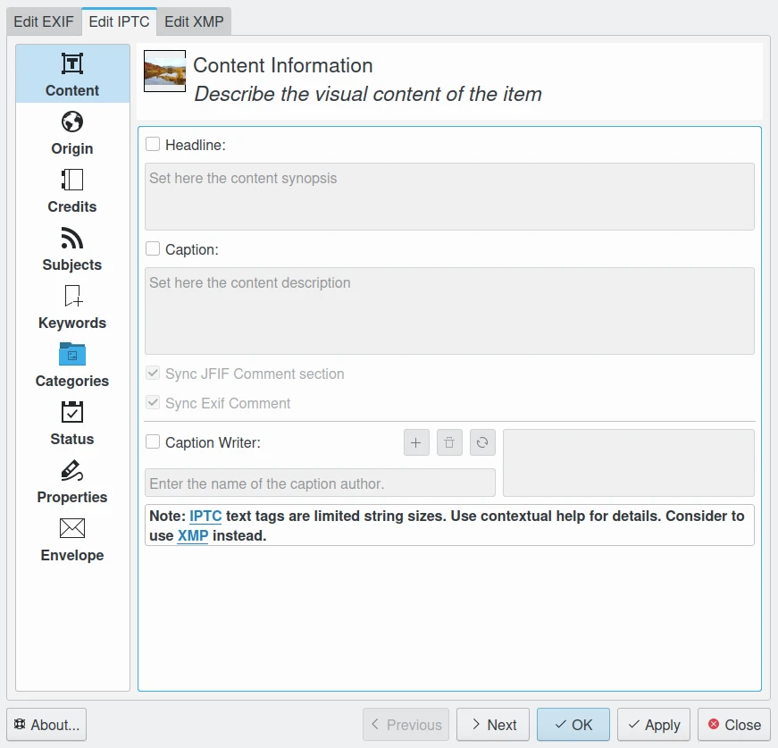
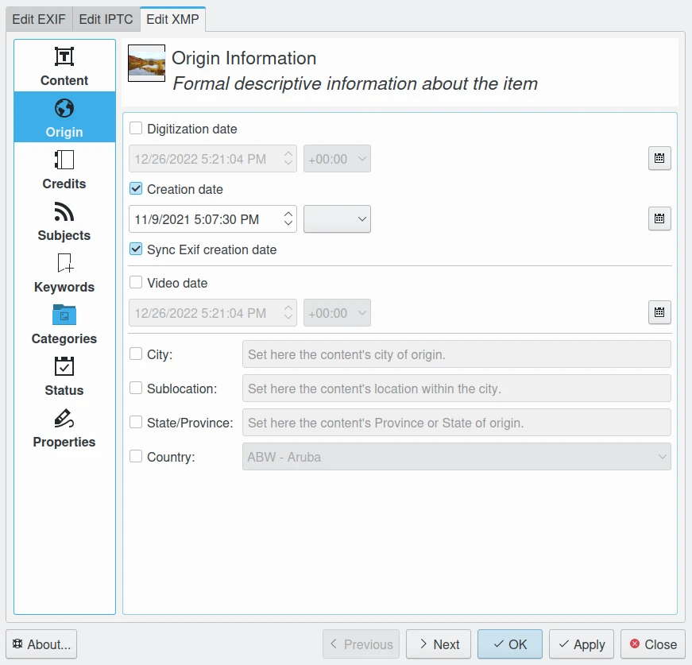

.. meta::
   :description: The digiKam Metadata Editor
   :keywords: digiKam, documentation, user manual, photo management, open source, free, learn, easy, metadata editor

.. metadata-placeholder

   :authors: - digiKam Team

   :license: see Credits and License page for details (https://docs.digikam.org/en/credits_license.html)

.. _metadata_editor:

Metadata Editor
===============

.. contents::

.. figure:: images/metadata_editor_exif.webp
    :alt:
    :align: center

    The Exif Tab from Edit Metadata Tool

The Metadata Editor is a tool for adding and editing Exif, IPTC, or XMP metadata attached to an image.

Image metadata is textual information that can be attached to digital images in order to annotate, describe and categorize them. This information is useful for searching and indexing images and for accessibility services. There are three standard formats in which image metadata can be stored: Exif, IPTC and XMP. They concentrate on different properties of the image and are used for different purposes. digiKam provides tools for viewing and editing image metadata in all these formats.

    The IPTC Tab from Edit Metadata Tool

The application offers metadata editing tools available through the :menuselection:`Item --> Edit Metadata` menu entry. The metadata editor conveniently arranges all metadata into sections for each kind of metadata chunk, making it easier to find and edit specific entries. For example, to edit hardware-related information, switch to the **Device** section. Here you can modify device manufacturer, device model, exposure-related settings, and other information.

    The XMP Tab from Edit Metadata Tool

In addition to Exif, IPTC and XMP formats are supported, so you can perform the described actions on metadata stored in these metadata chunks as for Exif. Remember that Exif is dedicated to store camera information, where IPTC and XMP are more used to store post-process text information such as rights management. So, it is not recommended to edit the metadata injected by the camera that took the photograph; on the other hand, you can add information about the author, copyright, etc. Detailed description of supported entries is `available online <https://exiv2.org/metadata.html>`_.

Note that you can synchronize some specific metadata entries from one chunk to another one, as for example the comments which is available in Exif, IPTC, and XMP as separate entries. Mark the check boxes corresponding to the entries you wish to copy from one format to another.

.. caution::

    Note that synchronizing metadata may produce undesired results because Exif is limited to pure ASCII character set.
