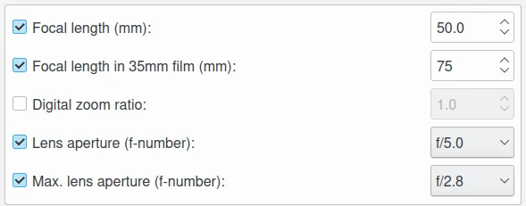
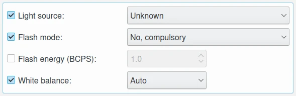
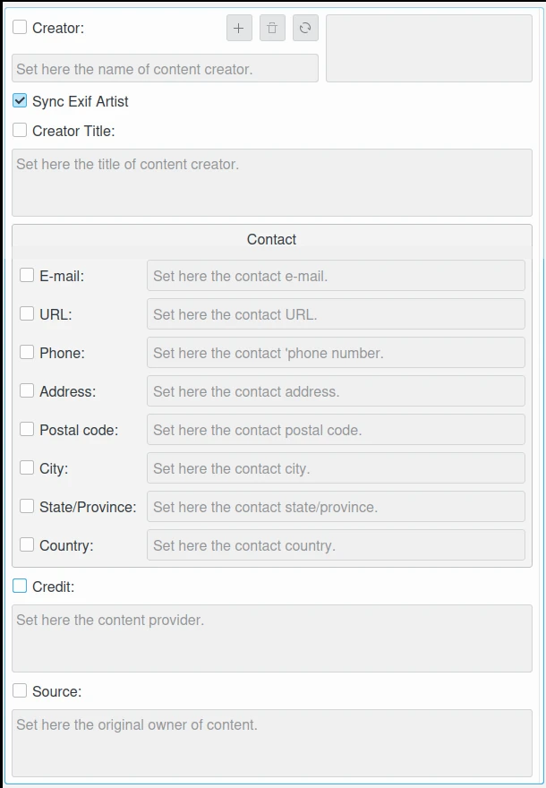

.. meta::
   :description: The digiKam Metadata Editor
   :keywords: digiKam, documentation, user manual, photo management, open source, free, learn, easy, metadata, editor, Exif, IPTC, XMP

.. metadata-placeholder

   :authors: - digiKam Team

   :license: see Credits and License page for details (https://docs.digikam.org/en/credits_license.html)

.. _metadata_editor:

Metadata Editor
===============

.. contents::

Overview
--------

The Metadata Editor is a tool for adding and editing Exif, IPTC, or XMP metadata attached to an image.

Image metadata is textual information that can be attached to digital images in order to annotate, describe and categorize them. This information is useful for searching and indexing images and for accessibility services. There are three standard formats in which image metadata can be stored: Exif, IPTC and XMP. They concentrate on different properties of the image and are used for different purposes. digiKam provides tools for viewing and editing image metadata in all these formats.

The application offers metadata editing tools available through the :menuselection:`Item --> Edit Metadata` menu entry. The metadata editor conveniently arranges all metadata into sections for each kind of metadata chunk, making it easier to find and edit specific entries. For example, to edit hardware-related information, switch to the **Device** section. Here you can modify device manufacturer, device model, exposure-related settings, and other information.

.. figure:: images/metadata_editor_dialog.webp
    :alt:
    :align: center

    The Edit Metadata Tool Dialog

In addition to Exif, IPTC and XMP formats are supported, so you can perform the described actions on metadata stored in these metadata chunks as for Exif. Remember that Exif is dedicated to store camera information, where IPTC and XMP are more used to store post-process text information such as rights management. So, it is not recommended to edit the metadata injected by the camera that took the photograph; on the other hand, you can add information about the author, copyright, etc. See description of supported text entries in :ref:`DAM Section <authorship_copyright>` of this manual.

You can synchronize some specific metadata entries from one chunk to another one, as for example the comments which is available in Exif, IPTC, and XMP as separate entries. Mark the check boxes corresponding to the entries you wish to copy from one format to another.

If you select many items from the icon-view, the metadata editor dialog allow to process the selection. With the **Previous** and **Next** buttons, you can navigate between items. The current filename and the index in the selection are given on the dialog title. A preview of current item is visible on the dialog header from the top.

.. caution::

    Synchronizing metadata may produce undesired results because Exif is limited to ASCII character-set.

Exif Tab
--------

The sections available in this tab group most common Exif tags used by camera devices. They are listed for editing with standardized values.

Caption
~~~~~~~

This view record technical descriptions from the camera. All text fields in this section are limited to ASCII characters unless stated otherwise.

    - **Name**: this checkbox allows to edit  the name of the document from which this image was been scanned.
    - **Description**: this checkbox allows to edit  the image description.
    - **Artist**: this checkbox allows to edit  the image author's name separated by semi-colons.
    - **Copyright**: this checkbox allows to edit  the copyright owner of the image.
    - **Caption**: this checkbox allows to edit  the image's caption. This field is not limited. UTF8 encoding will be used to save the text. This filed can be synchronized with the **JFIF Comment section**, **XMP caption**, and **IPTC caption** (warning: limited to 2000 characters)

    The Exif Caption View from Edit Metadata Tool

Date and Time
~~~~~~~~~~~~~

This view record camera time-stamp properties.

    - **Creation date and time**: this checkbox allows to edit the date and time of image creation. It is the date and time corresponding to the time-stamp when the file was changed. Use the calendar editor widget on the bottom to select the time-stamp and the button on the right side to reset time-stamp to the current date of computer. This last one can be sync with the **XMP creation date** and **IPTC creation date**.
    - **Creation sub-second**: this checkbox allows to edit the fractions of seconds for the date and time of image creation.
    - **Original date and time**: this checkbox allows to edit the date and time when the original image data was generated. For a digital still camera the date and time corresponding to the time-stamp when the picture was taken are recorded. Use the calendar editor widget on the bottom to select the time-stamp and the button on the right side to reset time-stamp to the current date of computer.
    - **Original sub-second**: this checkbox allows to edit the fractions of seconds for the date and time when the original image data was generated.
    - **Digitization date and time**: this checkbox allows to edit the date and time when the image was stored as digital data. If, for example, an image was captured by a digital still camera and at the same time the file was recorded, then Original and Digitization date and time will have the same contents. Use the calendar editor widget on the bottom to select the time-stamp and the button on the right side to reset time-stamp to the current date of computer.
    - **Digitization sub-second**: this checkbox allows to edit the fractions of seconds for the date and time when the image was stored as digital data.

    The Exif Date and Time View from Edit Metadata Tool

Lens
~~~~

This view record lens details used with camera.

    - **Focal length**: this checkbox allows to edit the lens focal length in millimeters used by camera to take the picture.
    - **Focal length in 35mm film**: this checkbox allows to edit the equivalent focal length assuming a 35mm film camera, in mm. A value of 0 means the focal length is unknown.
    - **Digital zoom ratio**: this checkbox allows to edit the digital zoom ratio used by camera to take the picture.
    - **Lens aperture**: this checkbox allows to edit the lens aperture (f-number) used by camera to take the picture.
    - **Max. lens aperture**: this checkbox allows to edit the the smallest aperture (f-number) of the lens used by camera to take the picture.

    The Exif Lens View from Edit Metadata Tool

Device
~~~~~~

This view record shot conditions used by camera.

    .. warning::

        `Exif Makernotes <hhttps://en.wikipedia.org/wiki/Exchangeable_image_file_format#MakerNote_data>`_ can be unreadable if you set the wrong **device manufacturer/model** description.

    - **Device manufacturer**: this checkbox allows to edit the manufacturer of image input equipment used to take the picture. This field is limited to ASCII characters.
    - **Device model**: this checkbox allows to edit the model of image input equipment used to take the picture. This field is limited to ASCII characters.
    - **Device type**: this checkbox allows to edit the image input equipment type used to take the picture. Possible values are **Film scanner**, **Reflection print scanner**, and **Digital still camera**.
    - **Exposure time**: this checkbox allows to edit the exposure time of picture, given in seconds.
    - **Exposure program**: this checkbox allows to edit the program used by the camera to set exposure when the picture was taken. Possible values are **Not defined**, **Manual**, **Auto**, **Aperture priority**, **Shutter priority**, **Creative program**, **Action program**, **Portrait mode**, and **Landscape mode**.
    - **Exposure mode**: this checkbox allows to edit the mode used by the camera to set exposure when the picture was taken. In auto-bracketing mode, the camera shoots a series of frames of the same scene at different exposure settings. Possible values are **Auto**, **Manual**, and **Auto bracket**.
    - **Exposure bias**: this checkbox allows to edit the exposure bias value (in APEX units) used by camera to take the picture.
    - **Metering mode**: this checkbox allows to edit the metering mode used by the camera to set exposure when the picture was taken. Possible values are **Unknown**, **Average**, **Center weighted average**, **Spot**, **Multi-spot**, **Multi-segment**, **Partial**, and **Other**.
    - **Sensitivity**: this checkbox allows to edit the ISO Speed of the camera which took the picture.
    - **Sensing method**: this checkbox allows to edit the image sensor type used by the camera to take the picture. Possible values are **Not defined**, **One-chip color area**, **Two-chip color area**, **Three-chip color area**, **Color sequential area**, **Trilinear sensor**, and **Color sequential linear**.
    - **Scene capture type**: this checkbox allows to edit the type of scene used by the camera to take the picture. Possible values are **Standard**, **Landscape**, **Portrait**, and **Night scene**.
    - **Subject distance type**: this checkbox allows to edit the type of distance between the subject and the image input equipment. Possible values are **Unknown**, **Macro**, **Close view**, and **Distant view**.

    The Exif Device View from Edit Metadata Tool

Light
~~~~~

This view record ambient condition captured by camera.

    - **Light source**: this checkbox allows to edit the kind of light source used to take the picture.
    - **Flash mode**: this checkbox allows to edit the flash program mode used by the camera to take the picture.
    - **Flash energy**: this checkbox allows to edit the flash energy used to take the picture in BCPS units. Beam Candle Power Seconds is the measure of effective intensity of a light source when it is focused into a beam by a reflector or lens. This value is the effective intensity for a period of one second.
    - **White balance**: this checkbox allows to edit the white balance mode set by the camera when the picture was taken. Possible values are **Auto** and **Manual**.

    The Exif Light View from Edit Metadata Tool

Adjustments
~~~~~~~~~~~

This view record technical details used by camera.

    - **Brightness**: this checkbox allows to edit the brightness adjustment value in APEX unit used by camera to take the picture.
    - **Gain Control**: this checkbox allows to edit the degree of overall image gain adjustment used by camera to take the picture. Possible values are **None**, **Low gain up**, **High gain up**, **Low gain down**, and **High gain down**.
    - **Contrast**: this checkbox allows to edit the direction of contrast processing applied by the camera to take the picture. Possible values are **Normal**, **Soft**, and **Hard**.
    - **Saturation**: this checkbox allows to edit the direction of saturation processing applied by the camera to take the picture. Possible values are **Normal**, **Low**, and **High**.
    - **Sharpness**: this checkbox allows to edit the direction of sharpness processing applied by the camera to take the picture. Possible values are **Normal**, **Soft**, and **Hard**.
    - **Custom rendered**: this checkbox allows to edit the use of special processing on image data, such as rendering geared to output. Possible values are **Normal process** and **Custom process**.

    The Exif Adjustments View from Edit Metadata Tool

IPTC Tab
--------

The sections available in this tab group most common IPTC tags used by photo-agencies  They are listed for editing with standardized values.

Pre-configured subjects can be used to describe the items contents based on IPTC reference codes. All text fields in IPTC tab are limited in size. Consider to use XMP tab instead. Some fields can accept multiple entries to append on a list. Items can be managed with the **Add**, **Delete**, and **Replace** buttons near the edited list. 

Content
~~~~~~~

This view describe the visual content of the item.

    - **Headline**: this checkbox allows to edit the content synopsis. This field is limited to 256 characters.
    - **Caption**: this checkbox allows to edit the content description. This field is limited to 2000 characters. This field can be synchronized with the **JFIF Comment section** and **Exif Comment**.
    - **Caption Writer**: this checkbox allows to edit the names of the caption authors. Multiple entries limited to 32 characters can be append to the list.

    The IPTC Content View from Edit Metadata Tool

Origin
~~~~~~

This view group formal descriptive information about the item.

    - **Digitization date** and **Digitization time**: these checkbox allows to edit the date, time, and zone of the digital representation. Use the calendar editor widget on the bottom to select the time-stamp and the button on the right side to reset time-stamp to the current date of computer.
    - **Creation date** and **Creation time**: these checkbox allows to edit the date, time, and zone of the intellectual content. Use the calendar editor widget on the bottom to select the time-stamp and the button on the right side to reset time-stamp to the current date of computer. These values can be synchronized with the **Exif Creation date**.
    - **Location**: this checkbox allows to edit the full country names referenced by the content. Multiple pre-configured entries can be append to the list.
    - **City**: this checkbox allows to edit the city of content origin. This field is limited to 32 characters.
    - **Sublocation**: this checkbox allows to edit the content location within city. This field is limited to 32 characters.
    - **State/Province**: this checkbox allows to edit the Province or State of content origin. This field is limited to 32 characters.
    - **Country**: this checkbox allows to select the country name of content origin.

    The IPTC Origin View from Edit Metadata Tool

Credits
~~~~~~~

This view record copyright information about the item.

    - **Byline**: this checkbox allows to edit the names of content creators. Multiple text entries limited to 32 characters can be append to the list.
    - **Byline Title**: this checkbox allows to edit the titles of content creators. Multiple text entries limited to 32 characters can be append to the list.
    - **Contact**: this checkbox allows to edit the persons or organization to contact. Multiple text entries limited to 128 characters can be append to the list.
    - **Credit**: this checkbox allows to edit the content provider. This field is limited to 32 characters.
    - **Source**: this checkbox allows to edit the original owner of content. This field is limited to 32 characters.
    - **Copyright**: this checkbox allows to edit the necessary copyright notice. This field is limited to 128 characters.

    The IPTC Credits View from Edit Metadata Tool

.. _iptc_subjects:

Subjects
~~~~~~~~

This view record subject information about the item.

    - **Use structured definition of the subject matter**: this checkbox allows to edit the `IPTC/NAA taxonomy subject codes <https://iptc.org/standards/subject-codes/>`_, with a focus on text. It consists of about 1,400 terms structured into 3 levels. The **Use standard reference code** option allows to select the standard taxonomy, and the **Use custom definition** option allows to customize the values. More than one entries can be append to a list of reference.
    - **IPR**: this field is the Informative Provider Reference. I.P.R is a name registered with the IPTC/NAA, identifying the provider that provides an indicator of the content. The default value for the I.P.R is *IPTC* if a standard Reference Code is used. This field is limited to 32 characters.
    - **Reference**: this field is the Subject Reference Number. Provides a numeric code to indicate the Subject Name plus optional Subject Matter and Subject Detail Names in the language of the service. Subject Reference is a number from the range 01000000 to 17999999 and represent a language independent international reference to a Subject. A Subject is identified by its Reference Number and corresponding Names taken from a standard lists given by IPTC/NAA. If a standard reference code is used, these lists are the English language reference versions. This field is limited to 8 digit code.
    - **Name**: this field is the Subject Name. English language is used if you selected a standard IPTC/NAA reference code. This field is limited to 64 characters.
    - **Matter**: this field is the Subject Matter Name. English language is used if you selected a standard IPTC/NAA reference code. This field is limited to 64 characters.
    - **Details**: this field is the Subject Detail Name. English language is used if you selected a standard IPTC/NAA reference code. This field is limited to 64 characters.

    The IPTC Subjects View from Edit Metadata Tool

.. _iptc_keywords:

Keywords
~~~~~~~~

This view record keywords relevant to the item.

The **Use information retrieval words** checkbox allows to edit the keywords list used to define the content. Below a text field allows to enter a new keyword, limited to 64 characters. Use **Add** button to append the new keyword to the list. **Delete** button removes an entry from the list and **Replace** button changes the current selected item on the list with the edit keyword value. 

    The IPTC Keywords View from Edit Metadata Tool

.. _iptc_categories:

Categories
~~~~~~~~~~

This view record categories relevant to the item.

The **Identify subject of content** checkbox allows to edit the categories list used to classify the content. On the right a text field allows to enter a new category ID, limited to 3 characters.

On the bottom the **Supplemental categories** checkbox allows to edit a a new supplemental category of content. This field is limited to 32 characters. Use **Add** button to append the new values to the list. **Delete** button removes an entry from the list and **Replace** button changes the current selected item on the list with the edited values. 

    The IPTC Categories View from Edit Metadata Tool

Status
~~~~~~

This view record workflow information.

    - **Title**: this checkbox allows to edit the shorthand reference of content. This field is limited to 64 characters.
    - **Edit Status**: this checkbox allows to edit the title of content status. This field is limited to 64 characters.
    - **Job Identifier**: this checkbox allows to edit Set here the string that identifies content that recurs. This field is limited to 32 characters.
    - **Special Instructions**: this checkbox allows to edit the editorial usage instructions. This field is limited to 256 characters.

    The IPTC Status View from Edit Metadata Tool

Properties
~~~~~~~~~~

This view record workflow properties.

    - **Release date** and **Release time**: these checkbox allows to edit the earliest intended usable date, time, and zone of intellectual content. Use the calendar editor widget on the bottom to select the time-stamp and the button on the right side to reset time-stamp to the current date of computer.
    - **Expiration date** and **Expiration time**: these checkbox allows to edit the latest intended usable date, time, and zone of intellectual content. Use the calendar editor widget on the bottom to select the time-stamp and the button on the right side to reset time-stamp to the current date of computer.
    - **Language**: this checkbox allows to select the language used by the content.
    - **Priority**: this checkbox allows to select the editorial urgency of content. Possible values are **0: None**, **1: high**, **2**, **3**, **4**, **5: normal**, **6**, **7**, **8: low**, and **9: user-defined**.
    - **Cycle**: this checkbox allows to select the editorial cycle of content. Possible values are **Morning**, **Afternoon**, and **Evening**.
    - **Type**: this checkbox allows to select the content type. Possible values are **News**, **Data**, and **Advisory**. On the right you can edit the editorial type description of content. This field is limited to 64 characters.
    - **Attribute**: this checkbox allows to select the editorial attributes of content and to edit the editorial attribute descriptions. Multiple entries can be append to the list. A description is limited to 64 characters.
    - **Reference**: this checkbox allows to edit the original content transmission reference. This field is limited to 32 characters.

    The IPTC Properties View from Edit Metadata Tool

Envelope
~~~~~~~~

This view record editorial details.

    - **Destination**: this checkbox allows to edit the envelope destination. This field is limited to 1024 characters.
    - **U.N.O ID**: this checkbox allows to edit the Unique Name of Object identifier. This field is limited to 80 characters.
    - **Product ID**: this checkbox allows to edit the product identifier. This field is limited to 32 characters.
    - **Service ID**: this checkbox allows to edit the service identifier. This field is limited to 10 characters.
    - **Envelope ID**: this checkbox allows to edit the envelope identifier. This field is limited to 8 characters.
    - **Priority**: this checkbox allows to select the envelope urgency. Possible values are **0: None**, **1: high**, **2**, **3**, **4**, **5: normal**, **6**, **7**, **8: low**, and **9: user-defined**.
    - **Format**: this checkbox allows to select the envelope file format.
    - **Send date** and **Send time**: these checkbox allows to edit the date, time, and zone when the service sent the material usable. Use the calendar editor widget on the bottom to select the time-stamp and the button on the right side to reset time-stamp to the current date of computer.

    The IPTC Envelope View from Edit Metadata Tool

XMP Tab
-------

The sections available in this tab group Xmp information which are an evolution of IPTC. XMP remove limitations of text size and introduce the alternative-language support. XMP tab sections are similar than IPTC, excepted the **Envelope** section which does not exist in XMP standard. XMP introduce also new fields in other sections.

.. note::

    XMP field supporting alternative-language feature can use the :ref:`online translator capability <localize_settings>` from digiKam to internationalize the strings automatically.

Content
~~~~~~~

This view describe the visual content of the item.

    - **Headline**: this checkbox allows to edit the content synopsis.
    - **Caption**: this checkbox allows to edit the content descriptions. The default caption alternative-language value can be synchronized with the **JFIF Comment section** and **Exif Comment**.
    - **Caption Writer**: this checkbox allows to edit the names of the caption authors.
    - **Copyright**: this checkbox allows to edit the necessary copyright notices. The default copyright alternative-language value can be synchronized with the **Exif Copyright**.
    - **Right Usage Terms**: this checkbox allows to edit the instructions on how the resource can be legally used.

    The XMP Content View from Edit Metadata Tool

Origin
~~~~~~

This view group formal descriptive information about the item.

    - **Digitization date**: this checkbox allows to edit the date and zone of the digital representation. Use the calendar editor widget on the bottom to select the time-stamp and the button on the right side to reset time-stamp to the current date of computer.
    - **Creation date**: this checkbox allows to edit the date and zone of the intellectual content. Use the calendar editor widget on the bottom to select the time-stamp and the button on the right side to reset time-stamp to the current date of computer. These values can be synchronized with the **Exif Creation date**.
    - **Video date**: this checkbox allows to edit the date and zone of the video intellectual content. Use the calendar editor widget on the bottom to select the time-stamp and the button on the right side to reset time-stamp to the current date of computer.
    - **City**: this checkbox allows to edit the city of content origin.
    - **Sublocation**: this checkbox allows to edit the content location within city.
    - **State/Province**: this checkbox allows to edit the Province or State of content origin.
    - **Country**: this checkbox allows to select the country name of content origin.

    The XMP Origin View from Edit Metadata Tool

Credits
~~~~~~~

This view record copyright information about the item.

    - **Creator**: this checkbox allows to edit the names of content creators. Multiple text entries can be append to the list. The default creator alternative-language value can be synchronized with the **Exif Artist**.
    - **Creator Title**: this checkbox allows to edit the titles of content creators. Multiple text entries can be append to the list.
    - **Contact**: this options group allows to edit the properties of the person or organization to contact. Available values are **E-mail**, **URL**, **Phone**, **Address**, **Postal code**, **City**, **State/Province**, and **Country**.
    - **Credit**: this checkbox allows to edit the content provider.
    - **Source**: this checkbox allows to edit the original owner of content.

    The XMP Credits View from Edit Metadata Tool

Subjects
~~~~~~~~

This view record subject information about the item. It's identical to the :ref:`IPTC Subjects <iptc_subjects>` section, but with no string size limitations.

    The XMP Subjects View from Edit Metadata Tool

Keywords
~~~~~~~~

This view record keywords relevant to the item. It's identical to the :ref:`IPTC Keywords <iptc_keywords>` section, but with no string size limitations.

    The XMP Keywords View from Edit Metadata Tool

Categories
~~~~~~~~~~

This view record categories relevant to the item. It's identical to the :ref:`IPTC Categories <iptc_categories>` section, but with no string size limitations.

    The XMP Categories View from Edit Metadata Tool

Status
~~~~~~

This view record workflow information.

    The XMP Status View from Edit Metadata Tool

Properties
~~~~~~~~~~

This view record workflow properties.

    The XMP Properties View from Edit Metadata Tool
