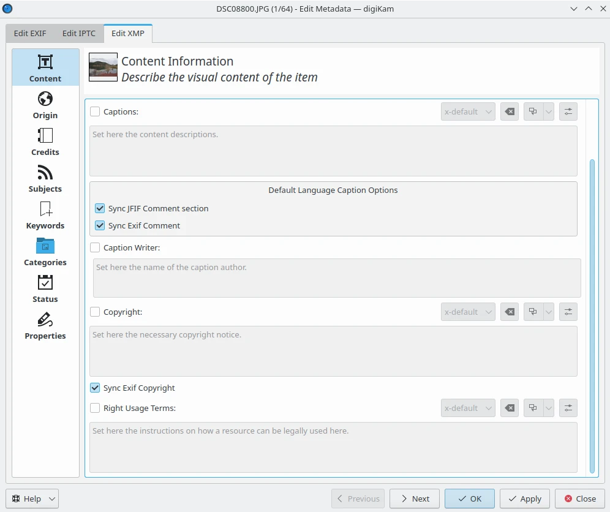

.. meta::
   :description: The digiKam Metadata Editor
   :keywords: digiKam, documentation, user manual, photo management, open source, free, learn, easy, metadata, editor, Exif, IPTC, XMP

.. metadata-placeholder

   :authors: - digiKam Team

   :license: see Credits and License page for details (https://docs.digikam.org/en/credits_license.html)

.. _metadata_editor:

Metadata Editor
===============

.. contents::

Overview
--------

The Metadata Editor is a tool for adding and editing Exif, IPTC, or XMP metadata attached to an image.

Image metadata is textual information that can be attached to digital images in order to annotate, describe and categorize them. This information is useful for searching and indexing images and for accessibility services. There are three standard formats in which image metadata can be stored: Exif, IPTC and XMP. They concentrate on different properties of the image and are used for different purposes. digiKam provides tools for viewing and editing image metadata in all these formats.

The application offers metadata editing tools available through the :menuselection:`Item --> Edit Metadata` menu entry. The metadata editor conveniently arranges all metadata into sections for each kind of metadata chunk, making it easier to find and edit specific entries. For example, to edit hardware-related information, switch to the **Device** section. Here you can modify device manufacturer, device model, exposure-related settings, and other information.

    The Edit Metadata Tool Dialog

In addition to Exif, IPTC and XMP formats are supported, so you can perform the described actions on metadata stored in these metadata chunks as for Exif. Remember that Exif is dedicated to store camera information, where IPTC and XMP are more used to store post-process text information such as rights management. So, it is not recommended to edit the metadata injected by the camera that took the photograph; on the other hand, you can add information about the author, copyright, etc. See description of supported text entries in :ref:`DAM Section <authorship_copyright>` of this manual.

You can synchronize some specific metadata entries from one chunk to another one, as for example the comments which is available in Exif, IPTC, and XMP as separate entries. Mark the check boxes corresponding to the entries you wish to copy from one format to another.

.. caution::

    Synchronizing metadata may produce undesired results because Exif is limited to ASCII character-set.

Exif Tab
--------

Most common Exif tags used by camera devices are listed for editing with standardized values.

The sections available in this view are listed below:

    - **Caption**: record technical descriptions from the camera. All text fields in this section are limited to ASCII characters unless stated otherwise.

        - **Name**: host the name of the document from which this image was been scanned.
        - **Description**: host the image description.
        - **Artist**: host the image author's name separated by semi-colons.
        - **Copyright**: host the copyright owner of the image.
        - **Caption**: host the image's caption. This field is not limited. UTF8 encoding will be used to save the text. This filed can be synchronized with **JFIF Comment section**, **XMP caption**, and **IPTC caption** (warning: limited to 2000 characters)

    .. figure:: images/metadata_editor_exif_caption.webp
        :alt:
        :align: center

        The Exif Caption View from Edit Metadata Tool

    - **Date and Time**: record camera time-stamp properties.

        - **Creation date and time**: this checkbox allows to edit the date and time of image creation. It is the date and time corresponding to the time-stamp when the file was changed. Use the calendar editor widget on the bottom to select the time-stamp and the button on the right side to reset time-stamp to the current date of computer. This last one can be sync with **XMP creation date** and **IPTC creation date**.
        - **Creation sub-second**: this checkbox allows to edit the fractions of seconds for the date and time of image creation.
        - **Original date and time**: this checkbox allows to edit the date and time when the original image data was generated. For a digital still camera the date and time corresponding to the time-stamp when the picture was taken are recorded. Use the calendar editor widget on the bottom to select the time-stamp and the button on the right side to reset time-stamp to the current date of computer.
        - **Original sub-second**: this checkbox allows to edit the fractions of seconds for the date and time when the original image data was generated.
        - **Digitization date and time**: this checkbox allows to edit the date and time when the image was stored as digital data. If, for example, an image was captured by a digital still camera and at the same time the file was recorded, then Original and Digitization date and time will have the same contents. Use the calendar editor widget on the bottom to select the time-stamp and the button on the right side to reset time-stamp to the current date of computer.
        - **Digitization sub-second**: this checkbox allows to edit the fractions of seconds for the date and time when the image was stored as digital data.

    .. figure:: images/metadata_editor_exif_date.webp
        :alt:
        :align: center

        The Exif Date and Time View from Edit Metadata Tool

    - **Lens**: record lens details used with camera.

    .. figure:: images/metadata_editor_exif_lens.webp
        :alt:
        :align: center

        The Exif Lens View from Edit Metadata Tool

    - **Device**: record shot conditions used by camera.

    .. figure:: images/metadata_editor_exif_device.webp
        :alt:
        :align: center

        The Exif Device View from Edit Metadata Tool

    - **Light**: record ambient condition captured by camera.

    .. figure:: images/metadata_editor_exif_light.webp
        :alt:
        :align: center

        The Exif Light View from Edit Metadata Tool

    - **Adjustments**: record technical details used by camera.

    .. figure:: images/metadata_editor_exif_adjustments.webp
        :alt:
        :align: center

        The Exif Adjustments View from Edit Metadata Tool

IPTC Tab
--------

Most common IPTC tags used by photo-agencies are listed for editing. Pre-configured subjects can be used to describe the items contents based on IPTC reference codes.

The sections available in this view are listed below:

    - **Content**: describe the visual content of the item.

    .. figure:: images/metadata_editor_iptc_content.webp
        :alt:
        :align: center

        The IPTC Content View from Edit Metadata Tool

    - **Origin**: formal descriptive information about the item.

    .. figure:: images/metadata_editor_iptc_origin.webp
        :alt:
        :align: center

        The IPTC Origin View from Edit Metadata Tool

    - **Credits**: record copyright information about the item.

    .. figure:: images/metadata_editor_iptc_credits.webp
        :alt:
        :align: center

        The IPTC Credits View from Edit Metadata Tool

    - **Subjects**: record subject information about the item.

    .. figure:: images/metadata_editor_iptc_subjects.webp
        :alt:
        :align: center

        The IPTC Subjects View from Edit Metadata Tool

    - **Keywords**: record keywords relevant to the item.

    .. figure:: images/metadata_editor_iptc_keywords.webp
        :alt:
        :align: center

        The IPTC Keywords View from Edit Metadata Tool

    - **Categories**: record categories relevant to the item.

    .. figure:: images/metadata_editor_iptc_categories.webp
        :alt:
        :align: center

        The IPTC Categories View from Edit Metadata Tool

    - **Status**: record workflow information.

    .. figure:: images/metadata_editor_iptc_status.webp
        :alt:
        :align: center

        The IPTC Status View from Edit Metadata Tool

    - **Properties**: record workflow properties.

    .. figure:: images/metadata_editor_iptc_properties.webp
        :alt:
        :align: center

        The IPTC Properties View from Edit Metadata Tool

    - **Envelope**: record editorial details.

    .. figure:: images/metadata_editor_iptc_envelope.webp
        :alt:
        :align: center

        The IPTC Envelope View from Edit Metadata Tool

XMP Tab
-------

Xmp is an evolution of IPTC removing limitations of information size. XMP tab is similar than IPTC.

The sections available in this view are listed below:

    - **Content**: describe the visual content of the item.

    .. figure:: images/metadata_editor_xmp_content.webp
        :alt:
        :align: center

        The XMP Content View from Edit Metadata Tool

    - **Origin**: formal descriptive information about the item.

    .. figure:: images/metadata_editor_xmp_origin.webp
        :alt:
        :align: center

        The XMP Origin View from Edit Metadata Tool

    - **Credits**: record copyright information about the item.

    .. figure:: images/metadata_editor_xmp_credits.webp
        :alt:
        :align: center

        The XMP Credits View from Edit Metadata Tool

    - **Subjects**: record subject information about the item.

    .. figure:: images/metadata_editor_xmp_subjects.webp
        :alt:
        :align: center

        The XMP Subjects View from Edit Metadata Tool

    - **Keywords**: record keywords relevant to the item.

    .. figure:: images/metadata_editor_xmp_keywords.webp
        :alt:
        :align: center

        The XMP Keywords View from Edit Metadata Tool

    - **Categories**: record categories relevant to the item.

    .. figure:: images/metadata_editor_xmp_categories.webp
        :alt:
        :align: center

        The XMP Categories View from Edit Metadata Tool

    - **Status**: record workflow information.

    .. figure:: images/metadata_editor_xmp_status.webp
        :alt:
        :align: center

        The XMP Status View from Edit Metadata Tool

    - **Properties**: record workflow properties.

    .. figure:: images/metadata_editor_xmp_properties.webp
        :alt:
        :align: center

        The XMP Properties View from Edit Metadata Tool
