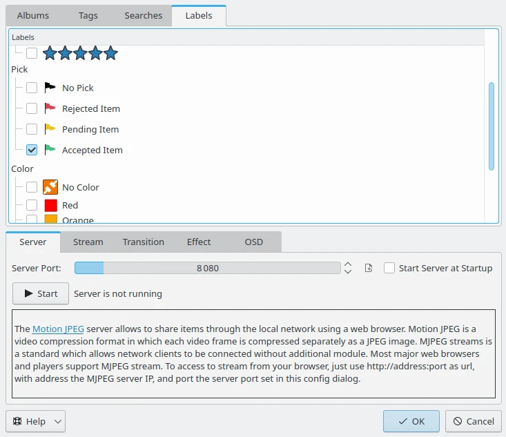
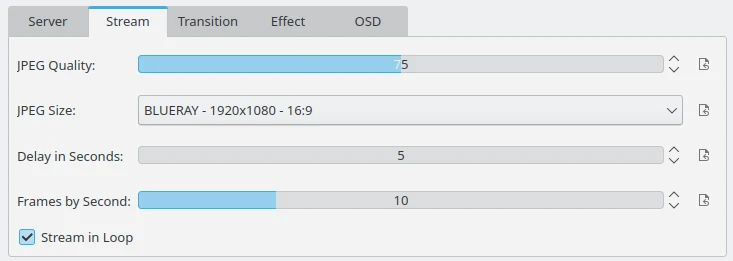
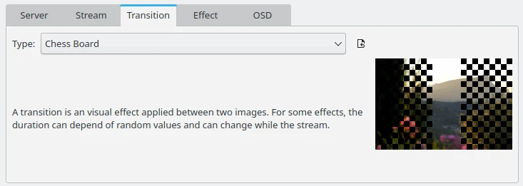
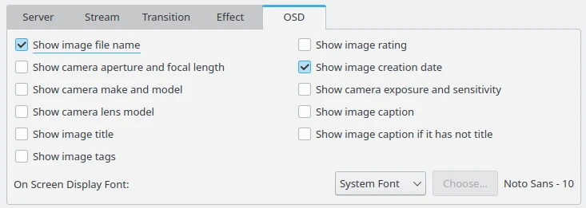
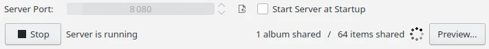
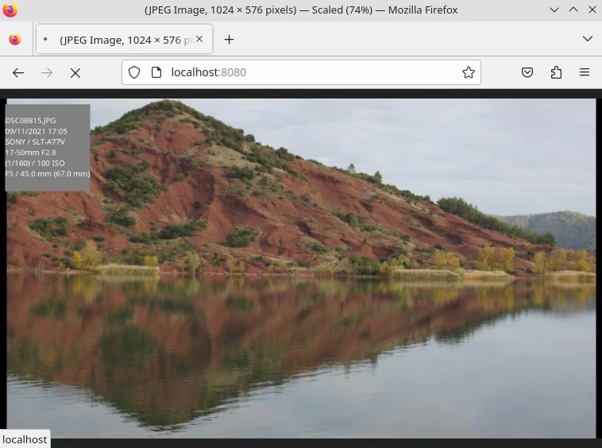

.. meta::
   :description: The digiKam Tool to Share as MJPEG Stream
   :keywords: digiKam, documentation, user manual, photo management, open source, free, learn, easy, mjpeg, server, share

.. metadata-placeholder

   :authors: - digiKam Team

   :license: see Credits and License page for details (https://docs.digikam.org/en/credits_license.html)

.. _mjpeg_stream:

MJPEG Stream
============

.. contents::

MJPEG Stream-Server is used to automatically export digiKam photos through the local network to a client software compatible with the `Motion JPEG protocol <https://en.wikipedia.org/wiki/Motion_JPEG>`_. This is the case of all major **Internet Browsers** which support MJPEG de facto without to add a plugin or a codec.

.. note::

    MJPEG is a stream to display contents one by one, as a slideshow, but without interaction of the user. It's similar as a communication channel or an advertisement screen that you can seen in an airport or a railway station.

To start the MJPEG Stream-Server, head to the **Tools** tab from the **Right Side-bar**. You will find the **Share as MJPEG Stream** icon on the list. You can also start it from the :menuselection:`Tools --> Share as MJPEG Stream` menu entry. The MJPEG Stream-Server window will open as follows: 

    The MJPEG Stream-Server Dialog

To add items in the stream just select your desired **Albums** from the nested lists. You can share from physical **Albums**, or virtual **Tags**, **Searches**, and **Labels**. When the selection is done, press the **Start** button, a wheel on the right side will indicate that server is currently running.

You can customize how the contents must be shared. The **Stream** view hosts all the main settings of the stream, including:

    - **JPEG Quality**: The compression level of images (50:lower quality - 100:higher quality). Warning: better quality require more network bandwidth.

    - **JPEG size**: The JPEG image size in pixels, using standard screen resolutions. Warning: larger size require more network bandwidth.

    - **Delay in seconds**: The temporization in seconds between images.

    - **Frames by seconds**: The number of frames by second to render the stream. Warning: larger rate require more network bandwidth.

    - **Stream in loop**: The MJPEG stream will be played in loop instead once.

    The MJPEG Stream Main Settings View

The **Transition** settings view allows to customize the visual effect applied between two images. Note that For some effects, the duration can depend of random values and can change while the stream. A preview of the transition is given on the right side.

    The MJPEG Stream Transition Settings View

The **Effect** settings view allows to customize the effect to perform a visual panning or zooming applied while to render an image in the stream. A preview of the effect is given on the right side.

.. figure:: images/mjpeg_stream_effect.webp
    :alt:
    :align: center

    The MJPEG Stream Effect Settings View

The **OSD** (for On Screen Display) settings view allows to customize the information to show as overlay on the top left corner of the images.

    The MJPEG Stream OSD Settings View

You can hide this MJPEG Stream-Server window (without closing the actual server) using the **Ok** button. If you want shutdown the server, re-open the MJPEG Stream-Server dialog and press the **Stop** button. Note that the files and folders you specify will be saved for you to use in later sessions.

Use the option **Start Server at Startup** if you want to run the MJPEG Stream-Server automatically once you start digiKam.

    The MJPEG Stream-Server is Running and can be Closed with the Stop Button

This server have been tested with the list of Web-Browsers listed below:

    - Google `Chrome <https://en.wikipedia.org/wiki/Google_Chrome/>`_ and `Chromium <https://en.wikipedia.org/wiki/Chromium_(web_browser)>`_.

    - Microsoft `Edge <https://en.wikipedia.org/wiki/Microsoft_Edge>`_.

    - Mozilla `Firefox <https://en.wikipedia.org/wiki/Firefox>`_.

    - Apple `Safari <https://en.wikipedia.org/wiki/Safari_(web_browser)>`_.
    
To access to stream from your Web-Browser, just use :guilabel:`http://address:port` as url, with :guilabel:`address` the MJPEG **Server** IP, and :guilabel:`port` the server **Port** set in this config dialog.

.. important::

    - MJPEG do not support the secure **https** protocol.

    - To be connected through the network on the MJPEG Stream-Server **Port**, this last one needs to be open on the **Server** firewall.

    The Shared Contents from digiKam Over the Network and Displayed into Firefox
