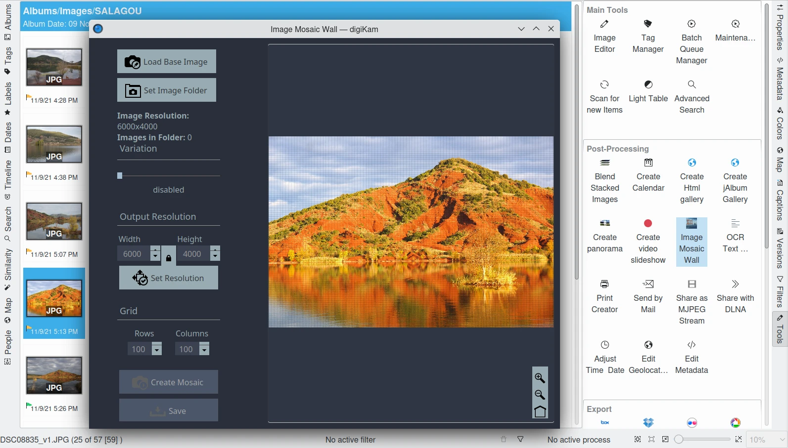
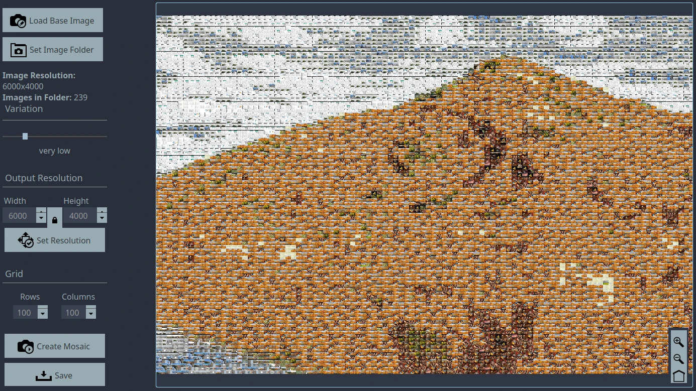

.. meta::
   :description: The digiKam Mosaic Wall Tool
   :keywords: digiKam, documentation, user manual, photo management, open source, free, learn, easy, mosaic, wall

.. metadata-placeholder

   :authors: - digiKam Team

   :license: see Credits and License page for details (https://docs.digikam.org/en/credits_license.html)

.. _mosaicwall_tool:

:ref:`Mosaic-Wall Tool <post_processing>`
=========================================

The `Mosaic-Wall <https://github.com/scheckmedia/ImageMosaicWall>`_ tool creates a mosaic image based on a bunch of other images. This tool is not included in the digiKam source code. Rather, it is a 3rd-party plugin included in binary distributions of digiKam, including the Windows, macOS, and Linux bundles.

First, you need to select one item from your collection to render as a matrix of photo. To start the Mosaic-Wall tool, head to the **Tools** tab from the **Right Side-bar**. You will find the **Image Mosaic Wall** icon on the list. You can also start it from the :menuselection:`Tools --> Image Mosaic Wall` menu entry. The tool dialog will open as follows:

    The Mosaic-Wall Tool Dialog

The previously selected image is rendered with a matrix overlay on the right side of the dialog. The buttons available on the bottom-right corner allow you to adjust the canvas zoom level to show the details of the rendered mosaic.

The tool settings on the left side of the dialog allows you to customize the parameters used to generate the mosaic. If the preselected photo from your collection is not the one that you want to render as a mosaic, you can change it using the **Load Base Image** button. The size in pixels of the base image is indicated just below.

The next button **Set Image Folder** allows you to set the directory where the images to display on the matrix are stored. The tool analyzes all the photos in this directory to select where each image should be applied to the matrix. The images are reduced in size and placed over the base image using a smart comparison of the shape of the resized image and the base image shape of the part to cover. When the analysis is complete, the tool indicates the number of files parsed in the folder that will be used to fill the matrix.

The **Variation** option allows you to customize the redundancy level of the reduced images placed over the matrix. Possible values are **disabled**, **very low**, **low**, **medium**, **high**, and **very high**.

The **Output Resolution** option allows you to customize the width and height in pixels of the target image covered by the matrix. The lock icon between the width and height value allows you to preserve the aspect ratio compared to the base image resolution. To validate changes to the values, press the **Set Resolution** button.

The **Grid** option allows you to customize the numbers of **rows** and **columns** of the matrix. With large values, more items from the image folder will be necessary to cover the mosaic with different thumbnails.

When all is ready to process, press the **Create Mosaic** button. Depending on the settings, this can take a while to complete, but the canvas will display the step-by-step progress of the mosaic construction. Finally, press the **Save** button to record the target image on your disk.

    The Mosaic-Wall Tool Rendering a Target Image with a Matrix of Photos.
