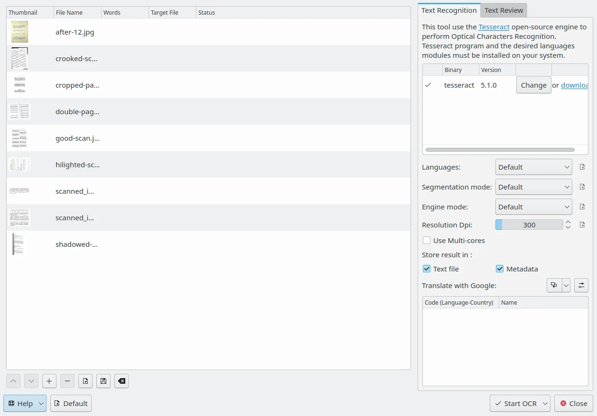
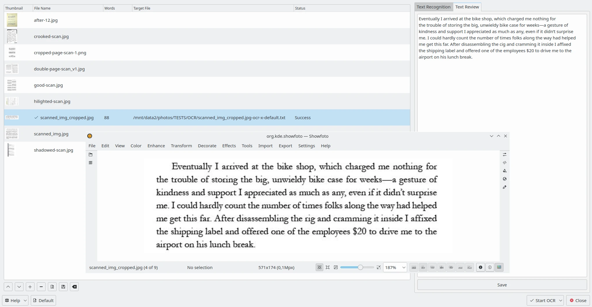

.. meta::
   :description: The digiKam OCR Text Converter
   :keywords: digiKam, documentation, user manual, photo management, open source, free, learn, easy, ocr, text, tesseract

.. metadata-placeholder

   :authors: - digiKam Team

   :license: see Credits and License page for details (https://docs.digikam.org/en/credits_license.html)

.. _ocrtext_converter:

OCR Text Converter
==================

.. contents::

The OCR text converter is a tool to parse the contents of an image and detect areas with text to convert into editable and translatable characters files.

The tool can batch optical character recognition (OCR) over images, and their translations in many languages using an online translator engine. It also allows you to review the text and make corrections and offers spell checking.

The tool use in background the `Tesseract <https://en.wikipedia.org/wiki/Tesseract_(software)>`_, a powerful open-source optical character recognition engine available for Linux, macOS, and Windows.

To perform text conversions, select the scanned images including text to recognize and start the tool from the menu :menuselection:`Tools --> OCR Text Converter`, or use the icon **OCR Text Converter** from the **Tools** tab on the right sidebar. The following dialog must appear:

    The digiKam OCR Text Converter Dialog

On the right side, the **Text recognition** tab shows on the top of view the **Tesseract** binary program version detected on your system. If none is present, you will need to install it on your system. Below, the **Tesseract** settings can be customized to process images.

The **Languages** setting specifies the language used for OCR. In the **Default** mode, when processing digital text with multiple languages, **Tesseract** can automatically recognize languages using Latin alphabets such as English or French, but it's not compatible with languages using hieroglyphs such as Chinese or Japanese. You can use the **Orientation and Script Detection** mode instead or a specific language module if available.

The **Segmentation mode** settings specify the **Tesseract** page segmentation mode to use while processing images. Possible choices are listed below:

    - **OSD only**: Orientation and Script Detection (OSD) only.
    - **With OSD**: Automatic page segmentation with OSD.
    - **No OSD**: Automatic page segmentation, but no OSD, or OCR.
    - **Default**: Fully automatic page segmentation, but no OSD.
    - **Col of text**: Assume a single column of text of variable sizes.
    - **Vertically aligned**: Assume a single uniform block of vertically aligned text.
    - **Block**: Assume a single uniform block of text.
    - **Line**: Treat the image as a single text line.
    - **Word**: Treat the image as a single word.
    - **Word in circle**: Treat the image as a single word in a circle.
    - **Character**: Treat the image as a single character.
    - **Sparse text**: Sparse text. Find as much text as possible in no particular order.
    - **Sparse text + OSD**: Sparse text with OSD.
    - **Raw line**: Treat the image as a single text line, bypassing hacks that are Tesseract-specific.

If you want more details about the Tesseract Segmentation Mode you can read this `online tutorial <https://pyimagesearch.com/2021/11/15/tesseract-page-segmentation-modes-psms-explained-how-to-improve-your-ocr-accuracy/>`_.

The **Engine mode** setting specifies the **Tesseract** OCR internal engine to use while processing images. Possible choices are listed below:

    - **Legacy**: Legacy engine only (older engine not based on the neural network).
    - **LSTM**: Neural network LSTM (Long Short-Term Memory deep-learning) engine only.
    - **Legacy + LSTM**: Both legacy and LSTM engines will be used.
    - **Default**: Default value. Let Tesseract choose the best engine based on what is available.

The **Resolution Dpi** settings specify the resolution as Dot Per Inch (DPI) for the input images.

If the **"Use Multi-cores** setting is enabled, files from the list will be processed in parallel with Tesseract.

The **Store result in** will specify where to place the text contents recognized by Tesseract while processing images. Possible choices are listed below:

    - **Text file**: Store OCR result in a separate text file in the same directory as the processed image.
    - **Metadata**: Store OCR result in alternative-language XMP tag from image metadata.

On the bottom of this view, the OCR result can be translated into different languages using one online translation engine. You can set more than one translation language to process images. Corresponding translations will be hosted in separate text files or in extra metadata entries depending on the **Store result in** setting. See :ref:`this page from the manual <spellcheck_settings>` for more details about the **Localize Settings**.

The **Text Review** tab on the right side allows editing the OCR result for each image processed with Tesseract. Select one item from the list on the left side and OCR result will be displayed in a text editor. You can fix text if necessary or apply spell-checking. See :ref:`this page from the manual <localize_settings>` for more details about the **Spell-Checking Settings**.

On the bottom of the dialog, the **Default** button allows resetting all settings to the default values. The **Start OCR** drop-down button allows the processing of the currently selected images from the list or all items. Finally, the **Close** button will stop all OCR processes if any and close the dialog.

    The digiKam OCR Text Converter Content to Review on the Right Side with the Corresponding Image Open in Showfoto 
