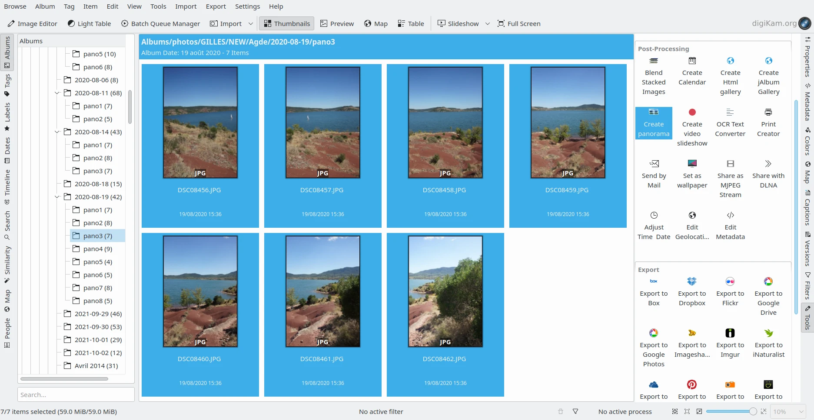

.. meta::
   :description: The digiKam Panorama Creator
   :keywords: digiKam, documentation, user manual, photo management, open source, free, learn, easy, panorama, assembly, stitch

.. metadata-placeholder

   :authors: - digiKam Team

   :license: see Credits and License page for details (https://docs.digikam.org/en/credits_license.html)

.. _pano_creator:

:ref:`Panorama Creator <post_processing>`
=========================================

    The Panoramic JPEG Files Selected from Icon-View (7x24Mpx Images taken with Sony A77 - 59 Mb)

A panorama is a composite of multiple photos taken in the same conditions with the same camera/lens. The camera is rotated about a single point between each shot, so the end photos can be stitched together as if shot with a super wide-angle lens. The sequential images must be taken with overlapping edges. The Panoramic Algorithm will try to found the common portions of the images to join and merge the contents. The get the most consistent perspective, it is best to use a tripod, especially with complex compositions. The **Panorama Creator** tool allows you to assemble shots taken horizontally, vertically, or as a matrix.

.. note::

    Be aware that the target panorama will be constructed from a huge amount of data and so panorama processing requires lots of memory.

Select the images that you want to stitch and go to :menuselection:`Tools --> Create Panorama`. A wizard dialog will open up as below.

.. figure:: images/pano_creator_01.webp
    :alt:
    :align: center

    The Panorama Creator Wizard with the Hugin Components Detection

This plugin uses the `Hugin command line tools <https://hugin.sourceforge.io/>`_ to analyze and assemble the items. If all the software components are found on your system, just select the output format that you prefer to render the panorama and click on **Next** button. The page below appears:

.. figure:: images/pano_creator_02.webp
    :alt:
    :align: center

    The Panorama Creator Wizard with the List of Items to Assemble

If necessary, re-arrange the images into the correct order, using the **Up** and **Down** buttons. Use the buttons with the **Plus** and **Minus** symbols to add or remove items. If you want to render a 360° panorama, the first image from the list will be the item placed on the center of the panorama. When all is done, click on **Next** button.

.. figure:: images/pano_creator_03.webp
    :alt:
    :align: center

    The Panorama Creator Wizard Pre-Processing Stage

The option **Detect moving skies** allows an automatic detection of clouds to prevent wrong key-points matching between images due to moving shapes. To be more precise, the process discards any points that are associated with a possible cloud during the selection of control points. This is useful to prevent moving clouds from altering the control points matching process used by the algorithms. Depending on the scene contents, turn on the option and press **Next** button to pre-process items.

.. figure:: images/pano_creator_04.webp
    :alt:
    :align: center

    The Panorama Creator Wizard Optimizations Stage

The optimizations page includes another option named **Level horizon** dedicated for use with horizontal scenes. Turn on this setting to detect the horizon and adapt the projection accordingly. The detected horizon will be a horizontal line in the final panorama. If your scene is a vertical composition, you can ignore this setting. Click on the **Next** button to preview the result.

.. figure:: images/pano_creator_05.webp
    :alt:
    :align: center

    The Panorama Creator Wizard Preview Stage

This page displays the assembled images allowing you to judge the results. You can then crop the contents to eliminate the black frames around your scene. By default, the tool is able to automatically detect the effective region of the panorama. If you move the mouse over the preview canvas, a toolbar appears in the top left corner to **Zoom In**, **Zoom Out**, and **Zoom to Fit** the image. Right click the mouse to re-define a new crop area. When all is OK, click the **Next** button for final processing and composition of the panorama.

.. figure:: images/pano_creator_06.webp
    :alt:
    :align: center

    The Last Page of the Panorama Creator Wizard

After a long computation, panorama stitching will be complete and the tool will propose a template name for the target file. If you want you can also save your project in a format compatible with Hugin. Click on the **Finish** button and you will see the output in the same **Album** as your original pictures.

.. note::

    The 7x24Mpx images (59 Mb) used as example in this section of this manual produce one single post-processed panoramic JPEG file of 82 Mpx (23 Mb).

    .. figure:: images/pano_creator_final.webp
        :alt:
        :align: center

        The Assembled Panoramic JPEG Files Displayed in digiKam
