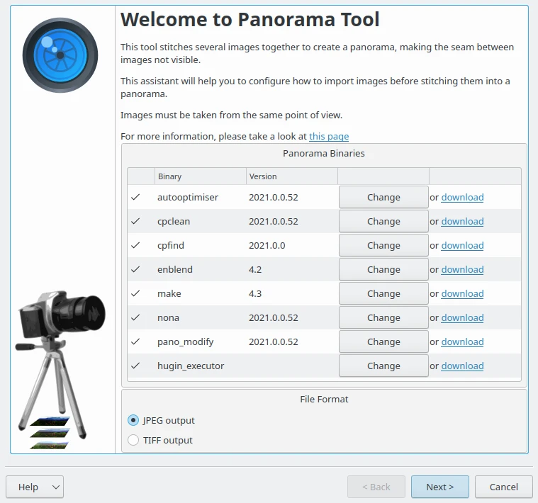
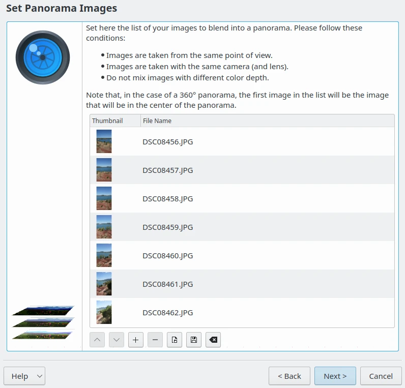
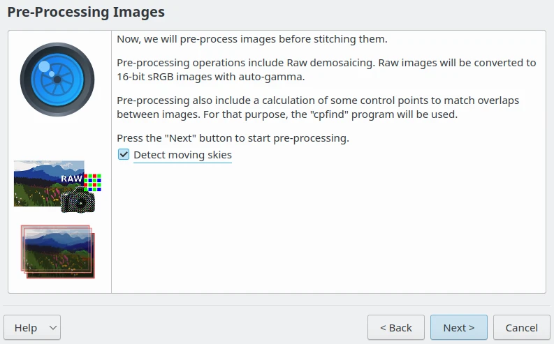
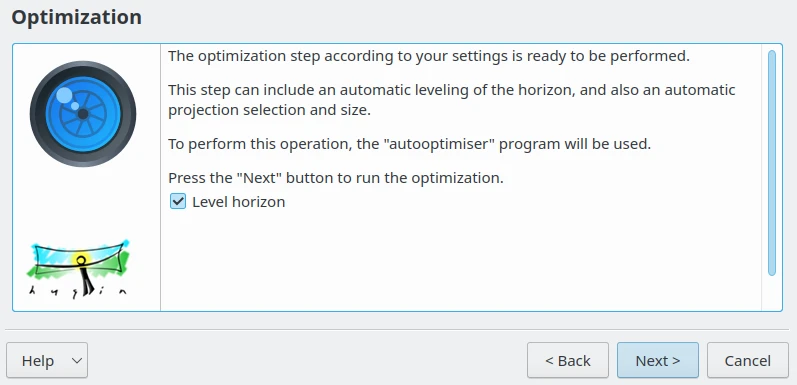
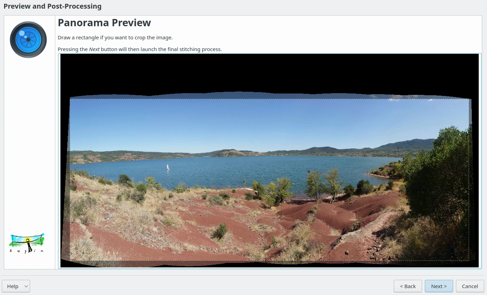
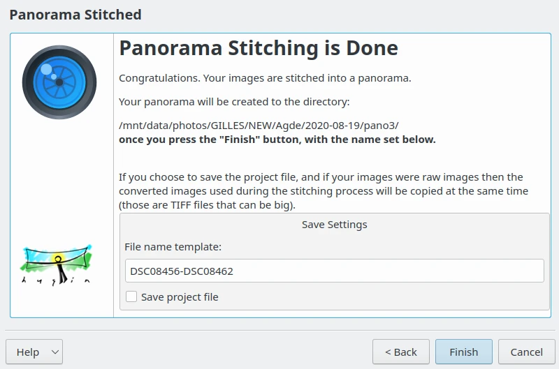

.. meta::
   :description: The digiKam Panorama Creator
   :keywords: digiKam, documentation, user manual, photo management, open source, free, learn, easy, panorama, assembly, stitch

.. metadata-placeholder

   :authors: - digiKam Team

   :license: see Credits and License page for details (https://docs.digikam.org/en/credits_license.html)

.. _pano_creator:

Panorama Creator
================

.. contents::

One of the most exciting tools available in digiKam and Showfoto is the Panorama tool. Which is simple and quite effective.

A panorama will be an composition of photo taken in the same conditions, same format, and ame resolution. To assemble the images, camera turn around the same point of view with a large angle to shot a panoramic scene. Images must be taken with a superimposed area on the left and on the right. Algorithm will try to found the common portions of images to join and merge contents. To be sure about stability you can use a tripod.   

Select the images that you want to stitch and go to :menuselection:`Tools -> Create Panorama` a wizard dialog will open up as below.

    The Panorama Creator Wizard with the Huggin Components Detection

This plugin is based on the `Hugin command line tools <https://hugin.sourceforge.io/>`_ to assemble the items. If all software components are found of your system, just select any output format that you prefer to render the panorama and click on **Next** button and the page below must appears:

    The Panorama Creator Wizard with the List of Items to Assemble

Arrange the images in correct order if they are not, use the up and down arrows, click the icon with the minus symbol to remove any images and click on **Next** button.

    The Panorama Creator Wizard Pre-Processing Stage

If you want the tool **Detect moving skies** then click the option and press **Next** button to pre-process items.

    The Panorama Creator Wizard Optimizations Stage

When optimizations are done, click on the **Next** button to preview the result.

    The Panorama Creator Wizard Preview Stage

In this page the images are assembled, your can judge of the result, and crop the contents zt the right place. When all in fine for you, click on **Next** button.

    The Last Page of the Panorama Creator Wizard

After a long computation, panorama stitching is now done. If you want you can now save your project. The same project files can be used in Hugin. Click on **Next** button and you will see the output in the same **Album** as your original pictures.
