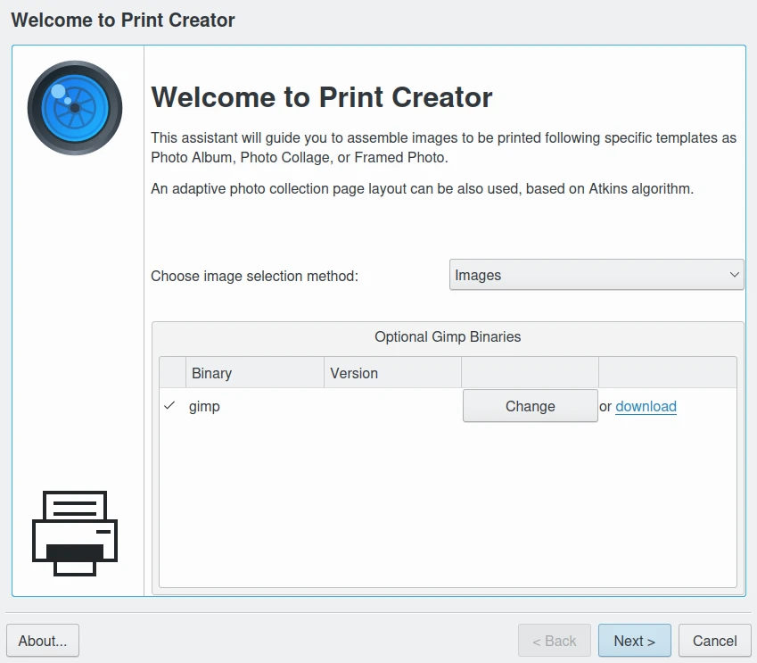
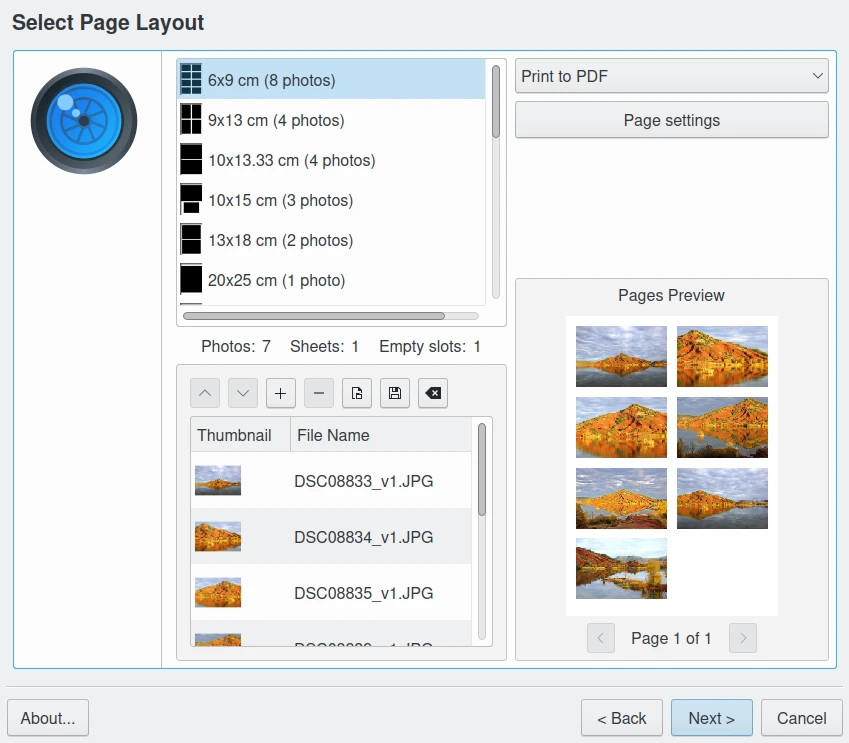
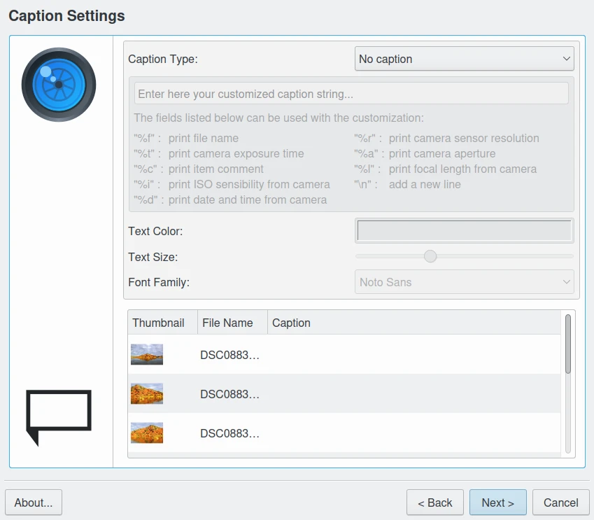
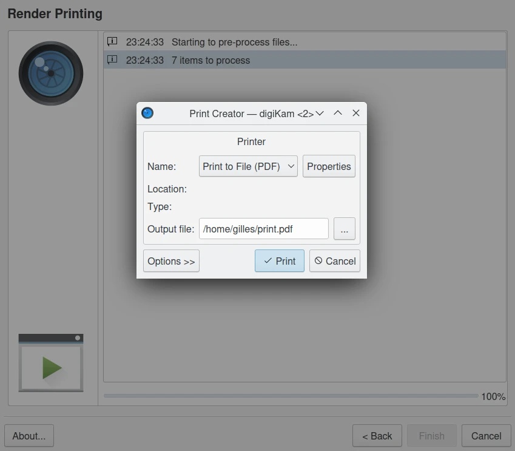

.. meta::
   :description: The digiKam Print Creator
   :keywords: digiKam, documentation, user manual, photo management, open source, free, learn, easy, print, creator, template, group, combination, layout

.. metadata-placeholder

   :authors: - digiKam Team

   :license: see Credits and License page for details (https://docs.digikam.org/en/credits_license.html)

.. _print_creator:

Print Creator
=============

.. contents::

Overview
--------

The Print Creator is a tool to print grouped images at the same time.

This tool allows multiple images to be combined into single sheets of paper in standard photo sizes for printing. The combined images can also be automatically opened with the image editor Gimp for enhancement or for direct printing using the Gimp-Print tool. The combined images can also be output directly as **PDF** or **image** files.

Using the Wizard
----------------

The first page allows to use the items selection method: from **Images** currently selected in digiKam, or from **Albums** hosted in your collections. This page also verify the availability of **Gimp** binary program.

    The Print Wizard Page to Select Items

The next page allows to customize the **Printing Layout**, the **List of Items** to assemble, and the **Printing Target** as:

    - Post processing with **Gimp**. Application needs to be installed on your system.
    - **PDF** file. Linux has a native export to PDF support. For Windows and macOS, supplemental driver needs to be installed.
    - **Image** file.

A layout preview using selected items an the printing template is given on the left bottom side of the dialog.

    The Print Wizard Page to Preview Selected Items on Template Layout

The next page allows to customize the caption for each items, as:

    - **No caption**.
    - **Image file name**.
    - **Exif date-time** from file metadata.
    - **Item comments** from file metadata.
    - A **Custom Format** constructed by a list of fields assembly as a string.

The caption **Text Color**, **Text Size**, and **Font Family** can be customized if necessary.

    The Print Wizard Page to Setup Captions

The next page allows to crop and rotate each items at the desired area before printing. You can review all items one by one before to start the print processing.

.. figure:: images/print_creator_page4.webp
    :alt:
    :align: center

    The Print Wizard Page to Crop or Rotate Items

The last page list all necessary tasks to render printing. If you select an image or a PDF file as target, a supplemental dialog will appear to customize the last options used by the print driver, and especially the place where the file must be generated.

    The Print Wizard Page to Render Printing

.. _printcreator_newlayout:

Creating a New Layout
---------------------

The Print Creator tool allows to add new templates to manage new page layouts easily. This chapter explains how to create templates, test, and share files for an official integration in application.

Getting Started
~~~~~~~~~~~~~~~

A template is at least one file with XML extension (for instance :file:`my-templates.xml`), if you want it to be included however you need another file that allows translations, e.g. a desktop file (see below).

When the Print Creator is running, it does the following:

    - Waits from you to choose the page size.
    - Looks for files describing templates (XML files).
    - For each file, it looks for templates. If template is fine, it checks if layout fits into the chosen page size, adds it, and loads desktop file if exists.
    - Shows templates with a preview icon in a list box.

The current official templates list can be seen `in this git repository <https://invent.kde.org/graphics/digikam/-/tree/master/core/dplugins/generic/tools/printcreator/templates>`_.

The XML File Structure
~~~~~~~~~~~~~~~~~~~~~~

The XML file is used to describe template layouts, once it was a real page layout. At now, you can add a fake page size to make it available for all those pages in which your new template fits.

An example of template (already included into default templates.xml) is a layout containing six passport size photos (35x40mm) is the following:

.. code-block:: xml

    <templates>
        <paper name="passport-photos" width="90" height="130" unit="mm" >
            <template name="6_photos_3.5x4cm" dpi="0" autorotate="true">
                <photo x="10" y="3"  width="35" height="40" />
                <photo x="55" y="3"  width="35" height="40" />
                <photo x="10" y="45" width="35" height="40" />
                <photo x="55" y="45" width="35" height="40" />
                <photo x="10" y="87" width="35" height="40" />
                <photo x="55" y="87" width="35" height="40" />
            </template>
        </paper>
    </templates>

The **paper** element represents the template layout, important attributes are width, height and unit:

- **width** attribute: Represents the layout width.
- **height** attribute: Represents the layout height.
- **unit** attribute: Explains in which units width and height are, it can be inches or inch, mm, or cm.

The **template** element is the real template definition and contains the photo positions. Attributes are:

- **name** attribute: It is the template's name. It's used to get translations at run-time set from a desktop file-name ( :file:`6_photos_3.5x4cm.desktop` in the example). If the desktop file-name does not exist, the name attribute is shown.
- **autorotate** attribute: Sets if autorotation must be done.
- **photo** element: Sets photo position (x and y attributes) and size (width and height attributes).

See below another example for **A6 page size**:

.. code-block:: xml

    <paper name="A6" width="105" height="148" unit="mm" >
        <template name="1_photo_9x13cm" dpi="0" autorotate="true">
            <photo x="5" y="10" width="90" height="130" />
        </template>
        <template name="1_photo_10.5x14.8cm" dpi="0" autorotate="true">
            <photo x="0" y="0" width="105" height="148" />
        </template>
    </paper>

The Desktop File
~~~~~~~~~~~~~~~~

The desktop file is needed for translations. If you use your templates for your own, you don't really need it. It's a standard ini-style file and looks like this (for instance :file:`1_photo_9x13cm`):

.. code-block:: ini

    [Desktop Entry]
    Type=Theme
    Name=9x13 cm (1 photo)
    Name[da]=9x13 cm (1 foto)
    Name[de]=9x13 cm (1 Foto)
    Name[en_GB]=9x13 cm (1 photo)
    Name[et]=9x13 cm (1 foto)
    Name[gl]=9x13 cm (1 foto)
    Name[it]=9×13 cm (1 foto)
    Name[nb]=9x13 cm (1 bilde)
    Name[nl]=9x13 cm (1 foto)
    Name[pt]=9x13 cm (1 fotografia)
    Name[pt_BR]=9x13 cm (1 foto)
    Name[sv]=9 x 13 cm (1 foto)
    Name[x-test]=xx9x13 cm (1 photo)xx

The nice thing is that when your layout get integrated into Print Creator tool default templates, translators teams will translate the desktop file for you.

Creating new Template from Another One
~~~~~~~~~~~~~~~~~~~~~~~~~~~~~~~~~~~~~~

The easiest way to get started is to copy templates.xml file and modify it. Templates folder can be found usually under **Linux** at :file:`/usr/share/apps/digikam/templates/`. Writing in this folder requires root access, so we will not create our template there, Instead do the following from a console:

- Create a template folder in your home directory:

.. code-block:: shell

    mkdir -p ~/.config/share/apps/digikam/templates/

- Go to this directory:

.. code-block:: shell

    cd ~/.config/share/apps/digikam/templates/

- Copy the :file:`templates.xml` to :file:`my_templates.xml` for instance:

.. code-block:: shell

    cp -r /usr/share/digikam/templates/templates.xml ~/.config/share/apps/digikam/templates/my_templates.xml

- Remove all pages and add yours then create the desktop file accordingly.

You are done, you can now open digiKam and start the tool, your new templates should appear in the **Layouts** list from the  **Select page layout** wizard dialog page.

Final Words
~~~~~~~~~~~

This is the end of this chapter, now is the time for you to get creative and add new templates.

When you are done, do not hesitate to propose your work for an official integration in digiKam, to see your new layout included in the official list. See the `Contribute page <https://www.digikam.org/contribute/>`_ from the digiKam project web-site for details.
