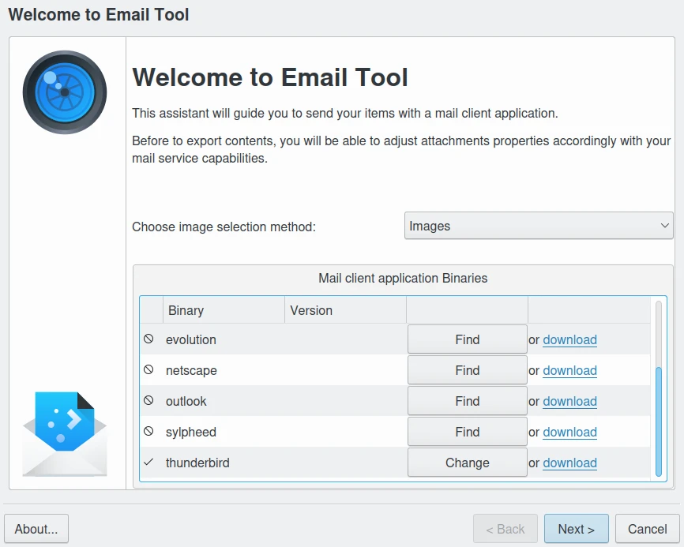
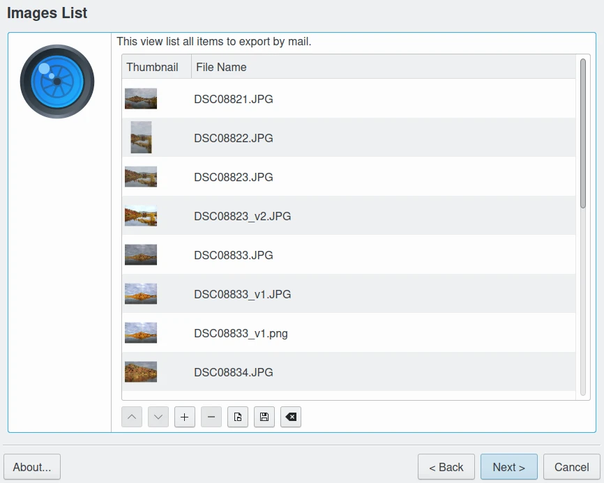
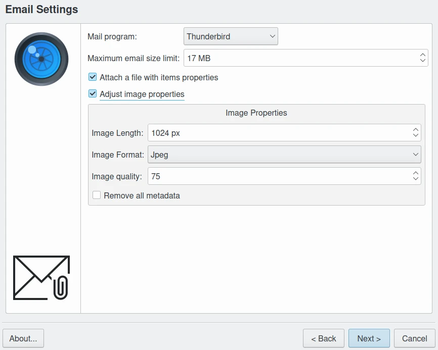
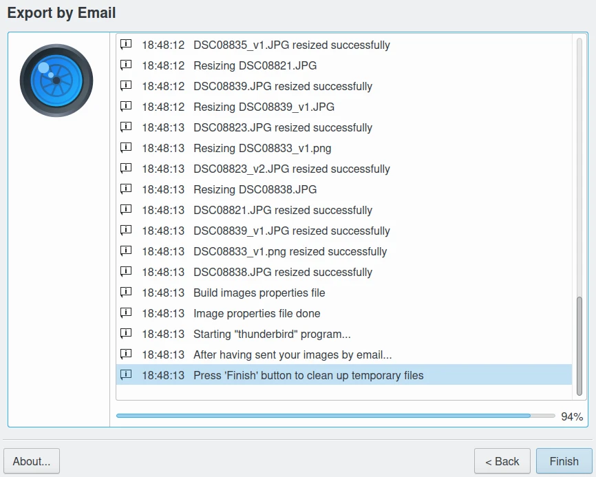
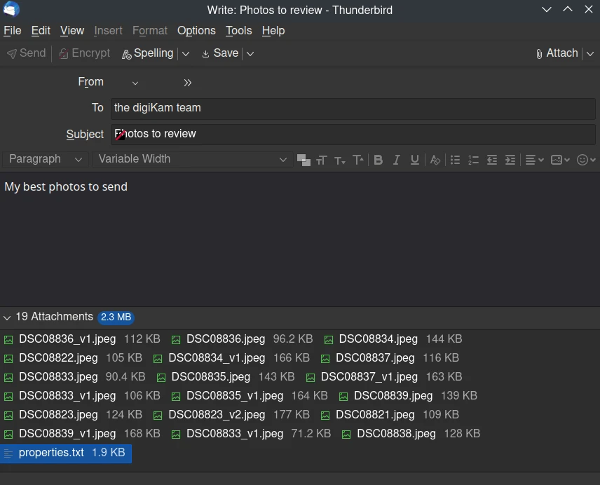

.. meta::
   :description: The digiKam Send Images By Mail 
   :keywords: digiKam, documentation, user manual, photo management, open source, free, learn, easy, html, gallery

.. metadata-placeholder

   :authors: - digiKam Team (see Credits and License for details)

   :license: Creative Commons License SA 4.0

.. _send_images:

Send Images
===========

.. contents::

This tool can be used to send images directly by e-mail.

With this tool you can e-mail the selected images with your favorite e-mail agent. Resizing images is possible. You can use drag and drop to add more images to the list of images to send.

When opening the tool from the application, the Email Images Options dialog will appear with the e-mail agent applications detected on your system. You can also select the items to send by **Images** list or **albums** collection.

With the Images list mode, you will show your pre-selected items from digiKam already in the list of the dialog.

Below the image list there are five buttons. The two left buttons are used to move a selected image in the list up or down. The middle button opens a file browser to add more files as needed in the usual file selection manner.

When clicking on the other buttons the selected images will be removed from the list or the list will be cleared. 

.. tip::

    You can drag and drop images between the host application window and the image file list to add new items to e-mail.

.. warning::

    Be sure not to overload your own or your addressees e-mail transmission limit; most providers limit the e-mail size to some megabytes of data. Use several e-mails if you want to send a lot of data. 

The next page is used to change the settings of the images to be sent. These settings will be remembered when you close the tool until you change them.

Select your favorite **Mail Program** from the drop-down menu.

If you select **Attach a file with image properties** from Application the comments, rating or tags included with the images will be merged to a text file and attached in the mail.

The next three items allow you to set-up the image properties to be sent. To enable these options check **Adjust image properties**. First select an Image size suitable for your Internet connection speed and the target mailbox size.

The PNG file format in the **Image format** drop-down menu is not well adapted to reduce photographic images file size, but is best suited for compressing lossless items like the TIFF file format. PNG must be used if you use dialup speed Internet and you want to preserve the photo quality. Otherwise, JPEG is the recommended format.

The **Image quality** can be chosen with the input box. 75% is the standard compression ratio for JPEG files. Setting compression to 100% will result in lossless compression at the cost of the largest file size. The difference in file size between 90% and 100% can be quite dramatic, whereas the gain in quality is minor. Very good quality is already obtained with 85% compression.

.. note::

    If you choose JPEG as the Image file format and the original files were in JPEG format, the original Exif data included is preserved in e-mailed images.

If you want to drop metadata, turn on **Remove all metadata** option.

The next page will show a progress dialog given a feedback on the progress of your operation to prepare item before e-mailing. Press the **Cancel** button during this stage if you want to abort the process.

When all jobs are completed, this dialog will not close automatically and you can consult the progress messages if any errors occurred during this stage. The mail agent will be started automatically at the end.

The composer window will be open with your favorite e-mail client. You just need to add the addressee and the subject. The selected images will be already be listed as attachments.

When email is sent, you can close the progress dialog to purge all temporary files.

