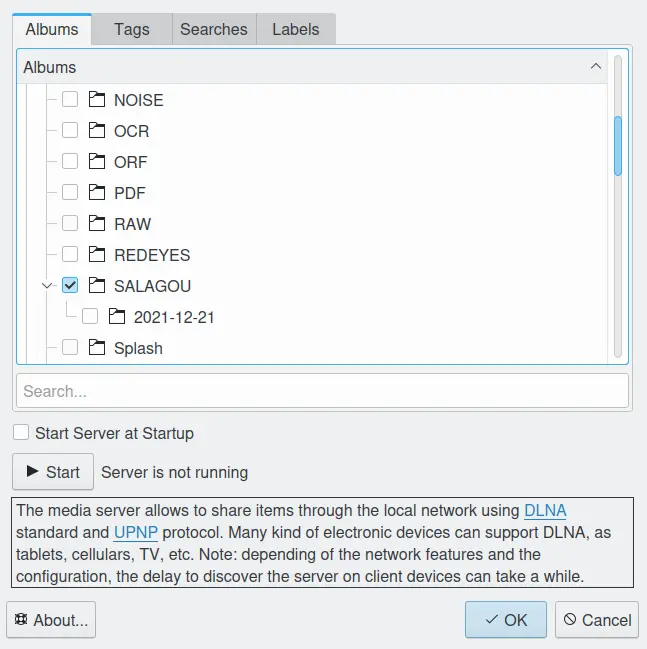
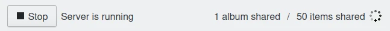
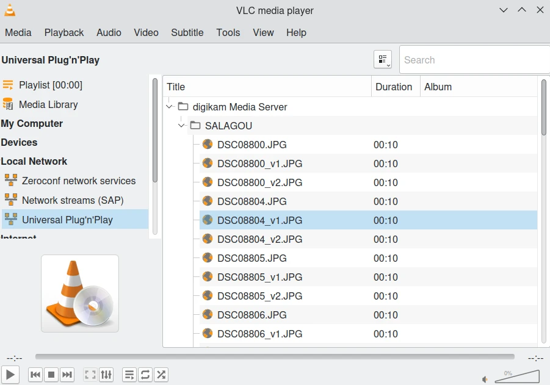

.. meta::
   :description: The digiKam Share With DLNA
   :keywords: digiKam, documentation, user manual, photo management, open source, free, learn, easy

.. metadata-placeholder

   :authors: - digiKam Team (see Credits and License for details)

   :license: Creative Commons License SA 4.0

.. _share_dlna:

Share With DLNA
===============

.. contents::

DLNA Mediaserver is used to automatically export digiKam photos through the local network to other DLNA-compliant devices like smart phones, TV, and tablets.

To start the mediaserver, head to the right bar and click the Tools menu. You will find the dlna server icon as shown in the next screenshot. You can also start it from the Tools menu in the main toolbar. The mediaserver window will open as follows: 

Now you have a couple of buttons. Use Add Items if you want to add single image files to be shared through the server. Use Add New Root Directory if you want a complete folder to be added to your server. You can choose to add the files inside this folder only or also the files inside the internal folders by checking the Scan Recursively checkbox. Use Delete Selected to remove the selected files/folders from the shared items. And finally you can hide this mediaserver window (without closing the actual server) using the Hide Window button. If you want to close the window AND the server, press the ordinary cross to the top-right of the window. Note that the files and folders you specify will be saved for you to use in later sessions.

Starting the digiKam configuration panel (Settings → Configure digiKam...), you will find a new option for the digiKam mediaserver. You actually have two simple options: if you want to start the mediaserver automatically once you start digiKam and if so, if you want to start the server in background or show the actual mediaserver window. That's all what the two checkboxes here do.

After you start the server, you might have to wait for about 30 seconds to one minute before other devices in the network can see your server, so please be patient :)

This server was tested with some client applications. This list includes:

    VLC media player 3.0.16 (PC - Ubuntu) - Note: Older versions of VLC do not work properly.

    GUPnP AV (PC - archlinux)

    VLC media player (Android)

    BubbleUPnP (Android)

    MediaHouse (Android)

    AnDLNA (Android)

