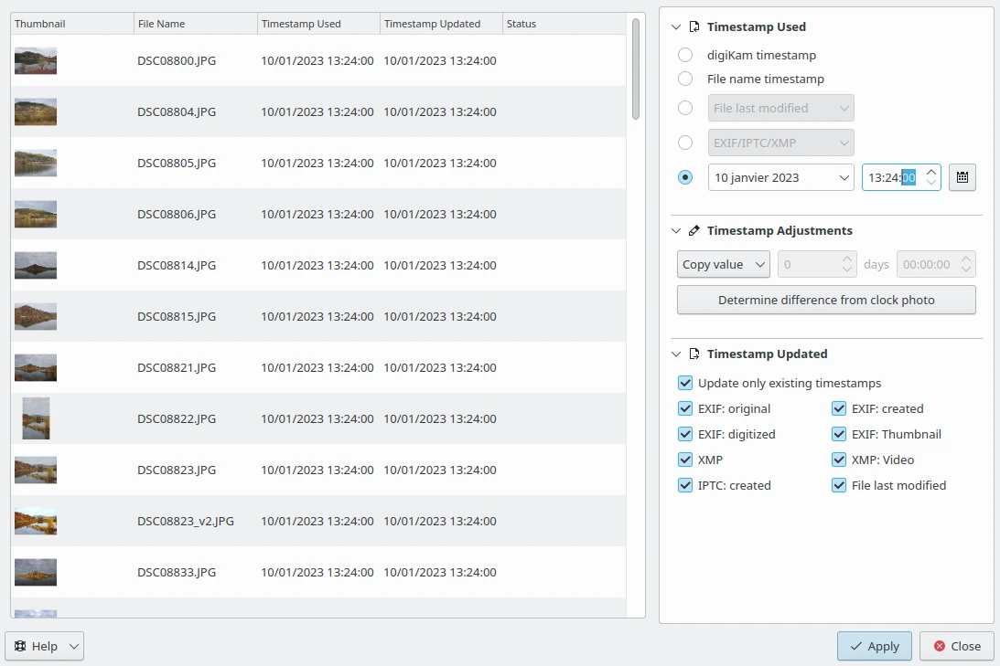

.. meta::
   :description: The digiKam Time Adjust
   :keywords: digiKam, documentation, user manual, photo management, open source, free, learn, easy, date, time, adjust

.. metadata-placeholder

   :authors: - digiKam Team

   :license: see Credits and License page for details (https://docs.digikam.org/en/credits_license.html)

.. _time_adjust:

Time Adjust
===========

.. contents::

The Time Adjust tool allows to adjust or set the time-stamps in file metadata. This common task is sometime mandataory when your image do not contains date in metadata as when contents is digitized with a scanner, or when a camera record a wrond date in you file due to a wrong device settings. With this tool you can choose the right source to take the date information, the date entries to fix or append, and the calculation to operate on date before registration.

The **Timestamp Used** allows to select the source of the date. Available choices are listed below:

    - **digiKam timestamp**: the date recirded in database.
    - **File name timestamp**: the date extracted from the filename.
    - From the file system: **File last Modified** will use the last modification date of file.
    - From the metadata

    The digiKam Time Adjust Tool Tuning Time-Stamp on Items
