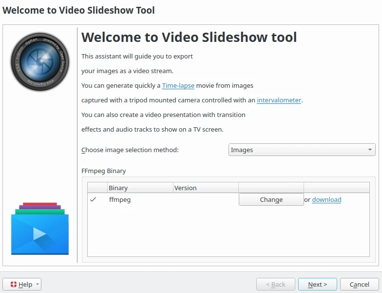
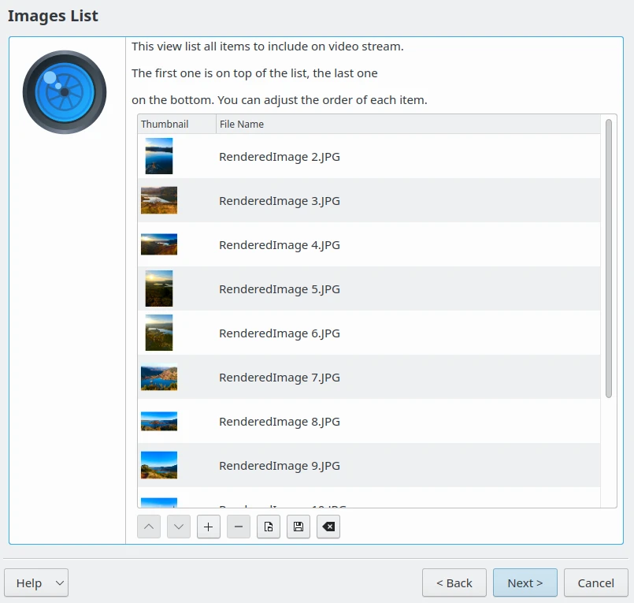
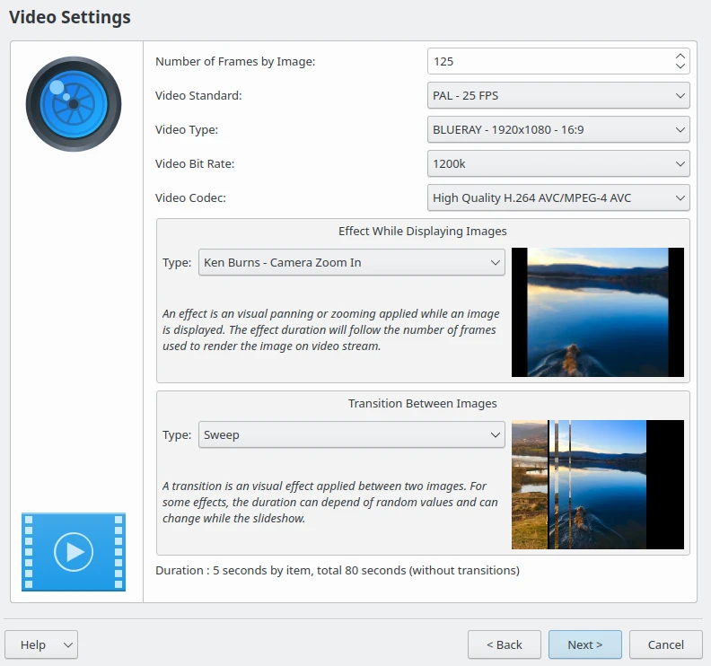
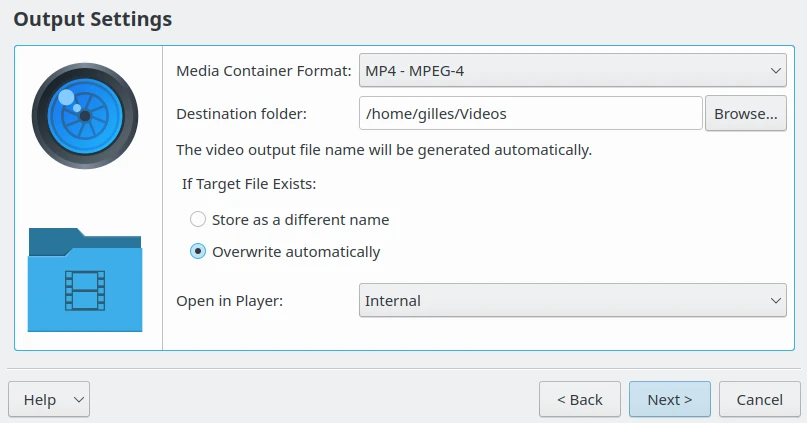
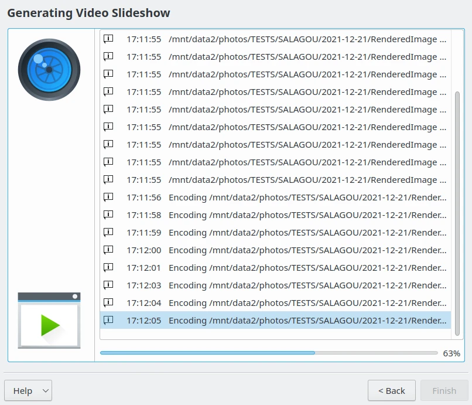
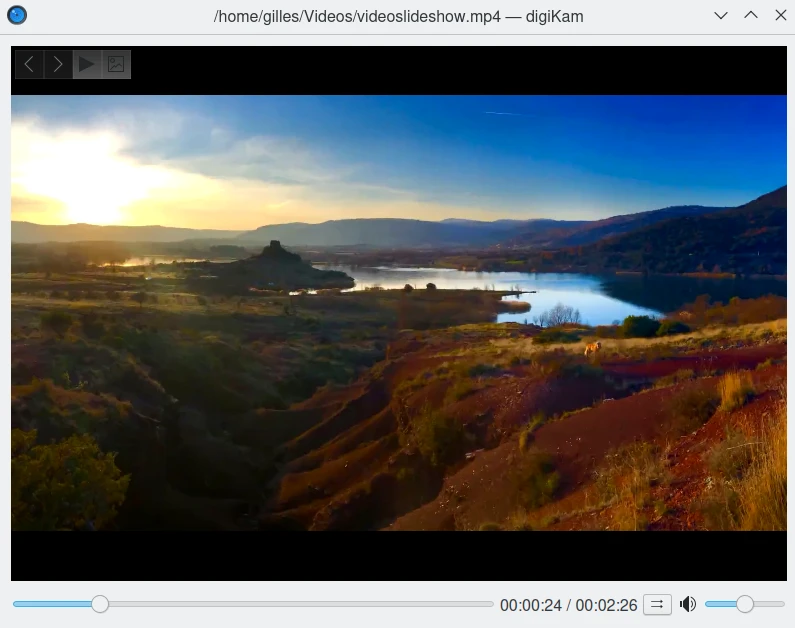

.. meta::
   :description: The digiKam Video Slideshow
   :keywords: digiKam, documentation, user manual, photo management, open source, free, learn, easy, video, slideshow

.. metadata-placeholder

   :authors: - digiKam Team

   :license: see Credits and License page for details (https://docs.digikam.org/en/credits_license.html)

.. _video_slideshow:

:ref:`Video Slideshow <post_processing>`
========================================

The Video Slideshow tool allows creation of a movie from a list of photos. The generated file can be played on a video player or a TV screen. Images are presented one by one with visual effects if you need them. This tool can also be used to create a time-lapse animation from shots taken with an intervalometer.

Select the images that you want to encode as video and go to :menuselection:`Tools --> Create video slideshow` a wizard dialog will open up as below.

    The Video Slideshow Wizard Welcome Page

This page allows you to select the contents to export using one of two methods, either from the current items selection, or from a list of albums. With the **Albums** selection mode you can generate a video slideshow from album contents. Just check the respective albums displayed in the hierarchical list. Use the next three tabs **Tags**, **Searches**, and **Labels** to refine your selection using tags, labels, or previous search results in digiKam.

If you use the **Images** selection mode only the previous selection of items from the Icon-View will be processed and listed on this page as a flat list.

    The Video Slideshow Wizard Images Selection Page

Press the **Next** button to display all the video settings used to encode the slideshow. The parameters are:

    - **Number of Frames by Image**: The number of frames generated of one image to encode in the video stream. This defines the time of one image will be present statically on screen. If you set an **Effect While Displaying Images**, this one will be rendered with this number of frames.

    - **Video Standard**: This is the video norm to use while encoding media, as **PAL - 25 FPS** or **NTSC - 29 FPS** (FPS: Frame Per Seconds).

    - **Video Type**: This is the video resolution to use while encoding media. Images are resized accordingly. Take care that high resolution will require more resources to encode and use more space on your disk.

    - **Video bit Rate**: This is the bandwidth used to encode video. A low value means poor quality, and a high value means good quality. Be aware that high-bit-rate video will require more space on your disk.

    - **Video Codec**: This is the standard video encoding method to make the media.

    - **Effect While Displaying Image**: Select the visual effects to apply on an image while **Number of Frames by Image**.

    - **Transition Between Images**: Select the visual effect to apply as a transition outside the **Number of Frames by Image**.

The tool on the bottom of this view calculates the delay for each image on the screen including applied visual effects, and the total duration of the slideshow.

    The Video Slideshow Wizard Video Settings Page

Pressing on the **Next** button will display all the media container settings to host the encoded contents. The parameters are:

    - **Media Container Format**: The file format container to host video media.

    - **Destination folder**: The directory on disk to store the video file.

    - **If Target File Exists**: Allows you to overwrite the video file if it already exists in the directory.

    - **Open in Player**: Allows you to open the video with the digiKam internal player or the default desktop application after it has been rendered.

    The Video Slideshow Wizard Output Settings Page

Pressing on the **Next** button will start the video encoding. This stage can take a while depending on the number of items to process and the delay for each image used to generate the video.

    The Video Slideshow Wizard Generating Output File

Finally, when encoding is done, a preview of the video file is displayed.

    The Video Slideshow Preview Displayed in digiKam Internal Player
