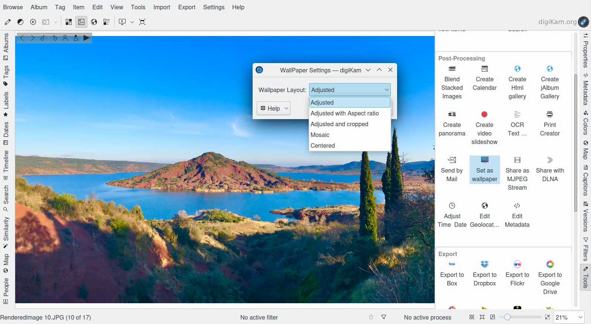

.. meta::
   :description: The Wallpaper Tool of digiKam
   :keywords: digiKam, documentation, user manual, photo management, open source, free, learn, easy, wallpaper

.. metadata-placeholder

   :authors: - digiKam Team

   :license: see Credits and License page for details (https://docs.digikam.org/en/credits_license.html)

.. _wall_paper:

Wall-Paper
==========

The Wall-Paper tool allows setting an image from your collection as a background photo on your desktop. If you use a multi-screen computer, the image is assigned to the current monitor where digiKam is running.

Select one image that you want to push on your desktop and go to :menuselection:`Tools --> Set as wallpaper`, or use the icon **Set as wallpaper** from the **Tools** tab on the right sidebar. A dialog will appear to customize the **Wallpaper Layout** of the background photo. The possible choices are listed below:

    - **Adjusted**: The image is resized to the desktop size without preserving the aspect ratio (Linux and Windows).
    - **Adjusted with Aspect ratio**: The image is resized to the desktop size preserving the aspect ratio (Linux only).
    - **Adjusted and cropped**: The image is resized to the desktop size and cropped to support the desktop aspect ratio (Linux only).
    - **Mosaic**: The image is displayed multi-time as a mosaic to fill the desktop (Linux and Windows).
    - **Centered**: The image is centered on the desktop without modification (Linux and Windows).

.. note::

    This dialog does not exist under macOS. The layout is always set as **Centered**.

    The Wall-Paper Dialog to Customize Layout of Background Photo
