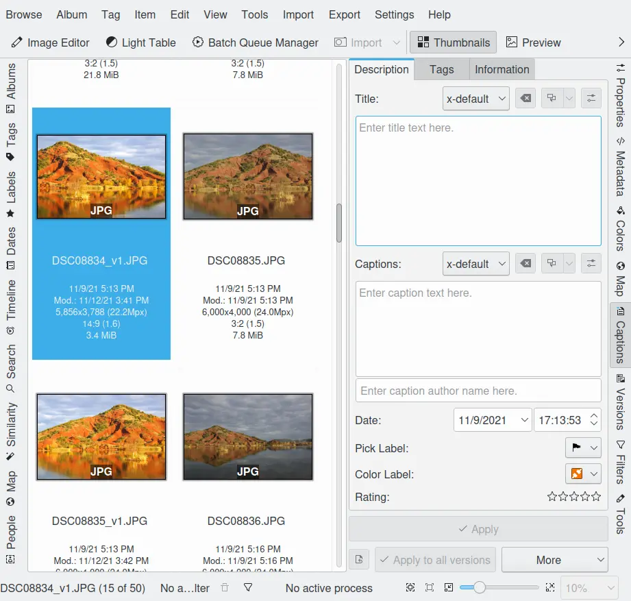
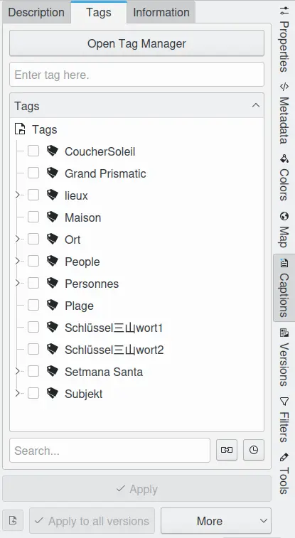
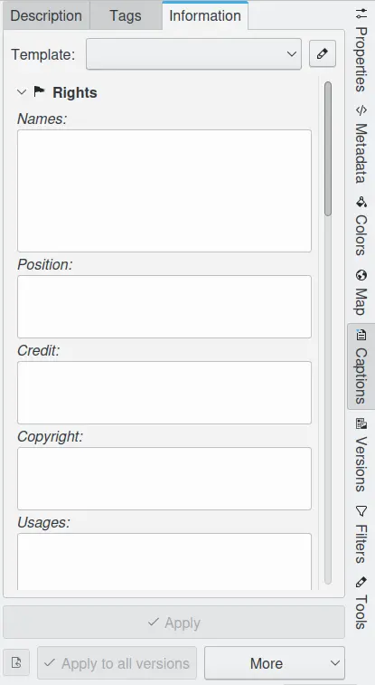

.. meta::
   :description: digiKam Right Sidebar Captions View
   :keywords: digiKam, documentation, user manual, photo management, open source, free, learn, easy, description, captions, title, author, labels, rating, date, tags, template

.. metadata-placeholder

   :authors: - digiKam Team

   :license: see Credits and License page for details (https://docs.digikam.org/en/credits_license.html)

.. _captions_view:

:ref:`Captions View <right_sidebar>`
====================================

.. contents::

Overview
--------

This sidebar tab serves to display *and edit* image attributes like captions, rating, date and tags. The attributes are stored in the associated database, in the IPTC, XMP, and Exif data fields and become part of the image. All attributes are accessible in one sidebar view as shown in the screenshot below. The order of priority when reading an image is: ``a)`` database ``b)`` XMP/IPTC and ``c)`` Exif. Any discrepancies in the data are resolved based on this priority.

    The Captions View from the Right Sidebar Displaying Description Information

.. _comment_editors:

Comment Editors
---------------

The **Description** view can be used to type or paste in a title and/or a captions of unlimited size (see note below). The text is UTF-8 compatible, meaning that all special characters are allowed. The captions are copied to the Exif, IPTC, and XMP fields in the image, allowing them to be used by other applications.

.. caution::

    IPTC data only supports ASCII characters and is limited to 2000 characters (old American norm). All texts will be truncated after 2000 chars, and special characters will be malformed. If you intend to use the IPTC caption field in other applications you should be compliant with these restrictions.

The title and caption editors are powerful tools which support:

   - Multiple alternative language strings.
   - Translation of strings to other languages using online tools.
   - Specifying the author of the strings.

The default language for the caption and title strings is designated **x-default** and must be written in English. The captions and titles can then be automatically translated into other languages and edited, if necessary. If only a single language is entered, it should be marked as **x-default**.

After commenting, either choose the **Apply** button or go straight to the next image. In either case, the descriptions will be saved to the file.

Next to the Apply button there is the **More** button. From it you can either choose to read metadata from the selected file to the database, or the other way around, to write metadata to the files (although the latter takes place anyway – if you edit the metadata, it will always be saved to the images file).

.. _date_edit:

Date and Time
-------------

In the Date and Time section, which should reflect the time the photograph was taken, you can edit the displayed values. This is handy if your camera clock was incorrectly set. You can either directly enter a date, or select a date from the pop-up calendar. You can likewise directly enter a time, or use the arrow buttons to adjust the time. Any changes to the date and time will be copied to the Exif **Date and Time** fields in the file. If you need to change the creation time and date for a number of images, there is a simpler method available in **Batch Queue Manager** or from :menuselection:`Item --> Adjust Time & Date...` menu entry in the **Main Window**. Select the images to be changed in the main view, and call the tool.

.. _labels_edit:

Labels
------

The Rating section displays a 0...5 star rating scheme that can be used in searches and sort orders. It can be applied by a single mouse click to the 5 stars in the sidebar or with a keyboard shortcut :kbd:`Ctrl+0...5`. To rate a number of images, select them and pop-up the context menu (click with the right mouse button) to apply a common rating.

The labels view also allow you to assign Color and Pick tags that you can use in your workflow to classify items.

These ratings are then copied into the XMP tag data fields.

.. _tags_tree:

Tags Tree
---------

The tag view shows an adaptive filter tag search box, the tag tree and a combo-box containing the tags previously applied in this digiKam session.

    The Metadata View from the Right Sidebar Displaying Tags Information

The tag tree will dynamically adapt as you type a search word into the box. So it is easy to quickly reduce the number of possibilities when searching for a tag. This feature is very useful if you have lots of tags.

The combo-box at the bottom is another ergonomic feature for easy tagging of an image series. As you apply different tags they will be memorized in this box for quick access.

Otherwise tags are simply applied by checking the respective boxes in the tree. All tags applied to an image are copied into the XMP/IPTC *keywords* data field.

.. note::

   If you select a number of images in the Icon-View and then check a tag in the tag tree, that tag is only applied to the highlighted images, and not to the whole contents of the Album.

.. _informaton_view:

Information View
----------------

The Information view allows you to assign a template of textual information to multiple items in a single pass. This information can be populated in the Setup/Template dialog. Each template can contain a set of strings describing the contents, the scene, the authors, the rights, the place etc.

    The Metadata View from the Right Sidebar Displaying Template Information

For more details about Templates, see the description of the :ref:`Template Settings <templates_settings>` section.
