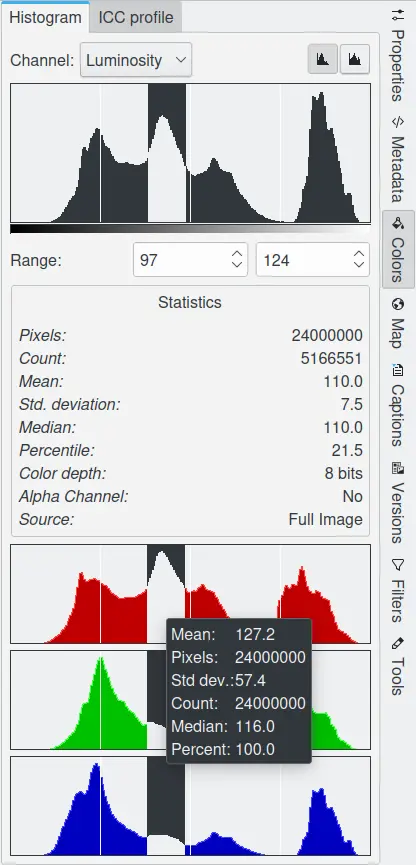
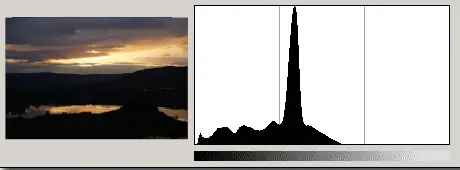

.. meta::
   :description: digiKam Right Sidebar Colors View
   :keywords: digiKam, documentation, user manual, photo management, open source, free, learn, easy

.. metadata-placeholder

   :authors: - digiKam Team (see Credits and License for details)

   :license: Creative Commons License SA 4.0

.. _colors_view:

Colors View
===========

.. contents::

The colors sidebar has two sub tabs Color and ICC Profile. Here are more details about Color Management

Histogram Viewer
~~~~~~~~~~~~~~~~

The histogram for an image shows the amount of each color that is present and their different amplitudes within the image. If your photograph has a color cast you might be able to see what is wrong by looking at the histogram.

The Histogram Viewer shows the statistical distribution of color values in the current image. It is purely informational: nothing you do with it will cause any change to the image. If you want to perform a histogram based color correction, use for example Color Balance, Levels Adjust or Curves Adjust in the Image Editor.

An image can be decomposed into **Red**, **Green** and **Blue** color channels. **Alpha** channel is a Layer in the image that supports transparency (like PNG or GIF images). Each channel supports a range of intensity levels from 0 to 255 (integer valued). Thus, a black pixel is encoded by 0 on all color channels; a white pixel by 255 on all color channels. A transparent pixel is encoded by 0 on the alpha channel; an opaque pixel by 255.

The Histogram Viewer allows you to view each channel separately:

    - Luminosity: shows the distribution of brightness values.

    - Red, Green, Blue: show the distribution of intensity levels for the Red, Green, or Blue channels respectively.

    - Alpha: shows the distribution of opacity levels. If the layer is completely opaque or completely transparent, the histogram will consist of a single bar on the left or right edge.

    - Colors: shows the Red, Green, and Blue histograms superposed, so that you can see all of the color distribution information in a single view. 

With the Scale option you can determine whether the histogram will be displayed using a linear or logarithmic Y axis. For images taken with a digital camera, the Linear mode is usually the most useful. However, for images that contain substantial areas of constant color a Linear histogram will often be dominated by a single bar. In this case a Logarithmic histogram will be more useful.

You can restrict the analysis of the Statistics field shown at the bottom of the dialog to a limited range of values if you wish. You can set the range in one of two ways:

    - Click and drag the pointer across the histogram display area, from the lowest level to the highest level of the range you want.

    - Use the spin button entries below the histogram area. Left entry is bottom of range and right entry is top of range. 

The statistics shown at the bottom of the Histogram Viewer describe the distribution of channel values, restricted to the selected range. These are:

    - The number of pixels in the image.

    - The number whose values fall within the selected range.

    - The mean.

    - The standard deviation.

    - The median of the selected histogram portion.

    - The percentage whose values fall within the selected range.

    - The color depth of the image.

    - Alpha channel in the image.

    - The source of the histogram, either Full Image or Image Region if you have selected an area of the image in the Editor.

How To Use an Histogram
~~~~~~~~~~~~~~~~~~~~~~~

Histograms are a graphical means to assess the accuracy of an image shown on the screen. The graph represents the 3 regions of the photograph brightness:

    (1) : the shadows-tone on the left.

    (2) : the middle-tone in the middle.

    (3) : the highlights-tone on the right.

.. figure:: images/sidebar_histogramdescription.webp

The distribution of the graph, where the spikes and bulges are clustered, indicates whether the image is too dark, too bright, or well-balanced.

With an under exposed photograph, the histogram will have a distribution of brightness that tends to be mostly on the left of the graph.

With an over exposed photograph, the histogram will have the bulge showing the brightness distributed mostly towards the right of the graph.

.. figure:: images/sidebar_histogramsample2.webp

With a correctly exposed photograph, the histogram will have a distribution of brightness that will be most prominent near the center part of the graph.

.. figure:: images/sidebar_histogramsample3.webp

.. important:: Not all photographs have to exhibit this bulge in the center part of their histogram. Much depends on the subject of the photograph. In some cases, it might be appropriate for the histogram to show a peak at one end or the other, or both.

The histogram is a reliable way of deciding whether or not a photograph is correctly exposed. Should the histogram show an over or under exposure, an Exposure Correction Tool should be used to fix the photograph.

ICC Profile Viewer
~~~~~~~~~~~~~~~~~~

An ICC profile is a set of data that characterizes a color input or output device, or a color space, according to standards promulgated by the `International Color Consortium <https://en.wikipedia.org/wiki/International_Color_Consortium>`_. Profiles describe the color attributes of a particular device or viewing requirement by defining a mapping between the device source or target color space and a profile connection space. Mappings may be specified using tables, to which interpolation is applied, or through a series of parameters for transformations used in Color Management.

Every files used to store captured image can be profiled. Camera manufacturers provide profiles for their products, and store them in image file as extra metadata. This ICC Profile viewer allows to display the textual information and a flat graph of color space.

.. figure:: images/sidebar_iccprofileviewer.webp
