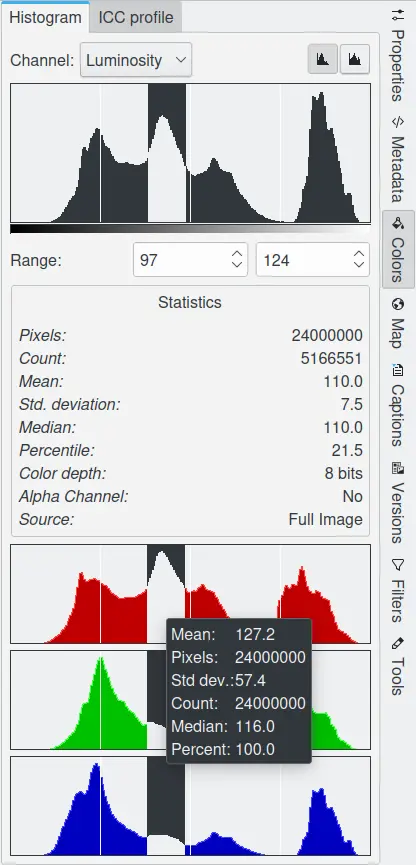
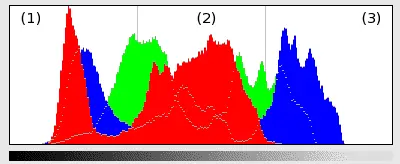
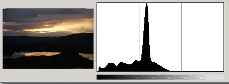
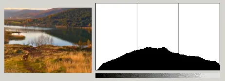
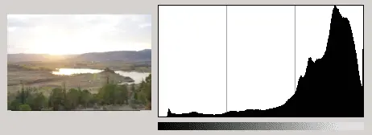
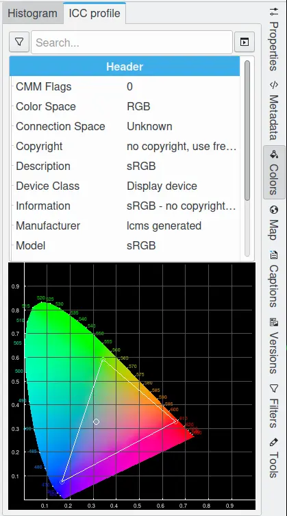

.. meta::
   :description: digiKam Right Sidebar Colors View
   :keywords: digiKam, documentation, user manual, photo management, open source, free, learn, easy, colors, histogram, icc, profile

.. metadata-placeholder

   :authors: - digiKam Team

   :license: see Credits and License page for details (https://docs.digikam.org/en/credits_license.html)

.. _colors_view:

Colors View
===========

.. contents::

The colors sidebar has two sub tabs **Histogram** and **ICC Profile**, which are described here. More complete information on color management within digiKam is available in the :ref:`Color Management <color_management>` chapter of this manual.

Histogram Viewer
~~~~~~~~~~~~~~~~

The Histogram Viewer shows the statistical distribution of color values in the current image. It is purely informational: nothing you do with it will cause any change to the image. A histogram-based color correction can be performed using the Color Balance, Levels Adjust or Curves Adjust features in the Image Editor.

    The Color View From Right Sidebar Displaying Histogram Information

Color images can be decomposed into **Red**, **Green** and **Blue** color channels. Some images also include an **Alpha** channel that supports transparency (like PNG or GIF images). Each channel supports a range of intensity levels from 0 to 255 (integer valued). Thus, a black pixel is encoded by 0 on all color channels; a white pixel by 255 on all color channels. A transparent pixel is encoded by 0 on the alpha channel; an opaque pixel by 255.

The Histogram Viewer allows you to view each channel separately:

    - **Luminosity**: shows the distribution of brightness values.

    - **Red**, **Green**, **Blue**: show the distribution of intensity levels for the Red, Green, or Blue channels respectively.

    - **Alpha**: shows the distribution of opacity levels. If the layer is completely opaque or completely transparent, the histogram will consist of a single bar on the left or right edge.

    - **Colors**: shows the **Red**, **Green**, and **Blue** histograms superposed, so that you can see all of the color distribution information in a single view.

With the **Scale** option you can determine whether the histogram will be displayed using a linear or logarithmic vertical axis. The **Linear** mode is usually the most useful for images taken with a digital camera. However,  a **Linear** histogram for images that contain substantial areas of constant color will often be dominated by a single bar. In this case a **Logarithmic** histogram may be more useful.

You can restrict the analysis of the **Statistics** field shown in the middle of the dialog to a limited range of values by setting the minimum and maximum range in one of two ways:

    - Click and drag the pointer across the desired range span within the histogram display area.

    - Use the spin button fields below the histogram area. The left entry is the minimum  range and the right entry is maximum range.

The statistics shown in the middle of the Histogram Viewer describe the distribution of channel values, restricted to the selected range. These are:

    - The number of pixels in the image.

    - The number of pixels whose values fall within the selected range.

    - The mean of the pixels within the selected range.

    - The standard deviation of the pixels within the selected range.

    - The median of the pixels within the selected range.

    - The percentage of pixels whose values fall within the selected range.

    - The color depth of the image.

    - Is there an alpha channel in the image?

    - The source of the histogram, either **Full Image**, or **Image Region** if you have selected an area of the image within the Image Editor.

How To Use a Histogram
~~~~~~~~~~~~~~~~~~~~~~

Histograms are a graphical means to assess the color and tonal qualities of an image shown on the screen. The graph can be divided into 3 regions of photographic brightness:

    (1) : the shadows on the left of the histogram.

    (2) : the mid-tones in the middle.

    (3) : the highlights on the right of the histogram.

    An Image Histogram in All Colors Mode

The spread of the histogram, and where the spikes and bulges are clustered, indicates whether the image is too dark, too bright, or well-balanced.

The histogram for an under exposed photograph will have a distribution of brightness that tends to be mostly on the left of the graph.

    An Under Exposed Photograph

The histogram for a correctly exposed photograph will have a distribution of brightness that will be most prominent near the center part of the graph.

    A Correctly Exposed Photograph

The histogram for an over exposed photograph will have the bulge showing the brightness distributed mostly towards the right of the graph.

    An Over Exposed Photograph

.. important:: Not all photographs have to exhibit this bulge in the center part of their histogram. Much depends on the subject of the photograph. In some cases, it might be appropriate for the histogram to show a peak at one end or the other, or both.

The histogram is a reliable way of deciding whether or not a photograph is correctly exposed. Should the histogram show an over or under exposure, it may be possible to fix the photograph using the :ref:`Exposure Correction Tool <color_bcg>`.

ICC Profile Viewer
~~~~~~~~~~~~~~~~~~

An ICC profile is a set of data that characterizes a color input or output device, or a color space, according to standards promulgated by the `International Color Consortium <https://en.wikipedia.org/wiki/International_Color_Consortium>`_. Profiles describe the color attributes of a particular device or viewing requirement by defining a mapping between the device source or target color space and a device-independent color space called the profile connection space. Mappings may be specified using tables, to which interpolation is applied, or through a series of parameters for transformations used in Color Management.

Every image file can be profiled. Camera manufacturers provide profiles for their products, and store them in image files as extra metadata. This ICC Profile viewer displays the textual information for the image's color profile and a chromaticity diagram indicating the image's color gamut.

    The Color View From Right Sidebar Displaying Color Profile Information
