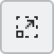
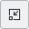
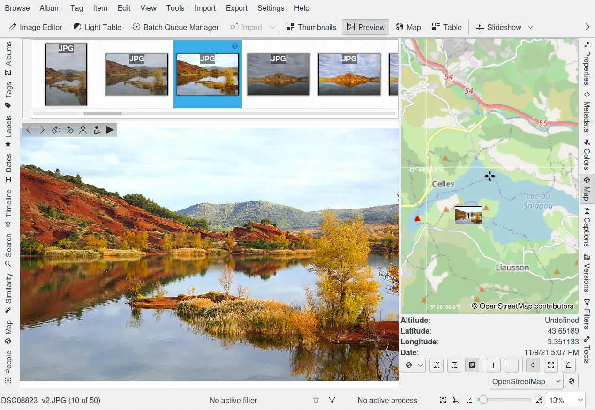

.. meta::
   :description: digiKam Right Sidebar Maps View
   :keywords: digiKam, documentation, user manual, photo management, open source, free, learn, easy, maps, geolocation

.. metadata-placeholder

   :authors: - digiKam Team

   :license: see Credits and License page for details (https://docs.digikam.org/en/credits_license.html)

.. _maps_view:

Maps View
=========

.. contents::

There are four tools involving geolocation in digiKam and two in Showfoto:

    - The **Map Mode** of the Image Area displays the locations of geo-coded images (images with GPS data) on a map depending on the selection in the Left Sidebar, e.g. the images in the album you selected in the Album View, the images with a specified tag (selected in the Tag View), images with a specified label, and so on. This tool is only available in digiKam.

    - The :ref:`Maps <mapsearch_view>` tab on the Left Sidebar is the search tool for selecting images based on their GPS data. This is also only available in digiKam.

    - The :ref:`Geolocation Editor <geoeditor_overview>`, accessible via :menuselection:`Item --> Edit Geolocation...` :kbd:`Ctrl+Shift+G` (:menuselection:`File --> Edit Geolocation...` in Showfoto), is the tool to set and to edit GPS data.

    - The **Map** tab on the Right Sidebar, described in this section, shows a map with a marker or a thumbnail to indicate the GPS location of the selected image. The map display is purely informative. The GPS coordinates are displayed below the map, along with the time the image was taken.

    The Map View From Right Sidebar

The map is navigated in the same manner as described in :ref:`Map Search section <mapsearch_view>`. Clicking on the navigation control's arrow buttons moves the map frame north/south or east/west. You can also move the map frame by using the keyboard arrow keys, or by clicking and dragging on the map.

Zoom in and out by moving the navigation control's vertical slider up and down, by clicking on the navigation control's + and - buttons, by using the Zoom in |zoom_in| and Zoom out |zoom_out| buttons just below the map, by scrolling the mouse wheel, or by using the :kbd:`+` and :kbd:`-` keys on the keyboard.

The map can be rotated from its center by click and dragging on the map while holding down the right mouse button.

The meaning of “GPS”, as well as the detailed descriptions of the functions and buttons that apply to all three geolocation maps, are described in the :ref:`Geolocation Editor <geolocation_editor>` chapter of this manual. This applies to the context menu on the map and the line of buttons under the map except the last one.

The lock icon will freeze the map. When selecting photos the map will no longer be moved automatically and will not be focused on the GPS points of the selected images.

The copy icon, on the next line, will copy the coordinates of the current image position in the map to the clipboard as plain text.

Different map services can be selected from the drop-down field under the line of buttons. Choose a map service and then click the **See more information on the Internet** button to the right.

The displayed positioning data are stored in the image's Exif tags if the option :menuselection:`Settings --> Configure digikam --> Behavior --> Geolocation information` is activated. That allows the location to be read by any other application that can understand Exif GPS data.
