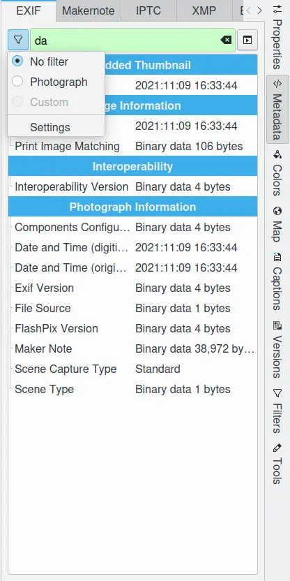
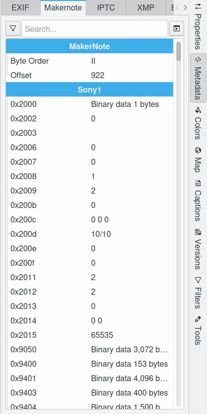
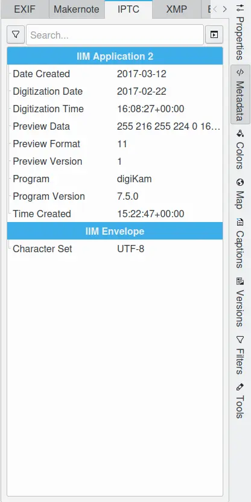
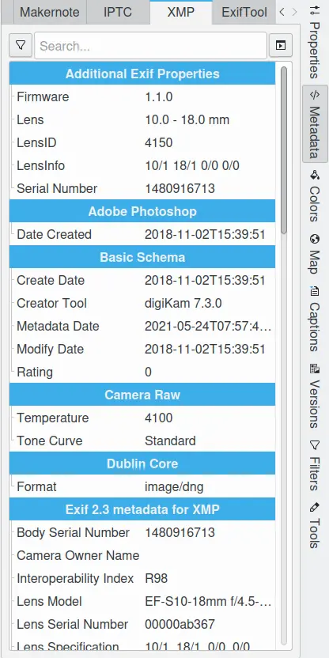
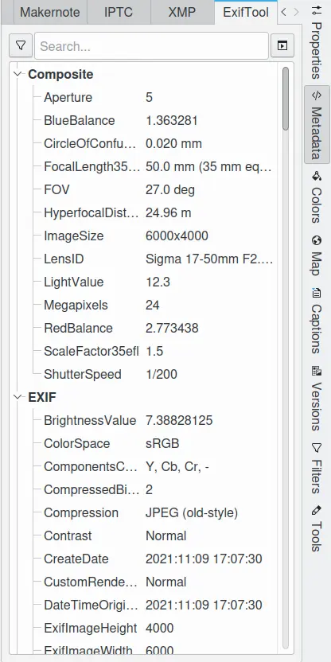

.. meta::
   :description: digiKam Right Sidebar Metadata View
   :keywords: digiKam, documentation, user manual, photo management, open source, free, learn, easy, sidebar, metadata, exif, iptc, xmp, makernotes, exiftool

.. metadata-placeholder

   :authors: - digiKam Team

   :license: see Credits and License page for details (https://docs.digikam.org/en/credits_license.html)

.. _metadata_view:

:ref:`Metadata View <right_sidebar>`
====================================

.. contents::

All information and properties related to the images or files stored by digiKam are referred to as metadata. Metadata fields include file properties such as file size and creation date, the camera settings when the image was taken, author info, copyrights, keywords, captions, and the coordinates of the location where the image was taken.

The metadata sidebar is composed of five sub tabs **Exif**, **Makernote**, **IPTC**, **XMP**, and **ExifTool**. While the metadata sidebar is primarily designed to display information, digiKam has multiple tools for setting and editing metadata:

    - With the :ref:`Camera interface <camera_import>`.

    - The :ref:`Metadata Editor <metadata_editor>`.

    - The :ref:`Geolocation tool <geoeditor_overview>`.

    - Copying :ref:`database information to files metadata <maintenance_metadata>`.

    - Copying :ref:`file's metadata to the database <maintenance_database>`.

    The Metadata View From Right Sidebar Displaying Exif Information

For each section of the metadata sidebar, a bar is available on the top of the view containing:

- A left button |tags_filter| that pops up a menu to filter the metadata list to only display some metadata fields:

  - **No Filter**: displays all metadata fields.
  - **Photograph**: displays only the most important metadata fields for photographs.
  - **Custom**: displays a customized selection of metadata fields.
  - **Settings**: selects the specific metadata fields to display in a custom display.

- A live search box in the middle of the bar. As you type in a keyword, the metadata list will be successively filtered. This is a quick way of accessing specific information.

- A right button |tools| that pops up a menu to export contents:

  - **Copy to clipboard**: copies the metadata text to the clipboard, so it can be pasted into another application.
  - **Save to file**: saves the metadata text to a data file.
  - **Print data**: exports the metadata text to a printer or PDF file.

.. note::

    The metadata view preserves the filter settings while the file selection is changed. This allows you to quickly identify differences in the metadata contents of various items by stepping through files.

.. _exif_tags:

Exif Tags
---------

Exif, which stands for `Exchangeable image file format <https://en.wikipedia.org/wiki/Exif>`_, is a file format designed specifically for digital cameras that encodes a large amount of information into each and every photograph. This information describes the camera which took the image along with the settings (including date and time) in use when the image was taken. Exif can also include an in-line thumbnail.

You can review embedded Exif information for the selected image from the first sidebar tab. The metadata fields in the Exif display are organized into one or more sections:

- **Embedded Thumbnail**: contains information about the embedded thumbnail image.

- **Global Positioning System**: contains location information if the photograph has been geo-coded.

- **Image Information**: contains general information about the image.

- **Interoperability**: contains information to support interoperability between different Exif implementations.

- **Photograph Information**: contains extended information about the photograph.

The Exif Viewer is purely informational – it cannot be used to change any of the Exif data. Scroll bars are enabled if there are more entries than available space.

.. _markernotes_tags:

Makernote Tags
--------------

The Exif standard defines a Makernote tag, which allows camera manufacturers to store custom metadata fields in the file. This is used by many camera manufacturers to store a myriad of camera settings not listed in the Exif standard, such as shooting modes, post-processing settings, serial number, focusing modes, etc. But the specifications of these custom fields is often proprietary and manufacturer specific.

You can review manufacturer-specific metadata for the selected image in the Makernote sidebar tab. The Makernote Viewer is purely informational – it cannot be used to change any of the Makernote data.

    The Metadata View from the Right Sidebar Displaying Markernote Information

.. _iptc_tags:

IPTC Tags
---------

The `International Press Telecommunications Council <https://www.iptc.org>`_, is a consortium of the world's major news agencies and news industry vendors. It develops and maintains technical standards for improved news exchange that are used by virtually every major news organization in the world.

The IPTC was established in 1965 by a group of news organizations to safeguard the telecommunications interests of the world's press. Since the late 1970s IPTC's activities have primarily focused on developing and publishing industry standards for the interchange of news data.

In particular, the IPTC defined a set of metadata attributes that can be applied to images. These were defined originally in 1979, and revised significantly in 1991 to be the *Information Interchange Model* (IIM), but the concept really advanced in 1994 when Adobe defined a specification for actually embedding the metadata into digital image files - known as *IPTC headers*.

You can review embedded IPTC information for the selected image in the IPTC sidebar tab. The IPTC Viewer is purely informational – it cannot be used to change any of the IPTC data.

    The Metadata View from the Right Sidebar Displaying IPTC Information

.. _xmp_tags:

XMP Tags
--------

The `Extensible Metadata Platform <https://en.wikipedia.org/wiki/Extensible_Metadata_Platform>`_ (XMP) is an ISO standard, originally created by Adobe Systems Inc., for the creation, processing and interchange of standardized and custom metadata for digital documents and data sets.

XMP standardizes a data model, a serialization format and core properties for the definition and processing of extensible metadata. It also provides guidelines for embedding XMP information into popular image, video and document file formats, without breaking the ability of applications that do not support XMP to read the files.

Although metadata can alternatively be stored in a sidecar file, embedding metadata avoids problems that occur when the metadata is stored separately and separated from the original image file.

XMP offers an enriched alternative method of storing IPTC fields.

You can review embedded XMP information for the selected image in the XMP sidebar tab. The XMP Viewer is purely informational – it cannot be used to change any of the XMP data.

    The Metadata View from the Right Sidebar Displaying XMP Information

.. _exiftool_view:

ExifTool View
-------------

`ExifTool <https://en.wikipedia.org/wiki/ExifTool>`_ is a free and open-source program for reading, writing, and manipulating image, audio, video, and PDF metadata. It is a platform independent, command-line Perl application. Prior versions of digiKam used the Exiv2 library to read and write metadata, but digiKam can now use the ExifTool as an alternative that supports a wider variety of file types and metadata fields than Exiv2.

ExifTool supports many types of metadata including Exif, IPTC, XMP, JFIF, GeoTIFF, ICC Profile, Photoshop IRB, FlashPix, AFCP and ID3, as well as the manufacturer-specific metadata formats for many digital cameras.

You can review information decoded by ExifTool for the selected image in the ExifTool sidebar tab. The ExifTool Viewer is purely informational – it cannot be used to change any of the file's metadata.

    The Metadata View from the Right Sidebar Displaying ExifTool Information
